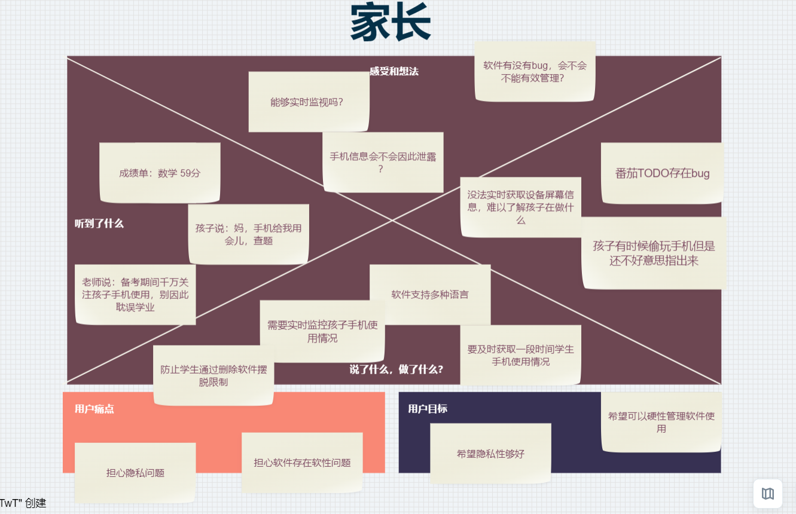

# CONT 商业模式设计

## 小组成员

| 组员   | 学号      |
| ------ | --------- |
| 任毅   | 191250116 |
| 王思尧 | 191250137 |
| 王庭泰 | 191250139 |
| 王嘉玮 | 191250136 |

## 度量数值

客户洞察部分的移情图：3个；

构思部分的候选创意：8个；

模型构建部分更新的画布内总要点数量：48个；关联关系：15条；引用的调研报告和新闻报告：篇；

讲故事部分的故事数量：6个（公司视角故事2个，客户视角故事4个）；

场景部分要点：6个；

## 目录

[TOC]

## 文档简介

我们按照商业模式画布，使用教材讲述的六种设计方法，对之前的分析进行了梳理与完善。较之之前的分析结果，更加清楚地完善了产品的价值追求，明确了产品的创意方向，与较之其他产品的关键性创意。

## 1. 客户洞察

### 1.1 家长

在疫情期间，在校学生随时可能面对封校居家的情况，然而初高中学生甚至大学生在面临电子设备的诱惑时往往很难产生足够的自制力。因此，家长对持有手机的孩子进行行之有效的管理监视成为了一个亟待解决的问题。我们希望打造软件可以作为有效的辅助工具帮助家长实现对孩子使用手机方面的控制。对此，我们为有需求的家长提供了为软件设置时长、监视子设备屏幕等方式，让管理更为有效、快捷。下图是一个希望限制孩子手机应用时长的王家长，因为疫情孩子需要使用手机上课，但是他平时不在家没有办法时刻监视孩子使用手机，高考将至，家长很着急。

### 1.2 想要认真学习，避免沉迷网络的未成年人

学生用户作为一个手机使用需要管控的庞大群体，是我们软件开发面向的主要对象。因为学生很难对自身手机使用产生足够的自制力，因此，我们为学生手机使用提供了协助监视的手段。我们允许监视人通过软件将手机设备绑定，从而学生可以通过监护人端的监视控制惯例，实现对手机使用的自我监控。下图是高二学生小王，他想认真学习，但是还经常沉迷于网络小说，因此，他想找到方法能通过他人的监管来达成努力学习的目的。

### 1.3 想要自我约束，控制自己手机使用时长的成年人。

我们发现，市面上已经存在的软性自我约束软件，比如番茄TODO，forest等，存在诸多的问题，比如，可以卡bug将软件卡掉，在使用期间可以将软件强制关闭等等，这对想要实现自我管理但还自制力较差的用户来讲极为不利。我们面向希望实现对自身手机软件使用强效管理的用户，开发了锁定软件并设置锁定时长，临时设置软件锁定时间等软件功能等等。下图是程序猿小王，他现在想要自己学习算法知识，但是B站太好逛了一逛就停不下来，他想让自己变得更为专注。

## 2. 构思

1. 从财务驱动的角度出发 

   如果我们在产品上线的初期通过向云服务商购买云服务器资源的方式来缩减向用户提供云服务的成本会怎么样？
   自行进行云服务器的搭建这一项活动本身是重资产的，在产品上线的初期，我们可能是没有足够的资金来进行服务器的购置和云服务器的构建的。尽管有人会说，我们可以像ofo和瑞幸一样，只要饼画的足够的好，就能吸引足够的融资来实现重资产的想法。这样的想法是太过于幼稚的，要知道，我们自行构建云服务器的想法在营收上就不是太为乐观的，就算是可以像阿里一样将闲置的计算资源开发成提供阿里云的方式来带来营收，其回报率在短时间内是较低的，很容易就会像ofo一样在最后不堪重负，连押金都退不回来；除此之外，技术的限制才是最大的问题，高昂的开发成本和维护成本对我们这样刚开始运营的公司的压力是巨大的，很有可能就是适得其反的行为。因此，在我们产品上线的初期，我们更倾向于与云服务商合作、并向其购买云服务器资源来为我们的用户提供云服务的方式，这样的成本是相对可控并且较为低廉的，可以在初期尽可能的帮我们缩减成本，以维持我们更好的商务运营。

2. 从客户驱动的角度出发

   如果用户觉得我们的功能不够完善、存在bug或者界面交互不够人性化怎么办？

   软件开发的初级阶段我们很难保证自己的产品足够高效、人性化满足所有用户的需求。因此，我们产品向用户提供了一个收集问题的信箱，用户可以将自己认为产品存在的问题通过信箱发送给我们。我们会对用户的反馈采用聚类的技术来进行共性问题的筛选，对于我们人性化功能的建议以及问题在通过我们产品部门的调整和优化之后，会提交给技术部门实现，然后上线版本测试，同时在通过问卷调查的形式获取使用者的反馈，再次进行优化。同时我们会设计奖励机制，公示对软件开发提供了较大贡献的用户名单，并对排名前列的用户发放奖励。

3. 从供给驱动和财务驱动的双重角度

   如果产品对基础功能免费，为有更高需求的用户提供进阶VIP服务会怎么样？

   针对不同的需求程度的用户提供不同程度的服务，有利于我们吸引不同样的客户群体的。对于产品的基础使用提供免费服务，有利于吸引更广泛的用户群体，而且基础使用也能满足较多用户的需求。但是，我们的更高层次的服务需要占用更多的服务器资源，对软件开发需求的成本也就更高，因此，对这方面服务有需求文档用户就需要开通VIP来享用这方面的服务，来更好的实现对子设备的监视。

4. 从资源供给的角度出发

   如果我们的软件使用自己的云服务器会怎么样？

   对于可以远端控制手机的软件来说，提供的服务需要很高的可靠性与实时性，同时对于我们的付费功能，实时监控手机界面，对私密性安全性也有一定的要求，从而云服务器可能很难满足用户的这方面的需求。考虑到软件产品开发推出初期，维持应用级容灾的成本会非常恐怖，启动经费很难支持我们自己搭建云服务器，因此更倾向于将云服务委托给外部的第三方服务商，他们成熟的技术可以对软件的服务的稳定性有所保障。而当软件发展有一定规模后，我们可以将一部分更高私密性和技术要求的服务迁移到我们自己的云服务资源上来。

5. 从客户驱动的角度出发

   如果家长用户和学生用户有相互切换的需求怎么办？

   由于软件的使用角色不是单一的，学生的软件账号也可能产生承担家长账号的需求。针对这种情况，我们为用户设计了角色转换功能，即，学生用户可以通过输入密码或进行身份认证等方式，实现账号身份的转变，从而获得家长端的功能。这样，无论是家长，学生还是有自我管理需求的成年人都可以方便快捷的获取对应身份的对应功能，使得软件使用变得更加灵活，符合用户需求。而通过这种方式，学生用户也不能随意的更改自身身份，从而加强了对学生用户的管理。

**总结：**

以上五个构思是我们在之前作业的基础上从不同的角度出发设计的创新点，通过小组讨论，我们对之前的商业模式画布进行了一定的补充。通过这几个方向的分析我们更加清楚的认识到了我们软件所需要的商业模式。首先我们作为一个对手机软件使用进行管控的软件，各种划分清晰的功能肯定是软件长时间吸引用户的关键所在。我们将面向用户划分为家长、未成年人以及需要自我管理的人群可以更好的区分软件能提供的服务类型。同时，我们为软件的被管控者和管控者都提供了信息反馈服务，可以让用户更好的了解自身及他人手机使用情况，来更好的监督管理自己，同时可以收获满满成就感。我们为手机上锁的功能也是别具一格，不同于市面的手机自我管理软件，我们为手机上的“硬性”的锁，让手机软件在被上锁期间无法被破解，保障了用户被有效管理的可靠性。我们也会细分功能，将向付费用户提供更优质的服务，我们还和广告商和各大软件平台间合作实现软件更好的运营开发。

## 3. 视觉化思考

### 3.1 可视化讲述及花絮

**==*//TODO*==**

### 3.2 可视化画布

上图是画布的整体可视化概况，接下来我们将依次讲解我们的画布及其改进。

#### 3.2.1 关键业务

家长模式：

针对家长端，家长端可以对儿童端应用软件进行相应约束限制。

a. 限制儿童端软件的使用时长：家长端可以查看到所绑定儿童端各个应用软件，并可以对应用软件施加一个使用限制，即规定一个时间内允许软件正常工作，超过规定时间后儿童端的该软件无法正常工作（如会有本软件的弹窗跳出进行强行屏蔽或提高延迟波动进行软性屏蔽）

b. 实时监控（进阶版--需付费）：家长端可远程实时监控儿童端屏幕信息以及儿童端各软件的使用信息，并会对数据进行整合分析生成报告提供给家长端

儿童模式：

针对儿童端，受到绑定的家长端软件控制，并与家长端软件保持联系。

a. 反馈机制：当儿童端本软件出现异常时（如被强行关闭或异常停止工作），儿童端的软件会自动发送一个反馈信号到家长端告知家长本软件的非正常退出情况。

b. 模式保护机制：儿童端无法自行切换为其他模式，切换模式需要获得家长端的验证码

c. 监控机制（进阶版--需付费）：儿童端软件的使用信息和屏幕信息会实时传输到云端存储，方便家长端查看儿童端软件使用情况

自我监督模式：

在单部手机里的自我监督模式，无家长端、儿童端区分，个人模式，适用于自我约束或家长将自己的手机给儿童玩的情况。

a. 锁定软件：可以自行为手机里的其他软件上锁并设定一个锁定时长（即在规定时间内手机内锁定的软件无法打开。

b. 密码认证解锁：每次使用本软件锁定其他软件时会需要用户自行设定一个解除密码，若出现意外情况需要及时使用已被锁定软件时只需要输入密码进行认证即可对软件进行解锁。

c. 软件时长限制与统计：可以设定某软件每日或每周使用时长限制，后台统计该软件每日或每周的使用情况，软件使用限制可以是短时的，也可以是长时的。并会分别在一日或一周的规定时间点生成报告反馈用户。

d. 奖励机制：当用户在规定时间内未使用密码认证解锁软件或是在长期过程中对于手机内软件使用没有超时记录则会达成相应成就，成就会自动保存到该用户数据中。用户可在朋友圈中分享自己获得的成就。

#### 3.2.2 客户细分

想要限制孩子手机应用使用时长的家长。

想要认真学习，避免沉迷网络的未成年人。

想要自我约束，控制自己手机使用时长的成年人。

#### 3.2.3 价值主张

创新：

目前市场上还没有定位完全一致的手机应用，本应用不仅可以自定义地限制手机上每一个应用的使用时长，还可以根据应用使用情况生成分析报告，让用户对自己的时间分配情况有更好的了解，同时，本应用还拥有独特的未成年人-家长绑定系统，家长可以设置未成年人手机应用的使用限额，并且可以付费来实时观察未成年人的手机使用，在本应用异常关闭时，会向已绑定的家长端应用发起提醒，以此避免应用因被关闭而失去效用，这样可以方便家长更加高效和便利地管理孩子的手机使用。

定制：

拥有自定义模式，应用白名单等具有定制特点的功能，用户可以根据自身情况自由设置部分参数，可以满足用户需求的高自由度和多样性。

价格：普通用户在不付费的情况下也能拥有较舒适的使用体验，VIP用户在适当付费之后将能够使用多种拓展功能。

成本削减：

本应用可以帮助用户屏蔽无关应用并分析自己的时间使用情况，以助力减少用户浪费在无关应用上的时间成本，同时，本应用的未成年人-家长绑定系统可以大大降低家长在防止孩子沉迷游戏上所需要付出的时间与精力。

可达性：

本产品的价值主张明确，积极响应国家号召和家长需求，可以较为容易地通过广告和推送抵达更多的潜在用户，具有相当广泛的可达用户。

便利性/可用性：

本产品使得用户能够更加便捷地获取自己的手机使用情况，以进行针对性的调整，同时方便家长更高效地管理孩子的手机使用

#### 3.2.4 渠道通路

合作伙伴渠道

a. 知名度 

​	i. 可以通过与各大应用商店的合作与宣传，提升自身知名度。

​	ii. 可以和手机平板厂商合作，作为该厂产品的预装App，可以有效的提高我们产品的流量，增强知名度。

​	iii. 可以和学校合作，在比如统一配备的学习平板上安装。

b. 购买：与各大应用商店合作，提供专属优惠，学校可以以优惠价格取得团体专属进阶功能使用权

自身渠道

a. 知名度

​	i. 制作官方网站，方便用户更好的了解我们，并且潜在用户在浏览到我们的网站时可以提高知名度。

​	ii. 在公司进入正轨后，特殊时段可以提供一定程度的免费服务，增强影响力和知名度。

b. 评价：通过问卷、问题反馈、在线客服等反馈机制让用户对产品功能和价值主张进行评估。

c. 购买：普通用户在我们的官方网站上或者软件内可以购买到VIP服务。

d. 传递：通过使用手册及操作引导的形式让用户明确产品的价值主张。

e. 售后：有智能客服和在线人工客服，向客户提供售后支持。

#### 3.2.5 客户关系

私人客服：

有在线人工客服，可以和客户进行交流并在销售的过程中以及购买完成之后提供相应的帮助。 

自助服务：

自助客服具有导航系统，用户可以根据自己遇到的问题查阅已有的常见问题条目，以解决较为常见的问题。

#### 3.2.6 收入来源

免费版：

植入（相关）广告，可以通过收取广告费盈利。

会员制：

充值成为VIP用户后，开放更多功能，并取消广告，且VIP用户在商城消费时享有一定折扣，可以通过收取会员费盈利。

商城：

应用中具有商城模块，可以通过商城交易收取平台费用盈利。

#### 3.2.7 核心资源

云服务器：

初期在用户量较少时只需低配置云服务器来维持运行以减少成本。在后期业务增长时，可以通过增加云服务器数量来避免资源耗尽问题。

开发营销维护团队：

软件开发过程中需要高效的开发团队保证软件开发任务顺利完成。在软件发布后需要专业营销团队对软件进行广告宣传，并且需要一个维护团队来保证软件的正常运行。

多语言支持：

软件支持多种语言，使软件变得国际化，让应用能够走出国门，使得国内外用户均可使用。

软件使用情况分析算法：

根据软件使用时段，时长，频率等信息分析用户使用情况并结合多学科理论生成分析报告的算法。

软件限制算法：

一套对于手机软件使用进行硬性限制的算法，即让限定的软件无法正常运转。

#### 3.2.8 重要合作

广告合作：

该软件在后期积累足够数量的用户时会植入相应的广告，因此需要与部分广告商建立企业上的合作关系。

运营商网络合作：

软件需要向电信网络投入且这是一个较为长期的过程，与网络运营商合作可以制定更清晰的产业发展计划，制定阶段性、透明的政策。协调价值链之间的利益关系从而调动各个环节的积极性。

云服务商：

该软件在开发初期需要在服务器中存储相关文件，在应用运行过程中的视频和下载包需要存储到云服务器上来为用户获得更好的体验。随着用户数量的增长也会需要更多的云服务器作为支撑，将用户数据存到云端既可以节省用户存储空间，又可以保证数据的安全性。

营销合作：

需要与其他相关企业进行合作，通过捆绑宣传来提高软件的知名度。

物资供应商：

软件企业中的员工在进行开发及调试工作时需要一定的平台基础，与物资供应商合作可以保障软件开发人员的工作环境质量。

手机平板厂商：

该软件可以与部分手机平板厂商合作，在旗下产品上预装，扩张用户量。

#### 3.2.9 成本结构

员工工资：

软件在开发过程中所需的开发人员的薪资以及后期维护过程时维护人员的薪资。

服务器成本：在软件开发初期，需要使用已有的云服务器平台以节省成本、扩大存储空间。在应用运行中需要对视频等文件进行存储，也需要云服务器资源保证软件的正常运转。

办公室设备成本：

软件里设有私人客服，且后期需要维护人员持续提供服务，因此需要一定的成本为职工的办公设备进行配置和维护。

广告成本：

在软件发布初期需要通过大量广告宣传来提高知名度，从而扩展用户数量，需要一定的广告运营成本。

## 4. 模型构建

### 4.1 商业模式画布

### 4.2 要点介绍

#### 4.2.1 关键业务

1. 家长模式：针对家长端，家长端可以对儿童端应用软件进行相应约束限制。

   a. 限制儿童端软件的使用时长：家长端可以查看到所绑定儿童端各个应用软件，并可以对应用软件施加一个使用限制，即规定一个时间内允许软件正常工作，超过规定时间后儿童端的该软件无法正常工作（如会有本软件的弹窗跳出进行强行屏蔽或提高延迟波动进行软性屏蔽）

   b. 实时监控（进阶版--需付费）：家长端可远程实时监控儿童端屏幕信息以及儿童端各软件的使用信息，并会对数据进行整合分析生成报告提供给家长端

2. 儿童模式：针对儿童端，受到绑定的家长端软件控制，并与家长端软件保持联系。

   a. 反馈机制：当儿童端本软件出现异常时（如被强行关闭或异常停止工作），儿童端的软件会自动发送一个反馈信号到家长端告知家长本软件的非正常退出情况。

   b. 模式保护机制：儿童端无法自行切换为其他模式，切换模式需要获得家长端的验证码

   c. 监控机制（进阶版--需付费）：儿童端软件的使用信息和屏幕信息会实时传输到云端存储，方便家长端查看儿童端软件使用情况

3. 自我监督模式：在单部手机里的自我监督模式，无家长端、儿童端区分，个人模式，适用于自我约束或家长将自己的手机给儿童玩的情况。

   a. 锁定软件：可以自行为手机里的其他软件上锁并设定一个锁定时长（即在规定时间内手机内锁定的软件无法打开。

   b. 密码认证解锁：每次使用本软件锁定其他软件时会需要用户自行设定一个解除密码，若出现意外情况需要及时使用已被锁定软件时只需要输入密码进行认证即可对软件进行解锁。

   c. 软件时长限制与统计：可以设定某软件每日或每周使用时长限制，后台统计该软件每日或每周的使用情况，软件使用限制可以是短时的，也可以是长时的。并会分别在一日或一周的规定时间点生成报告反馈用户。

   d. 奖励机制：当用户在规定时间内未使用密码认证解锁软件或是在长期过程中对于手机内软件使用没有超时记录则会达成相应成就，成就会自动保存到该用户数据中。用户可在朋友圈中分享自己获得的成就。

#### 4.2.2 客户细分

1. 想要限制孩子手机应用使用时长的家长。
2. 想要认真学习，避免沉迷网络的未成年人。

3. 想要自我约束，控制自己手机使用时长的成年人。

#### 4.2.3 价值主张

1. 创新：目前市场上还没有定位完全一致的手机应用，本应用不仅可以自定义地限制手机上每一个应用的使用时长，还可以根据应用使用情况生成分析报告，让用户对自己的时间分配情况有更好的了解，同时，本应用还拥有独特的未成年人-家长绑定系统，家长可以设置未成年人手机应用的使用限额，并且可以付费来实时观察未成年人的手机使用，在本应用异常关闭时，会向已绑定的家长端应用发起提醒，以此避免应用因被关闭而失去效用，这样可以方便家长更加高效和便利地管理孩子的手机使用。
2. 定制：拥有自定义模式，应用白名单等具有定制特点的功能，用户可以根据自身情况自由设置部分参数，可以满足用户需求的高自由度和多样性。
3. 价格：普通用户在不付费的情况下也能拥有较舒适的使用体验，VIP用户在适当付费之后将能够使用多种拓展功能。
4. 成本削减：本应用可以帮助用户屏蔽无关应用并分析自己的时间使用情况，以助力减少用户浪费在无关应用上的时间成本，同时，本应用的未成年人-家长绑定系统可以大大降低家长在防止孩子沉迷游戏上所需要付出的时间与精力。
5. 可达性：本产品的价值主张明确，积极响应国家号召和家长需求，可以较为容易地通过广告和推送抵达更多的潜在用户，具有相当广泛的可达用户。
6. 便利性/可用性：本产品使得用户能够更加便捷地获取自己的手机使用情况，以进行针对性的调整，同时方便家长更高效地管理孩子的手机使用

#### 4.2.4 渠道通路

1. 合作伙伴渠道

   a. 知名度 

   ​	i. 可以通过与各大应用商店的合作与宣传，提升自身知名度。

   ​	ii. 可以和手机平板厂商合作，作为该厂产品的预装App，可以有效的提高我们产品的流量，增强知名度。

   ​	iii. 可以和学校合作，在比如统一配备的学习平板上安装。

   b. 购买：与各大应用商店合作，提供专属优惠，学校可以以优惠价格取得团体专属进阶功能使用权

2. 自身渠道

   a. 知名度

   ​	i. 制作官方网站，方便用户更好的了解我们，并且潜在用户在浏览到我们的网站时可以提高知名度。

   ​	ii. 在公司进入正轨后，特殊时段可以提供一定程度的免费服务，增强影响力和知名度。

   b. 评价：通过问卷、问题反馈、在线客服等反馈机制让用户对产品功能和价值主张进行评估。

   c. 购买：普通用户在我们的官方网站上或者软件内可以购买到VIP服务。

   d. 传递：通过使用手册及操作引导的形式让用户明确产品的价值主张。

   e. 售后：有智能客服和在线人工客服，向客户提供售后支持。

#### 4.2.5 客户关系

1. 私人客服：有在线人工客服，可以和客户进行交流并在销售的过程中以及购买完成之后提供相应的帮助。 
2. 自助服务：自助客服具有导航系统，用户可以根据自己遇到的问题查阅已有的常见问题条目，以解决较为常见的问题。

#### 4.2.6 收入来源

1. 免费版：植入（相关）广告，可以通过收取广告费盈利。
2. 会员制：充值成为VIP用户后，开放更多功能，并取消广告，且VIP用户在商城消费时享有一定折扣，可以通过收取会员费盈利。
3. 商城：应用中具有商城模块，可以通过商城交易收取平台费用盈利。

#### 4.2.7 核心资源

1. 云服务器：初期在用户量较少时只需低配置云服务器来维持运行以减少成本。在后期业务增长时，可以通过增加云服务器数量来避免资源耗尽问题。
2. 开发营销维护团队：软件开发过程中需要高效的开发团队保证软件开发任务顺利完成。在软件发布后需要专业营销团队对软件进行广告宣传，并且需要一个维护团队来保证软件的正常运行。
3. 多语言支持：软件支持多种语言，使软件变得国际化，让应用能够走出国门，使得国内外用户均可使用。
4. 软件使用情况分析算法：根据软件使用时段，时长，频率等信息分析用户使用情况并结合多学科理论生成分析报告的算法。
5. 软件限制算法：一套对于手机软件使用进行硬性限制的算法，即让限定的软件无法正常运转。

#### 4.2.8 重要合作

1. 广告合作：该软件在后期积累足够数量的用户时会植入相应的广告，因此需要与部分广告商建立企业上的合作关系。
2. 运营商网络合作：软件需要向电信网络投入且这是一个较为长期的过程，与网络运营商合作可以制定更清晰的产业发展计划，制定阶段性、透明的政策。协调价值链之间的利益关系从而调动各个环节的积极性。
3. 云服务商：该软件在开发初期需要在服务器中存储相关文件，在应用运行过程中的视频和下载包需要存储到云服务器上来为用户获得更好的体验。随着用户数量的增长也会需要更多的云服务器作为支撑，将用户数据存到云端既可以节省用户存储空间，又可以保证数据的安全性。
4. 营销合作：需要与其他相关企业进行合作，通过捆绑宣传来提高软件的知名度。
5. 物资供应商：软件企业中的员工在进行开发及调试工作时需要一定的平台基础，与物资供应商合作可以保障软件开发人员的工作环境质量。
6. 手机平板厂商：该软件可以与部分手机平板厂商合作，在旗下产品上预装，扩张用户量。

#### 4.2.9 成本结构

1. 员工工资：软件在开发过程中所需的开发人员的薪资以及后期维护过程时维护人员的薪资。
2. 服务器成本：在软件开发初期，需要使用已有的云服务器平台以节省成本、扩大存储空间。在应用运行中需要对视频等文件进行存储，也需要云服务器资源保证软件的正常运转。
3. 办公室设备成本：软件里设有私人客服，且后期需要维护人员持续提供服务，因此需要一定的成本为职工的办公设备进行配置和维护。
4. 广告成本：在软件发布初期需要通过大量广告宣传来提高知名度，从而扩展用户数量，需要一定的广告运营成本。

### 4.3 关联要点

**以下标号对应画布中的模块分别为：**

**1 --> 客户细分**

**2 --> 价值主张**

**3 --> 渠道通路**

**4 --> 客户关系**

**5 --> 收入来源**

**6 --> 核心资源**

**7 --> 关键业务**

**8 --> 重要合作**

**9 --> 成本结构**

1. 1.1（家长），2.1（创新），2.4（成本缩减），2.6（便利性/可用性）：本产品能够帮助家长管控孩子的手机使用情况，减少孩子沉迷手机的可能性，可以部分减轻家长的教育负担，同时由于此前尚未有相同功能的产品，本产品将可以填补这一部分的空缺。
2. 1.1（家长），2.5（可达性）：随着国家限制未成年人游戏时长政策的推行，家长对孩子沉迷手机的隐患愈加关注，因此本产品可以较为容易地为家长所知道和接受。
3. 1.1（家长），4.1（私人客服），4.2（自助服务）：考虑到家长的年龄层次，为了更好地帮助家长了解该产品的使用方式，我们提供在线客服和自助客服以实时解决家长在使用本产品中遇到的问题。
4. 1.1（家长），7.1（家长模式），7.3（自我监督模式）：如果未成年人有自己的手机，那么家长可以使用家长模式来进行管控，而如果未成年人需要使用家长的手机进行学习或者查资料，那么家长可以使用自我监督模式来管理手机应用的可用时长等来达到避免未成年人偷玩手机的目的。
5. 1.2（未成年人），1.3（成年人），2.2（定制）：针对想要帮助自己排除干扰，专注学习/工作的用户，我们提供高度灵活的自定义功能，可以对各个应用自行添加多项使用限制以避免自己沉迷手机浪费时间。
6. 1.2（未成年人），1.3（成年人），2.3（价格），5.1（免费版），5.2（会员制）：基础版免费，拓展功能收费的模式被大部分人所接受，用这种收费模式能够在快速扩大用户规模的同时获得盈利。
7. 1.2（未成年人），1.3（成年人），7.3.d（奖励机制）：本产品的成就系统可以成为推动用户自我管控，不断提升自己的动力之一，同时兼具一定的社交属性，对于产品的推广有一定帮助。
8. 3.1.a（知名度），8.4（营销合作），8.6（手机平板厂商）：本产品具有一定的教育属性，因此可以通过与学校的合作提高知名度，此外，还可以通过预装在手机平板上，与手机平板厂商进行捆绑，进一步提高知名度
9. 3.1.b，3.2.c（购买），5.2（会员制），用户可以通过官网或者在应用内部购买vip服务，而合作厂商和学校则可以拥有一部分的购买优惠。
10. 3.2.e（售后），4.1（私人客服）4.2（自助服务）：私人客服和自动客服可以帮助用户解决关于软件的问题。
11. 4.1（私人客服），6.2（维护团队），9.1（员工工资），9.3（办公室设备成本）：为了解答用户在使用软件时遇到的问题，我们需要在维护团队中包含一部分客服人员，这部分客服人员的工资及办公室设备都会产生一定成本。
12. 5.1（免费版），6.5（软件限制算法）：免费版的主要功能需要一套强大的软件限制算法支持，该算法应该能在屏蔽应用时起到硬性作用，无法通过通常手段关闭。
13. 5.2（会员制），6.1（云服务器），6.4（软件使用情况分析算法），7.1.b（实时监控），7.3.c（软件时长限制与统计）：会员拓展功能中，孩子的屏幕状况将会被保存至云服务器，以供家长查看，而对软件使用情况的统计与分析则需要一套融合了心理学社会性等的算法支持。
14. 6.1（云服务器），8.2（运营商网络合作），8.3（云服务商），9.2（服务器成本）：存储媒体文件及其他数据信息需要服务器的支持，为了削减成本，我们使用更为灵活方便的云服务器，而视频
15. 6.2（营销团队），8.4（营销合作），9.4（广告）：产品需要通过各种途径投放广告来提高知名度，广告投入，营销人员工资也是成本的一部分。

### 4.4 基本事实与分析

> 根据全国未成年人互联网使用情况研究报告显示，当前使用互联网的未成年人当中，居然有62.5%的人会经常在网上玩游戏，其中玩手机游戏的比例达到了56.4%。
>
> 而这些网络游戏的设计者根据人的心理特点，设立一个又一个激励反馈机制，诱导用户在吸引点的刺激中层层深入，进而成瘾。刚巧处在青春期的孩子叛逆心强，好奇心重，渴求自主，自控力较低，极易对网络游戏成瘾。
>
> 网络游戏后成瘾后会严重影响他们正常的学习生活和身心健康，甚至导致一系列社会问题，让家长苦不堪言。
>
> ----《2020年全国未成年人互联网使用情况研究报告》

> 限制未成年人游戏时长可以帮助孩子建立健康的游戏习惯，同时也尽量避免因为孩子的游戏行为可能导致的家庭矛盾。
>
> 腾讯新规的出台无疑对未成年人游戏和充值做出更严格的要求，这种方式对未实名用户或未成年用户也能进行更有效的约束。
>
> 同时，学校和家长要多给孩子以正面肯定、认同与激励,使他们建立学习上的自信心,避免产生逃避学习的挫折性心理，帮助孩子培养多方面、有意义、有价值的兴趣爱好,克服网游依赖症。
>
> ----腾讯新闻

> 本次调研以随机抽样的方式，深度访谈了全国各地向我们反映孩子沉迷手机网络游戏的103位家长，同时详细整理了49封来自各地家长给中心的信件，归纳分析了共计152份材料。其中，83%的家长明确表示自己家孩子沉迷《王者荣耀》，15%的家长因为对游戏不了解，并不清楚孩子玩的是什么游戏，但大多描述为“打打杀杀的手机游戏”，另有2%的家长表示自己孩子玩的是其他游戏。
>
> 调研发现，沉迷手机网络游戏的未成年人以男生居多，占到93%左右，女生所占比例相对较小。这些未成年人年龄最小的11岁，年龄最大的即将满18岁，14~17岁的最多。
>
> 
>
> 其次从家庭结构来看，3%的家庭属于联合家庭；3%的家庭属于隔代家庭；94%的家庭属于核心家庭，其中14%的家庭属于单亲家庭。
>
> 
>
> ----《未成年人沉迷手机网络游戏现象调研报告》

**分析：**

**调研报告和新闻反映目前我国未成年人沉迷网游的数量之大。六成以上的未成年人都经常打网络游戏，半数以上的人都在玩手机游戏，目前国家已经颁布了相关的规则限制未成年人每周的网络游戏时长。CONT软件设计一方面是为了响应国家的号召，为社会群众提供一个可以限制应用程序使用时长的工具。另一方面也是为了满足市场的需求，未成年人和追求自律的群体都是该软件的适用人群。且软件会针对某一个特殊群体提供目的性的软件服务环境，对不同类型的用户提供功能不同的服务，让用户拥有更好的服务体验。**

**调研数据显示大多数沉迷游戏的未成年人为年龄介于14与17之间的男性孩童，而在现实生活中往往是女性用户更喜欢去做规划，更喜欢去记录自己一天的工作成果，因此也可以考虑如何增加一些特定的功能吸引更多的男性用户加入到这个使用群体中（奖励机制、分享机制）。而对于这些沉迷游戏的青年人的家庭结构大多数为正常的核心家庭结构，即多数家庭都为正常家庭，说明沉迷游戏这个因素一般情况下与家庭的结构无关，不需要软件去识别用户的家庭情况。而未成年人沉迷游戏会影响其现实交往能力，导致其精神颓靡颓废，甚至会严重影响未成年人的心理健康。这无疑会为个人和家庭带来极为严重的负面影响。而也正是网络游戏的负面影响之大为CONT提供了社会上的需求。**

------

> 限制手机应用使用时长这类APP的常见功能
>
> - 锁机：
>
> 就是预先设置一个时间，比如30分钟，然后开始锁机，然后软件开始运行，这个时候你打开手机的时候就不能玩任何APP了。
>
> - 每日时长限制/监督
>
> 就是限制自己每天玩手机的时长，比如说我设置2小时，然后我今天打开手机的总时长超过2小时之后，那么软件就会给我强制锁机。
>
> - 数据统计
>
> 也就是查看自己以往的数据，每个软件的查看维度不同，有得软件可以从日周月年维度，还可以给锁机分类，按类别来查看，这个部分番茄todo做的很好
>
> - 房间/自习室
>
> 就是自己建立一个虚拟的房间，和好朋友一起学习，可以查看对方的学习时长，每天都会有一个排名。对于我这种和朋友一起学习才能有动力的用户来说特别棒。
>
> - 打卡
>
> 可以设置锁机之后打卡功能，比较适用于养成习惯的时候，比如说每天30分钟背单词。
>
> - 白名单
>
> 有些时候我们想克制自己玩手机，但是我们又必须某些软件，比如背单词，或者计算机等。那么白名单功能就可以派上用场了，在锁机之前，我们可以设置部分软件进入白名单，然后锁机软件就会忽视这类软件，一般情况下，软件会自动将电话，短信等放在白名单。
>
> - 番茄功能
>
> 就是一个固定时间连续的锁机功能，不知道是哪位大神创造的，基本理论就是每工作25分钟就休息5分钟，然后到了锁机软件这儿就是：锁机25分钟，自由使用5分钟。当然了，时间是可以自己设置的，不过其实没有这个软件也不要紧，这其实就是一个定制的锁机功能。
>
> ----知乎网 作者：墨墨

> 由艾瑞数据提供的2020年11月APP行业概况可知，人们大部分上网时间都花费在视频与社交上。上网时间的增多意味着学习时间的减少，并且视频与即时通讯的可碎片化使用使得人们更加难以专注，手机拖延症和手机依赖症成为互联网时代手机用户的一个巨大困扰。
>
> 番茄ToDo正是瞄准当下对于提高专注度，提高学习与工作效率，摆脱手机拖延与依赖有迫切需求的用户群体，结合科学的番茄工作法与专注奖励机制，通过有效的时间管理，提高用户工作效率，养成良好习惯。
>
> 番茄ToDo以番茄钟为其核心功能，加入待办集，自习室，数据统计等功能丰富用户场景。
>
> 番茄ToDo以“无广告，秒启动”为卖点之一，无开屏广告，且APP内广告极少，难以发现，故其通过广告变现的能力较弱。
>
> 番茄ToDo主要采用开通VIP季度卡以增加限制次数等增值服务来实现盈利。
>
> ----番茄ToDo产品分析报告

**分析：**

**由上述统计数据可以反映随着碎片化时代的到来，人们越来越难以集中精力，无法精心。市面上针对此需求的效率软件应运而生。而我们的软件CONT与目前市场现有的软件番茄ToDo有很多的相似之处，基本上都是通过锁机的方式来限制用户软件的使用。但番茄ToDo主要针对的是那些需要自我管束的群体，而CONT面向的用户范围更广。面对市场上种类繁多的软件使用限制APP，用户往往需要一个集自我约束，管理孩童功能于一体的软件，由一个统一的软件来为用户提供相同质量的服务，能够在满足用户使用软件的需求的同时为用户提供最大程度的便利。**

**市场上存在一些与CONT存在竞争关系的软件，如番茄ToDo、Forest。因此我们的软件CONT需要全新的功能从市场上脱颖而出，需要利用CONT可以服务不同客户群体的优势在进入市场后，吸引各行各业的人进入软件，致力于为用户提供一站式服务体验，在不断积累用户数量的同时，让用户对软件产生一定的用户粘性，进而让用户进行支付升级会员作为我们收入来源，而扩展功能意味着需要更多的存储空间，需要支付额外的费用。我们的软件在发展初期客户数量较少，获取的咨询信息较少的时侯，不应该注重去扩展功能，而是在获得用户反馈信息后持续不断地对用户界面进行优化，致力于为用户提供最为优质地体验。在后期积累了一定用户数量后可以拓展语言功能，推出英语版，使得软件可以被海内外用户使用，这也会给我们的社交软件带来巨大的流量，知名度。**

------

> 
>
> ---- 番茄ToDo产品结构分析调查报告

**分析：**

**CONT软件可以效仿番茄ToDo的产品迭代过程，维持一个高频率的产品迭代来不断提升产品质量**

**第一阶段：核心功能探索期**

**产品初上线时期，是产品核心功能的探索期，主要以锁机的形式满足用户管理时间，提升效率的核心需求，推出管理模式，放弃理由分布，图表显示统计数据等功能，并不断提升用户体验，丰富用户场景，如加入习惯养成功能，新增正向计时与不计时模式等。**

**第二阶段：产品优化期**

**在产品迭代的第二阶段，尝试增加更多功能，满足用户进一步的需求。为满足用户的社交需求，推出了打卡分享以及时间轴分享功能；为使得产品更加个性化，推出了背景图设置功能，优化了排序功能和列表显示；为进一步满足用户的时间专注需求，推出严格模式。**

**第三阶段：自习室功能的推出和初步优化**

**推出了自习室功能，以满足用户的社交需求，并在此后不断进行完善与改进，同时对已有功能板块进行改进与优化，初步构建出一个完整的效率办公软件。**

**第四阶段：内容建设基本完善，不断优化已有功能**

**对自习室进行了改版，使得其社交功能由局限的熟人社交转变为广泛的拥有相似目标的陌生人社交，并改进用户反馈的不合理功能，使得其更加贴近用户需求，成为一个更加成熟的产品。**

------

​		中国互联网络信息中心指出，中国网民人均上网时长30.8小时/周，短视频应用使用时长占比11.0%，短视频使用时长居第三。

中国网民人均上网时长30.8小时/周

　　据显示，截至2020年3月，中国网民的人均每周上网时长为30.8个小时，较2018年底增加3.2个小时。受2020年初新冠肺炎疫情影响，网民上网时长有明显增长。

​		手机网民经常使用的各类App中，即时通信类App的使用时间最长，占比为14.8%；网络视频(不含短视频)、短视频、网络音频、网络音乐和网络文学类应用的使用时长占比分列第二到六位，依次为13.9%、11.0%、9.0%、8.9%和7.2%。短视频应用使用时长占比同比增加2.8个百分时，增长明显。

----第46次《中国互联网络发展状况统计报告》

​		34.9%的用户每天使用移动社交软件在2小时以内，42.5%的用户每天使用移动社交软件时间为2-3小时，15.1%移动社交用户每天的使用时间为3-4小时，而每天使用移动社交软件时间超过4小时的用户占比较少，占7.5%。

----《iiMedia Research》数据

国人每天花近6小时玩手机

95后更是8.33小时

今天，中国移动互联网大数据公司QuestMobile今天发布《中国移动互联网2019春季报告》显示，截至2019年3月，中国移动互联网用户每天花在移动互联网的时间为349.6分钟，（近6个小时），同比增长36.8分钟。

而除去8小时睡眠时间，人的一天只有960分钟，349.6分钟占据了其中超1/3。

----《中国移动互联网2019春季报告》

截至2020年3月，我国网民使用手机上网的比例达99.3%，较2018年底提升0.7个百分点；网民使用电视上网的比例为32.0%，较2018年底提升0.9个百分点；使用台式电脑上网、笔记本电脑上网、平板电脑上网的比例分别为42.7%、35.1%和29.0%，台式电脑使用比例下降较为明显。

----CNNIC 2020年第45次中国互联网络发展状况统计报告-互联网接入环境

截至2013年6月底，我国网民规模达5.91亿，互联网普及率为44.1%，而仅我国手机网民的规模就达到4.64亿，即，网民中使用手机上网的比例达到78.5%。而在对手机网民使用各类应用情况的调查中发现，手机网络新闻应用的使用率以在半年内大于9%的增长位列榜首。近年，通过社交媒体接触到的信息在一定程度上增加了受众对新闻的兴趣和对专业性新闻信息的需求，这对新闻媒体来说是新的发展契机，但同时也是全新的挑战。

----第32次《中国互联网络发展状况统计报告》

**分析：**

**据上述资料显示，国内网民是一个十分庞大的群体。中国网民不但数量巨大，而且每个人上网时间都很可观。随着国内互联网的普及程度提升，这两个数字也在逐年增加。在国内各个软件使用周期时间分布可以看到，大多数网民上网时间集中分布在10点-12点，18点-20点这些休息时间，而主要使用软件是网上外卖和短视频，但短视频软件使用时间远远高于其他软件，且这个数字受新冠肺炎疫情的影响有着明显的增长。这对我们的软件CONT发展可以说是新的发展契机，同时也是一个全新的挑战。在这个手机成瘾的时代，通过一些约束手段来帮助人们戒除网瘾，既能满足社会部分人群需要（有利于CONT从市场中获益），又有利于社会稳定发展，改善网络环境。**

----

----

### 4.5 市场潜力预估

CONT软件优势在于面向的用户范围大于其他与之竞争的软件，CONT集自我监督，家长监督，未成年人限制功能于一体，为更广泛的客户群体提供丰富的产品功能。它的主要成本在于它的几项出色项目：实时对儿童端软件使用具体信息监控，引入云存储来存储用户的手机软件使用信息，对于VIP用户扩展更多的功能需求（需要额外的存储开销）。CONT的劣势在于:目前市面已存在一部分与其功能类似的软件（番茄ToDo、Forest），这些竞争软件已经上市并已经发展成熟并且拥有稳定的用户群体，同时还拥有很高的知名度和满意度。作为一个新诞生的产品想要与他们竞争，并且要吸引一些已经对既有平台满意的用户会比较困难。同时用户不买账，很有可能造成入不敷出的局面。但是本产品可以为用户提供更多的服务功能、贴心的客户咨询、简介的界面和用户实时反馈处理。

随着互联网的发展，手机越来越成为人们生活中不可缺少也不可离开的东西，手机中毒患者也与日俱增，时间管理约束和效率办公软件的市场会进一步扩大。CONT很有可能会凭借其独特的功能从中脱颖而出，并在之后思考如何抢占市场份额，将产品进一步地提高和完善。

CONT与其他效率软件相比显现处了更多优势，基础功能免费提供给各个用户，用户额外支付解锁VIP扩展功能的模式也能更好地吸引来更多用户。

## 5. 讲故事

1. 公司角度

   公司成立的第一天，老板召集大伙开会，开始商量接下来的各项工作。“首先，我们的软件要能锁住应用，不能随随便便就被强制关掉。”老板想到了过去自己在用番茄TODO时通过切应用关掉应用锁的往事，如是说道，程序员老张点了点头，开始思考算法（**核心资源**），“另外，为了提供更专业的服务，我们还需要能分析用户手机使用情况，然后生成报告”（**核心资源**），老板又看向老张，“那得要一个心理专业的来帮忙”老张摊手，示意这事儿自己干不成，“可以，你跟人事说一下就行”老板答应了，老张松了口气，“接下来，我们还要提供视频监控服务”，网络部的老李立马回应“我们可以去找云服务商租用一些云服务器，这样可以降低我们的服务器成本”（**重要合作，核心资源**），老板满意地看了看老李，然后又看向了营销部的老王，老王拿起手中做好的方案，讲解道“我们可以在官网和各大应用商店上投放广告和开放下载，此外，作为具有教育属性的产品，我们还可以和相关企业合作”（**重要合作，渠道通路**），“很好，那就开始工作吧”老板听完了汇报，大手一挥，散会。

   两个月后，各项事务都上了正轨，产品逐渐为人所知，但大家发现，用户的留存率并不高，通过问卷调查，总算是搞清了原委，原来不少用户都是为了管理孩子手机而下载的，但这些家长很多都文化水平不高，他们往往被软件的各项设置弄的头昏眼花，于是自然就留存不下来，老板知道情况后，决定招人作为客服解决家长的问题，同时让程序员们熬夜紧急添加上新手指引和问题自助服务（**客户关系，价值主张**），如此下来，软件的留存率逐渐有了很大的提升。

   到年底了，老板在清点公司一年的收入和支出，免费版接的广告和会员费都提供了不少的收入（**收入来源**），而支出来源于员工工资，服务器成本，办公室设备和打的广告（**成本结构**），总体来说赚了不少，市场反应也很好，于是老板将眼光移向了尚未开垦的海外市场，“先找人翻译成英文，投放到美国应用市场试试”（**核心资源**）老板如此想道。

2. 客户角度（家长和未成年人）

   说起来，时间一晃已经到了二十年以后，我也成为了带娃一族（**客户细分**）。只是过于发达的电子设备给青少年学习成长带来了一定的影响，我家小孩，小王，就因为沉溺于手机vr互动视频，茶饭不思，成绩也一落千丈，编程入门也濒临挂科，我就很担忧啊。一个偶然的机会，我在逛应用商城的时候（**渠道通路**），就意外地看到了CONT这个软件，软件评分竟然到了9.99分，我寻思，有意思，当年我上需求课的时候不也构思过一个同名软件吗。好奇心驱使，点进去一看，功能和我当年构思出奇的相似，而开发者竟然就是我室友，好啊，竟然瞒着我开发这种软件。我二话不说，给我和孩子的手机上安装了这款软件。我发现，软件支持给子设备应用上锁，并可以设置上锁的时间，所以我立即给孩子的手机上了一个小时锁（**关键业务**），不过还看半分钟歪嘴龙王的广告（**收入来源**）。不过，当我听到了孩子在隔壁房间悲呼，我直呼这半分钟广告看的很值得啊。刚一打开软件，精致的应用组件让人眼前一亮，贴心的使用说明引导我很容易就在远程给孩子的手机软件进行上锁并设置锁定时间（**价值主张**）等等优势，我感慨于软件的巨大作用。也是为了支持室友劳动，我开通了一直到2099年的会员（**收入来源**），并把软件推荐到了家长群里面，供大家一起使用获益。开通会员后，不需要再看头疼的广告，竟然还可以实时监控子设备屏幕信息，还可以每天获取CONT向父设备发送的软件使用时长占比（**关键业务**），实在太赞了！下，CONT怎么给我发来了系统通知，CONT已经从子设备上移除（**关键业务**），难道小王把软件卸载了？不行，不说了，我得把压箱多年的鸡毛掸子掏出来，再去他房间看一眼，等下难免一场恶战啊，最后说一句，CONT永远的神啊！

3. 客户角度（需要自我管理的手机用户）

   最近，33娘沉迷于B站，整天抱着手机刷视频，经常熬夜到很晚，这也让33娘自己十分不安，想要戒掉网瘾却屡次失败（**客户关系**）。直到有一天，她在B站上刷到一个恰饭视频（**渠道通路**），里面介绍了集应用限制，自律培养和绑定控制于一体的学习软件（**价值服务**）——CONT，这很快就引起了33娘的注意。随后33娘就在应用商店（**重要合作**）里搜索到了有关CONT的信息，原来，CONT是一款致力于帮助用户摆脱手机依赖的产品，包含自我监督模式，针对想要自我约束的成年人（**客户群体**），可以锁定软件并设置锁定时长，设置锁定密码，限制软件使用时长，生成软件使用报告以及提供成就机制（**关键业务**）。当然，CONT的基础功能是免费的，想要更多进阶的功能需要充值会员，而且没有会员的话，总是会遇到各种各样的广告，这令33娘很不爽。于是，33娘决定充值了会员（**收入来源**）。后来，由于用上了CONT，33娘真的逐渐摆脱了对手机的沉迷，生活也变得越来越美好，然后她便十分兴奋地向自己的朋友推荐CONT（**渠道通路**），一个正向循环就这样形成了。

4. 公司角度*（某人放飞自我版本）*

   （前情回顾：由于2233使用CONT成功戒掉了手机，她们未来的女儿77娘也受到2233的感染，合理使用手机，努力学习，天天向上，考上了米国著名的常绿藤大学——加里吨大学，于是2233决定加入了CONT的研发公司，进入了营销部）

   有一个人前来投诉。

   “生意行吗，哥俩？”那人走下摩托车，径直向2233走来。

   “哥们儿，这会员多少钱一个月呐？”

   “一个月20，连续包月18。”33娘道。

   “What's up？这策划是金子做的，还是这美工是金子做的？”来人气势汹汹地说。

   “你瞧瞧这市面上其他地方哪有真CONT啊，我们这可是集应用限制，自律培养和绑定控制于一体的人类高质量app，你嫌贵我还嫌贵呢。”22娘护在33娘身前。

   “你看我下载的这个CONT，它只能单纯地锁住手机，有时候我只是想锁住游戏，结果需要搜索的时候，浏览器也锁住了；而且我家孩子使用了多久的手机我根本就不知道，更没法监控孩子的手机屏幕；还有，说好了会员免广告，为什么我充了会员还是广告不断；你们宣传里的奖励机制和成就机制我也根本就找不到，骗子，都是骗子！”

   “你下载的那是假CONT，要用就用真CONT。真CONT，不只能锁住手机，还可以自定义白名单，自定义每个要锁住的应用的上锁时长和解锁密码（**关键业务**）。真CONT，不只能监控自己，更能在家长和孩子的手机连接之后，获取孩子手机的使用状况（**客户关系**），开通会员后更能直接监控屏幕。真CONT，开通会员免广告，还在会广告不断发愁吗，试试开通会员吧（**收入来源**）。真CONT，具有奖励机制和成就机制，当用户在规定时间内未使用密码认证解锁软件或是在长期过程中对于手机内软件使用没有超时记录则会达成相应成就，成就会自动保存到该用户数据中，用户可在朋友圈（**重要合作**）中分享自己获得的成就。”22娘得意地说。

   “同时，真CONT的与众不同之处在于其“软硬结合”（**核心资源**）。软性控制体现在儿童模式的“缓冲”机制，而硬性则体现在当子设备中的CONT意外关闭时，系统会向父设备发送提醒，因此子设备不能通过关闭或者删除软件来摆脱控制，而屏幕信息的获取则对试图偷偷玩手机的未成年人形成了有效的威慑。同样，在自我监督模式下，我们会提供“硬核模式”，该模式中被锁定的应用将无法通过任何方法提前解锁（**关键业务**）。这也是CONT名字的来源，Controller，控制者，意为依靠外界的强大力量来束缚住信息时代人们被过分赋予的放肆的自由（**价值主张**）。”33娘补充说。

   “哇，真CONT，金色传说！”来人心满意足的离开了。

   “不要再用假CONT了，要用就用真CONT！”2233齐声说道。

5. 客户角度（家长和未成年人）*（某人放飞自我版本）*

   故事要从一个月黑风高，伸手不见五指的夜晚讲起。这天晚上，22娘正躺在一张豪华无比的黑天鹅真丝绒席梦思大床上睡得正香，突然刺耳的手机铃声划破了深夜的宁静。

   “你爱我呀我爱你，蜜雪冰城甜蜜蜜......”

   “滴——”

   22娘拖着疲惫的身体接通了电话，只听电话那头传来了一个愤怒的声音：“喂！是77娘的家长吗？这次期中考试77娘又挂科了，你们家长平时都是怎么管教孩子的？从来不写作业，看吧，考试又挂科了，这个77娘，我们学校实在是教不了了，下次考试再挂科直接退学！这个学，你就看你上不上吧！”

   “滴——”还没等22娘反应过来，老师就挂掉了电话。

   22娘缓缓坐起身，老师刚才劈头盖脸的斥责仍在耳边回响。“哎，又挂科了，我就知道，最近77娘每天回到家就捧着个手机，整天在一个二次元平台上刷视频，学业都荒废了，那能不挂科吗？对了，那个二次元平台好像叫什么，bilibili什么的，哎，年轻人的世界是越来越不懂了。这么年轻，不好好学习，她怎么睡得着的呀？”

   “撒日朗，撒日朗......”

   “哈哈哈哈啊哈啊哈啊哈要笑死了我不行了......”

   这时，隔壁房间又传出了鬼畜视频的声音和77娘魔性的笑声，22娘终于绷不住了，推开房门，说道：“阿七，你又在刷鬼畜哦，休息一下吧，去看个书好不好？”

   “烦呐”

   “我在跟你讲话，你有没有听到？”

   就在这气氛逐渐焦灼之时，屏幕上突然飘过一群弹幕：“开始恰饭”“图穷匕见”“要来了要来了”“我就知道”“空降08：37”“逐渐开始不对劲”“？？？”。只听手机里传出一个浑厚的男声（**渠道通路**）：“现在很多人沉迷手机游戏无法自拔，亦或是终日抱着手机刷着视频虚度人生，CONT，一款集应用限制，自律培养和绑定控制于一体的手机APP，致力于帮助用户摆脱手机依赖，帮助家长避免未成年人沉迷手机......”

   “帮助家长避免未成年人沉迷手机（**价值主张**）？”22娘立马发现了华点，自言自语道。

   22娘飞快地回到自己房间，在应用商店（**重要合作**）里搜索CONT，嘴角逐渐上扬成一个对勾......

   （2 month later——）

   “喂，是77娘的家长吗，我是班主任，诶，诶，对，这次期末考试的成绩出来了，诶，对，对对对对对，你知道这次77娘考了多少吗？她竟然从班级77名，一下进步到了班级22名！太厉害了8，简直就是奇迹！你究竟是怎么做到的？”

   “嘿嘿，因为——我用了CONT app！”

   CONT app，主要针对想要限制孩子手机应用使用时长的家长（**客户细分**），家长模式和儿童模式是其最主要业务（**关键业务**），它将家长设备和未成年人设备通过软件账号（**核心资源**）实现绑定，从而家长可以在父设备上通过CONT实现对子设备软件的管理（**客户关系**）。同时，软件允许家长用父设备中CONT设置子设备软件使用时长限制，同时家长还可以定时收到由CONT系统发送的子设备手机软件使用信息，更进一步，为了加强家长对子设备软件使用的监督，在会员模式下（**收入来源**），CONT还提供了子设备向父设备发送当前手机屏幕截屏和手机软件使用情况分析报告的功能。CONT app，孩子需要它，你更需要它，大家用了都说好！

6. 客户角度（需要自我管理的手机用户）*（某人放飞自我版本）*

   “噼里啪啦——轰隆隆——”

   一道炸雷从天而降，整个世界都仿佛随之颤抖起来。

   “77娘呢？老师呢？这是哪儿？”22娘垂死梦中惊坐起，茫然地望着四周。

   “什么77娘？什么老师？你是不是又做什么奇怪的梦了？”身旁传来33娘机械的声音，“弗洛伊德曾说，梦是一种生理现象，有梦想、希望、美好、幸福的意思。古人相信......”

   “桥豆麻袋，师傅别念了，77娘呢？就是，我们的女儿呢？”

   “醒醒吧，你没有女儿。这才是我们第一天一起睡觉啊，想什么呢？”

   “啊这——”22娘回回神，这才清醒过来，然后她的视线逐渐向下移动，这才发现，在这个乌漆嘛黑的房间中，有一个盈盈发光的屏幕，发出五颜六色的光芒，是33娘在看手机。

   “你在看什么呢？手机不就是用来打电话的吗？有什么好看的？到底手机重要还是我重要！”22娘气鼓鼓地说。

   “这你就不懂了吧，我在刷b站，就是bilibili，算了，说了你也不懂，22娘你果然是还活在上个世纪的人呀”33娘慵懒地说。

   “纳尼？bilibili？嘶——，刚才做梦的时候似乎，似乎梦到过这个名字，这是个什么来着？好像是个二次元平台，我未来的女儿就差点毁在这个平台上。”一边琢磨着，22娘的眼神又落在33娘的手机屏幕上，“不行，绝对不行，上一代人的堕落行为不能遗传给下一代，如果我手中这个发光的圆圆的东西都不能投给这个视频（**收入来源**），祖国的花朵又怎能见到明天的太阳？为了我未来的女儿，我一定要......等等，我似乎，忘记了什么（记忆回退）......对了，好像有一个神奇的软件来着，叫什么来着？名字，君の名は，好像和自控力有关，控制，control（**价值主张**），对了，叫CONT。是你~是你~梦见的就是你~”

   “33——，小33——，别看手机了好不好，陪我一会嘛”

   “搭嘎，口头哇路！”

   “（日语）哼，看看看，整天就知道看，你这个人呐，你是八嘎吗，现在的你哦，除了好好读书以外，就没有其他任何可以为社会做贡献的事情了，然而就连好好读书你都做不到，你难道不害臊吗，我跟你说啊，那些会读书的人，prpr可爱的纸片人，都是为了释放压力，都是为了接下来能更投入学习而做的休息，换到你身上就是单纯的变态行为，每天就知道看动漫，看到可爱的妹子就喊‘啊！我老婆’，你就不觉得这样的自己很羞耻吗，那些可爱的妹子哦，肯定也会喜欢学习很好的男孩子，像你这样的笨蛋她们肯定是很讨厌的......”

   “你再骂（恳求），呜呜呜，22，我知道错了，我改，我改还不行吗？可是我现在每天看手机，已经习惯成自然了，没有手机我就活不了，我应该怎么办呀！（**客户关系**）”33娘因为戒不掉手机，气的内心崩溃，又哭又闹，呜呜呜呜，好可怜啊。

   “嘿嘿，这你就不用担心了，因为我们有CONT app！”

   CONT app，除了家长模式和儿童模式以外，还有自我监督模式，针对想要自我约束，控制自己手机使用时长的成年人（**客户细分**）。自我监督模式是CONT产品基于市场产品的改良业务，当前市面上的自我管理软件并不能充分限制用户其他软件使用，因此，CONT提供了如下服务：锁定软件并设置锁定时长，设置锁定密码，限制软件使用时长，生成软件使用报告以及提供成就机制（**关键业务**）。当用户需要屏蔽某些软件的打扰时，可以临时为软件设置锁定时间，期间无法使用，对于长期使用而言，用户还可以在CONT中对某些软件的使用添加各项限制，以逐步减轻对该应用的依赖。此外，CONT还会在获得允许后记录用户使用软件的情况，并会根据用户需要生成数据报告反馈给用户（**客户关系**）。当用户满足某些自律条件时则会达成相应成就，成就会自动保存到该用户账号中，用户可以在社交平台分享其成就。此外，自我监督模式还可以满足手机外借时用户隐私保护的需要，只需锁定需要保护的软件即可。 CONT app，伴侣需要它，你更需要它，大家用了都说好！

 

## 6. 场景

梦中（22娘）：

  「砸瓦鲁多」（Made In Heaven）

（2 month before——）

22娘飞快地回到自己房间，在应用商店里搜索CONT（**了解产品**），嘴角逐渐上扬成一个对勾......

一直以来，22娘都苦于不知如何限制女儿的手机使用，有一阵子，她也想直接没收女儿的手机，但是女儿又不能没有手机。一来女儿要用手机和自己联系，二来现在已经是信息化时代了，凡事都离不开手机，甚至学校有时候布置的作业也需要用手机来完成。如果把她的手机里的游戏和b站都删掉，她也会趁自己不注意又下载回来；如果整天盯着女儿学习，不离开她半步，又觉得这样不利于女儿形成独立健全的人格，真是左右为难啊。而CONT的出现，正好满足了22娘的需求。

在应用商店里，22娘了解到了更多关于CONT的信息（**获得产品**）。原来，CONT可以将家长的设备和孩子的设备通过软件账号绑定，然后家长就可以通过自己的设备对孩子的设备进行管理。

“真是天助我也，世界上怎么会有这么好用的软件啊。”22娘感叹道。

于是第二天，22娘就和女儿77娘严肃地讨论了这个问题，77娘也表示一味沉迷手机是不对的，开始接受CONT的管理（**与产品交互**）。然后，在CONT的限制之下，77娘逐渐改变了依赖手机的习惯，开始认真学习，她写的满满的作业和消失的黑眼圈都令老师和同学惊讶，堕落的生活从此从此一去不复返，每一天都是新的一天。

 

 

现实（33娘）：

“嘿嘿，嘿嘿，诶嘿嘿，真不错”22娘在梦里笑出了声。

“咦，33娘，又做什么良辰美梦了？看你笑的样子，口水都流到枕头上了”33娘略带嫌弃地说。

22娘笑嘻嘻地坐起来，环顾四周，既没有屏幕发出的五颜六色的光芒，也没有吵闹的鬼畜视频，有的只是安静祥和的夜晚。

“哼哼，我现在可是经过了CONT的洗礼，已经不是从前的那个33娘啦，绝对不会在深夜被窝里看手机啦（**客户对产品的评价**）”33娘骄傲地说，“自从上次听从了你的建议，我就开始用CONT约束自己，CONT除了家长模式和儿童模式以外，还有自我监督模式，我可以自定义地锁定软件并设置锁定时长，设置锁定密码，还能生成软件使用报告，还能得到成就呢。后来我感觉这些功能已经满足不了我的胃口了，就偷偷地充了会员（**购买产品**），嘿嘿，22娘你不会怪我乱花钱吧？”

“Of Course Not！为自律和学习而花的钱怎么能叫乱花呢？这叫投资，最好的投资就是投资自己，懂不懂呀？”22说着点了一下33的鼻子。

“嘿嘿，就知道你最好了”33害羞地低下头，靠在22的肩膀上，“升级成会员以后，当用户需要屏蔽某些软件的打扰时，可以临时为软件设置锁定时间，期间无法使用，对于长期使用而言，用户还可以在CONT中对某些软件的使用添加各项限制，以逐步减轻对该应用的依赖。此外，CONT还会在获得允许后记录用户使用软件的情况，并会根据用户需要生成数据报告反馈给用户（**评估产品**）。”

“软件都升级了，我们的关系什么时候升级呀？”

“软件要充会员，我嘛，得加钱，哈哈，逗你的。”

“嘿嘿，是CONT改变了我们的命运，不如我们也去加入CONT的研发公司吧。”

“好耶，去营销部，凭我的三寸不烂之舌，定能......”

“嘘，夜深了，睡吧。”

