# CONT商业模式评估

## 小组成员

| 组员   | 学号      |
| ------ | --------- |
| 任毅   | 191250116 |
| 王思尧 | 191250137 |
| 王庭泰 | 191250139 |
| 王嘉玮 | 191250136 |

## 度量数值

教材上列举的商业模式环境里每个方面的每个子问题下的所有主要问题都与商业模式结合并进行回答

总体评估中的加分项：6 项；减分项：5 项；总体共 11 项

SWOT 分析（包含机会与威胁评估）中的所有评分项都打分并阐述了理由

引用的调研报告和新闻：39篇

更新过的商业模式画布中新增或修改过的模块要点占二阶段画布模块要点总数的15%左右

## 文档简介

本次报告，我们小组认真地对商业模式环境进行了分析，仔细的评估了我们的商业模式，并优先从对成本影响⽅向探索了蓝海战略并给出了完整的画布与讨论，实现了对我们的商业模式画布的更细致的分析与各项的评估，最终完成了对于商业画布的更新与完善，三种评估方式的产物加上更新过的商业模式作为本⽂档的四个章节逐⼀描述

## 目录

[TOC]

## 1. 商业模式环境

### 1.1 市场影响力

#### 1.1.1 市场问题

**子问题1：影响客户环境的关键问题有哪些？**

问题1解析：哪些问题正在影响着我们的软件的市场？

问题1回答：

互联网的普及率在逐年增长，越来越多的人使用手机，手机软件的使用时长也在不断增长。虽然一定程度上说明我国互联网产业在不断发展进步，但也表明国民手机使用过于泛滥，甚至出现了成瘾的情况。对于手机软件的限制成为市场上的一种需求。

国家颁布条例规定限制未成年人软件使用时长，加强对未成年人沉迷网络游戏的有关措施，营造出更为良好的网络环境。我们的软件在一方面也积极响应国家号召，为家庭、学校、社会提供一个途径更好地管理未成年人。

> ***调研&报告 1***
>
> *中新经纬客户端4月28日电28日，中国互联网络信息中心发布《中国互联网络发展状况统计报告》(以下简称《报告》)，《报告》指出，中国网民人均上网时长30.8小时/周，短视频应用使用时长占比11.0%，短视频使用时长居第三。《报告》显示，截至2020年3月，中国网民的人均每周上网时长为30.8个小时，较2018年底增加3.2个小时。受2020年初新冠肺炎疫情影响，网民上网时长有明显增长。*
>
> *——《中国互联网络发展状况统计报告》*

> ***调研&报告 2***
>
> *近日，国家新闻出版署下发《关于进一步严格管理 切实防止未成年人沉迷网络游戏的通知》。通知要求：*
>
> *所有网络游戏企业仅可在周五、周六、周日和法定节假日每日20时至21时向未成年人提供1小时服务，其他时间均不得以任何形式向未成年人提供网络游戏服务；*
>
> *不得以任何形式向未实名注册和登录的用户提供游戏服务；*
>
> *各级出版管理部门要加强对防止未成年人沉迷网络游戏有关措施落实情况的监督检查，对未严格落实的网络游戏企业，依法依规严肃处理；*
>
> *积极引导家庭、学校等社会各方面共管共治，依法履行未成年人监护责任，为未成年人健康成长营造良好环境。*
>
> *——《关于进一步严格管理 切实防止未成年人沉迷网络游戏的通知》*

**子问题2：哪些改变正在发生？**

问题2解析：现在的时间管理软件在经历什么样的变化？

问题2回答：

时间管理软件正在处于高速发展的阶段，且由于疫情方面的影响会使得宅在家里的人数不断上涨，对于时间的管理需求也愈发迫切。我们的软件能迎来拥有大量用户的机会，并能在用户反馈中不断更新调整。时间管理软件也不能仅仅只是对用户进行短时间的时间监管，需要从更多方向去帮助用户适应产品，并让用户对软件产生依赖性。

> ***调研&报告 3***
>
> *从番茄ToDo的迭代情况中分析得出，该产品定位逐渐由单一的对用户进行短时间监管，提升工作效率转变为更全面化的时间管理（养习惯、定计划），真正从多维度帮助用户养成专注习惯，以增强用户的依赖性和用户黏度。自习室功能的上线是产品在社交领域的探索，可增强用户互动性，维持用户活跃度。*
>
> *——人人网：番茄ToDo产品的迭代分析报告*

**子问题3：市场将走向何处？**

问题3解析：对于我们这种时间管理+监督功能的软件，未来的发展趋势是什么？

问题3回答：

> ***调研&报告 4***
>
> *随着5G时代的到来，技术的进步、物质的丰沛、媒介的发达和信息获取的便捷都能让我们更充分地使用和整合资源，但问题也随之而来。人们已经很少拥有大块、连续的时间，“时间碎片化”作为一种现代性症候，让越来越多人遭遇时间管理难题。*
>
> *为了避免碎片化时间带来的低效率工作和学习等不良影响，诸多平台根据现有时间管理相关理论，相继推出了自助管理时间的APP，以期帮助用户做好时间规划，提高工作和学习效率。目前市面上常见的时间管理APP是基于如一万小时理论、二八法则、时间四象限、番茄工作法、柳比歇夫时间统计法等原理开发设计的。这些理论分别从不同的角度、用不同的方法告诉人们什么事情是值得花时间、花精力去做的，这些事情该如何去做才会有更高的效率。市场上已有的时间管理APP主要可以分为3类：制定计划类、提升专注类、习惯养成类，主要的目标用户群体是上班族和大学生。*
>
> *——聚集网：时间管理APP的种类功能及前景分析*

#### 1.1.2 市场分类

**子问题1：哪些是最重要的客户群体？**

问题1解析：在商业模式画布中的客户细分中，哪一部分是最重要的客户？

问题1回答：

> ***调研&报告 5***
>
> *从年龄分布上看，番茄ToDo的用户将近一半为24岁以下用户，结合中国互联网用户是使用年龄来看，24岁以下用户主要为高中、大学学生群体以及刚步入职场的新人。*
>
> *这部分人群通常有明确的学习或工作任务，需要整段时间集中精力完成，而且这个年龄段的用户通常为手机的中度/重度依赖者，相比其他年龄的人群，更容易沉迷于网络导致浪费大部分时间，对办公效率软件有着更大的需求*
>
> *从用户所在地域分布来看，将近半数的用户集中在一线城市，而二三线城市以及下沉市场用户数量占比较少。这与不同城市的生活工作节奏有关，一线城市生活节奏快，学生学习、就业压力较大，对时间的管理利用以及工作效率的有着更高的要求。*
>
> *——人人网：番茄ToDo的用户画像*

**子问题2：哪个群体的增长潜力最大？哪些群体在缩小？**

问题2解析：在商业模式画布中的客户细分中，哪一部分客户在未来数目增长潜力最大，那一部分的客户数量会逐渐缩小？

问题2回答：

未来市场上，最有潜力的群体是学生群体，学生群体需要有一款软件能够有效地自我管理，而家长群体也需要一款软件对自己的孩子做一个实时监督。因此该软件可以在学校方面发掘更庞大的商业利益。

在未来，家长群体对未成年人的监管力度可能会下降，而自我监督模式下的使用群体会不断增多。由于玩网络游戏者大多为男性，因此男性用户群体对该软件的使用会增长得更为迅速。

> ***调研&报告 6***
>
> *从性别分布来看，使用番茄ToDo的用户中大多数为女性，且数量要远远高于男性。究其原因，从性格上看，女生偏细腻的性格更喜欢“完成一项任务前/后进行记录，并对一天内时间的分配进行会看分析”的操作模式。而男生更偏向于直接开始/结束某一项任务的进程，而省去较为繁琐的记录过程。*
>
> *——人人网：番茄ToDo用户种类统计*

**子问题3：哪些边缘群体值得留意？**

问题3解析：还有哪些群体未在商业模式画布中提及，却有可能成为未来市场中客户？

问题3回答：

除了家长、未成年人和需要自我管理的人员以外，需要考学或需要集中精力处理工作事物的人都是我们软件使用的潜在用户，他们都有潜力发展成为未来市场上的主要客户。

> ***调研&报告 7***
>
>  *产品的用户主要定位在学生、考学人员以及需要提高专注度和自控力的人。用户能够通过使用该软件，养成良好的学习习惯，增强对事情的专注度，以及对时间的把控力，进而提高工作效率。*
>
> *——简书：番茄ToDo产品分析报告*

#### 1.1.3 需求和诉求

**子问题1：客户需要什么？**

问题1解析：客户使用我们的软件是基本上是为了解决什么问题？

问题1回答：

> ***调研&报告 8***
>
> *未成年人沉迷游戏已经成了一个需要亟待解决的社会问题了，不要认为自己身边没见过多少游戏上瘾的未成年就觉得政策过于严厉了，那是因为你还没当父母或者说你还没有接触那些因为小孩玩游戏学业荒废，积蓄花光而焦急窘迫的家庭。*
>
> *总有人说什么从古至今每个时代都会有一些娱乐的方式，也不见得多么的耽误人，确实娱乐是无罪的，但是当它成为一个社会普遍现象的时候，是要值得警惕的。*
>
> *——知乎：限制未成年人玩游戏有错吗？*

> ***调研&报告 9***
>
> *所谓成长，其实没有非常准确的定位。但有一点毋庸置疑，就是我们会越来越感到时间的珍贵。随着生活节奏变快，责任变大了，梦想清晰了，日子却越过越快了。在这个时候，我们都希望时间能够走慢一些，但时间却不会停下来等我们。只能是由我们努力去赶上时间的步伐，提高自己对时间流逝的感知能力，与时间成为朋友。*
>
> *道理容易执行难，懒惰、拖延、分心都是我们在执行的过程中需要对抗的心理本能。所以在管理时间的这个过程中，有一个趁手的工具来支撑行为是非常重要和有必要的。*
>
> *我自己陆陆续续的尝试过了市面上几年来的大多数时间管理相关的软件，有记录类的（主动和被动），有番茄钟类的（区别在于激励方式），有时间累计类的（10000小时实践），当然少不了GTD和日程相关的Todo类型软件（单一目标导向）。*
>
> *——知乎：高效利用时间-选择与设计时间管理软件*

**子问题2：没有被满足的客户需求里哪个最值得关注？**

问题2解析：客户需求里哪些功能需求未被实现，却有很大的商业价值？

问题2回答：

自习室功能的扩展，目前番茄ToDo软件已经存在自习室功能，允许多个用户同时进入自习室里共同学习并可以互相监督。但自习室目前的功能也仅仅局限于此，未来可以对自习室做一些功能上的扩展，如彼此之间不仅仅只是互相监督，也可以相互督促，可以私密交流学习分享学习资料等。

奖励机制。对于Forest专注森林有种树的奖励机制，可以分享给自己的朋友。而这个奖励只是虚拟层面上的奖励，其实可以与其他企业合作，给予现实生活中的奖励，如现金红包或部分产品的优惠券等等。

**子问题3：客户真正需要搞定什么？**

问题3解析：客户使用我们的软件，最本质上的目的是什么？

问题3回答：

客户最根本目的是为了摆脱网络环境的沉迷，节省自己的时间，保持专注力去处理工作，保证自己的办事效率。

> ***调研&报告 10***
>
> *产品背景：*
>
> *随着电子产品的普及和各类软件的急速发展，网络生活越来越有趣多样、让人沉迷，在这样的环境下，保持专注变成了一件越来越难的事情，越来越多人无法控制地在电子产品上消磨时间，他们非常需要保持专注、提升时间利用率。不少时间管理软件应运而生，受到了广大年轻人的青睐。“forest专注森林”就是其中的一员。*
>
> *产品简介：*
>
> *forest是一款时间效率软件，帮助解决年轻人难以保持专注、效率低的问题，forest不仅能有效地帮助用户保持专注，它独有的种树模式也会给用户带来成就感和有趣的体验。使用forest时，用户要先设定好专注时间，保持专注成功才会得到金币奖励，否则树会枯萎；用户可以通过得到的金币在现实中+种下一棵树或购买其他树种和背景音*
>
> *——百度：你也在forest专注森林里保持专注吗*

**子问题4：哪些需求在增加？哪些在减少？**

问题4解析：在所有客户的需求中，哪些需求对客户来说会逐渐重要，呈增长趋势，哪些需求其实对用户来说又会逐渐变得不那么重要？

问题4回答：

随着网络普及率的增长，国民网络使用时间也在不断增长，许多人已经对软件使用成瘾，因此用户需要自我管理摆脱网络沉迷的需求也在增加，客户对于一款能够自我进行时间规划管理，提高专注力，增加工作效率的软件期望更为迫切，为了应对这部分需求的增加对于我们软件商业利益的提升也就变得尤为重要。

在国家颁布未成年网络保护条例后，国内各个游戏平台都在游戏内采取了相应的措施对未成年人网络游戏时间做出了限制，因此可能家长主动地对未成年人软件使用监督的需求量会不断减少，因此我们的软件功能不能仅仅停留在软件限制和监督上，需要有新的功能扩展。让家长在游戏已有防沉迷机制下依然会选择使用我们的软件，保住家长这个群体。

#### 1.1.4 切换成本

**子问题1：哪些东西将客户捆绑在一家供应商和它的服务上？**

问题1解析：有哪些服务是我们可以提供而其他公司提供不了的？

问题1回答：

我们能提供实时监控，即控制端可以对目的端的使用软件信息，屏幕展示信息做到一个实时监控，可以在一部手机里自动获得另外一部手机的软件使用信息及相关报告以达到家长监督孩子的功能。

这是普通的时间管理软件番茄ToDo、Forest不具备的功能。我们软件的功能也在原有的时间管理软件上有一定的转变。如线上自习室的资源分享功能以及与现实生活相关的奖励功能。我们将监督可视化，将管理自动化，开发时间管理软件的最大价值，让用户能够将我们的软件与其他时间管理软件区别出来。

**子问题2：哪些切换成本阻滞客户转投竞争对手？**

问题2解析：用户如果不使用我们的产品，而去使用其他的时间管理软件，他们会失去什么？

问题2回答：

对于想要监督孩子学习的家长来说，如果让孩子自行使用自我监督的软件，可能孩子自制力不够，孩子依然会选择偷偷玩游戏，由此达不到管理孩子学习的目的。而番茄ToDo、Forest上存在的bug也会让孩子欺瞒家长有机可乘。

对于想自我监督的人来说，番茄ToDo、Forest上存在的管理缺陷，如可以通过一定方式打开限制软件并可以正常使用或刷学习时间等都会让使用者体验感变差，若个人管制力不强，还会落个自欺欺人的结果。而使用者在自习室中也只能充当一个监督参与者，无法获得共同学习的收益。在奖励机制方面也只能获得精神上的奖励而没有物质上的奖励。

**子问题3：客户容易找到并采购类似的服务吗？**

问题3解析：现在市场上有和我们提供类似服务的软件吗？

问题3回答：

有。番茄ToDo、Forest都是与我们类似的时间管理软件，由于现在软件使用泛滥，对于时间管理的需求也在不断增大，我们的软件在市场上便有了需求。我们的软件在原有的时间管理软件上做了更为精细的客户群体划分，让每个不同类型的客户群体都能享受到软件提供的对应服务，后续我们也会在用户反馈的基础上不断提供完善所需的功能，让用户产生依赖性。

**子问题4：品牌多重要？**

问题4解析：竞争市场上有巨头式的知名软件吗？我们应该打造什么样的品牌？

问题4回答：

目前时间管理软件的两个巨头分别是番茄ToDo和Forest，但是这两个品牌的缺点也很明显，功能较为单一。我们也致力于弥补他们两者的缺点，并在此基础上加以创新，以创造一个能够适配更大量用户群体的软件。

#### 1.1.5 收入吸引力

**子问题1：客户真正愿意花钱买的是什么？**

问题1解析：我们提供的服务中客户愿意为什么样的服务付费？

问题1回答：

家长对儿童端屏幕信息的实时监控，获取儿童端的软件使用信息分析报告，云存储空间收费，更加个性化的界面设置，更多其他扩展功能的使用。

上述功能都属于会员功能或专属权益，需要有对应的收费。这款软件仍适应于大批免费用户，只是在一定程度上需要保证软件的会员率。

**子问题2：利润中最大一块从哪里获得？**

问题2解析：我们在收入来源中哪一部分的活力是最大的？

问题2回答：

与企业进行合作，如与校园合作收取相应的会员费或企业提供的资源来减少成本。个人的会员费，企业的会员费与支付的相关费用也会提供更大的利益，而且企业合作还能显著降低成本。与企业合作，在软件里植入相关广告，获取赞助资金，拥有大量的资金周转和合作伙伴是必要的。因此，企业与我们的合作提供的资金是我们最为稳定且主要的收入来源。

**子问题3：客户能够轻易地找到并购买更便宜的产品和服务吗？**

问题3解析：有没有同类型的竞争软件会比我们的收费更低？

问题3回答：

番茄ToDo、Forest、以及其他时间管理软件大多都通过会员制的收费形式。这是最为普遍的收费方式，市场还有部分是完全免费软件，但完全免费软件往往有着广告频繁，功能单一，版本停滞的缺点，其提供的服务质量完全无法与我们的产品相比。

### 1.2 行业影响力

#### 1.2.1 （现有的）竞争对手

**子问题1：谁是我们的竞争对手？**

问题1解析：现在已有的市场环境中，谁会与我们的业务产生冲突，他们为什么会被视为直接的竞争对手？

问题1回答：

番茄ToDo和Forest专注森林是我们的竞争对手，两者都是时间管理软件服务行业的领头羊，且他们已经上市有一段时间，有自己的用户群体，也有着较为稳定的收入来源，一些客户已经对他们的软件产生了一定程度的依赖性。两款软件的主要价值主张不太相同，番茄ToDo倾向于通过锁机的形式管理用户软件，而Forest则倾向于以一个奖励性的机制来潜意识地管理用户，目前两者都有很多企业级合作，在市场上也处于很高地位，是我们软件的直接竞争对手。而其他完全免费的管理软件则因为其服务质量原因而不作为参考。

**子问题2：哪些是我们这个领域的主流玩家？**

问题2解析：领域内的主流软件有哪些？

问题2回答：

目前在时间管理领域内，最大的软件就是番茄ToDo和Forest专注森林。番茄ToDo的用户主要是国内用户，而Forest专注森林不仅在国内有着很可观数目的用户，在国外也有很不错的市场。

**子问题3：他们的竞争优势或劣势是什么？**

问题3解析：主要的竞争对手的优势和劣势分别是什么？

问题3回答：

优势：

> ***调研&报告 11***
>
> *Forest 专注森林，是目前市面上效率App中处于第一梯度的位置，使用“种下树木，但用户离开种植界面一定时间后，树木会枯死”的创意，很好的抓住了提升效率的理念。*
>
> *笔者看来：开发团队将用户的责任感与道德相结合起来，例如：没忍住玩手机，小树就会枯死；在手机端种小树，在现实中种植真树……*
>
> *两者的结合，可以增加用户的粘性，而坚持专注一段时间后，又可以获得金币解锁更多树木、背景音乐和种植真树的玩法，增加了用户对产品的兴趣程度。*
>
> *在App的界面和操作性上，简洁清晰明了、画风简约、又用相应的图标代替文字，以及整个App操作简单快速方便，甚至无需任何说明即可上手，这增加了用户的体验感。*
>
> *最后，Forest的成功，得益于开发团队很好的增加了用户的体验感，也牢牢紧系这最初的目标，不过解决需求的形式有些单一。仅靠种树，当同行产品创新出更有意思的创意时，很难再保证Forest还能处于领先的地位，因此，还需开发出更多有趣的玩法创意。*
>
> *——人人网：产品分析-Forest专注森林*

劣势：

> ***调研&报告 12***
>
> *1、 功能同构严重，缺乏创新内容*
>
> *尽管时间管理软件众多，但软件的差异化不够。一方面软件功能雷同，同质化竞争突出；另外一方面，种类日益丰富但真正依赖的仍是云服务为代表的多平台，形式繁荣的背后缺乏实质的利润增长点。*
>
> *2、 内容产业落后，缺乏拉动力量*
>
> *时间管理软件是技术拉动需求型产业，相对国外产业而言，国内时间管理产业发展尚处于起步阶段，对社会服务应用的渗透不足，无法激发用户对服务的需求，*
>
> *3、 产业链路独立，缺乏共同利益*
>
> *时间管理产业链上各个环节还没有实现很成熟的配合，沟通渠道不够顺畅，上下游服务间合作松散，难以形成真正有效的利益共同体，抑制了良性发展。*
>
> *4、 用户结构单一，缺乏行业应用*
>
> *目前时间管理软件的客户群体主要还是集中于个人用户市场，虽然项目管理有相对较高比例的行业应用，但其中时间管理仍以点对点的个人应用方式为主，市场规模还有待进一步挖掘。*
>
> *5、 增值应用欠缺，缺乏产业前景*
>
> *由于时间管理是全新的业务，增值应用存在不确定因素，无法正确快速响应市场需求。若没有一个正确的产业发展目标，没有一个明确的增值应用方向，必将影响时间管理软件产业的发展。*
>
> *——CSDN：当前国内时间管理软件产业*

**子问题4：描述竞争对手的主要产品和服务（聚焦群体、成本结构），以及对我们的客户群体、收益来源和利润的影响有多大？**

问题4回答：

> **调研&报告 13**
>
> *Forest 专注森林的用户大概分为以下几种：*
>
> -  *学生群体：在众多群里来说，学生的自制力是相对较差的，家长或者学生自身为了专心学习，提高学习的效率进而采取手段来达到目的。同时也可以在同学之间对自己专注的时间进行对比，获得荣耀感。*
> -  *初入职场人：由于初入职场，在学生时代所遗留下来的毛病便在职场中展现出来——手机成瘾症，因此，为了保住工作岗位，专注工作，需要解决此问题，而Forest就刚好很适合。*
> -  *职场初级者：相比于初入职场的菜鸟而言，已经进入职场一两年的初级者为了提高自己的业绩，提升工作效率，同时也意识到生活习惯的重要性，因此，使用Forest。同时有些用户还是从学生群体中继承下来的。*
>
> *产品定位*
>
> *产品使用的Solgen：保持专注，勿做低头族。*
>
> *从slogan很清楚的明白：产品的定位是帮助用户在工作学习等期间，暂时放下手中的手机，专注于真正需要做的事情，从而提高学习工作的效率，进而改善用户的生活习惯——远离手机成瘾症。*
>
> *Forest 专注森林，是一款帮助用户专心于当前事务的个人效率型App*
>
> *内购与金币模式*
>
> *Forest在iOS端采用一次购买永久免费的模式，在App Store里面只需12元就可以购买，进去软件里面，所有可购买的都需要金币，而金币的来源就是种植树木或者通过RMB购买，不同的种植时间段有着不同的金币收入。而金币的作用除了解锁更多的树木，背景音乐外，还可以删除之前枯死的树木（价格不菲）。*
>
> *一次购买永久免费的模式还有一个很棒的优点，就是不会让用户有广告的骚扰，在很多免费的App中，广告是用户的一大烦恼之一，为此他们不得不购买每月VIP，而这样的性价比并没有一次购买永久免费的模式高。*
>
> *Forest采用的金币模式也很适应了“保持专注，勿做低头族”的口号，想要解锁更多的树木、背景音乐和种植真树，就必须远离手机成瘾症。*
>
> *同时金币模式也在潜移默化的给用户描述着“专注创造财富”的理念，让用户慢慢地感受到专注于一事，这也在慢慢在改变用户生活习惯上起了很大的作用，可以说衍生扩展了Forest的功能，让用户对Forest的兴趣程度越来越大。*
>
> *——人人都是产品经历：产品分析-Forest专注森林*

#### 1.2.2 新进入者（挑战者）

**子问题1：谁是你所处市场的新进入者？**

问题1回答：Guru、Momentum、Rescue time、潮汐等都是我们是这个时间管理+效率软件市场上的新进入者，每一款软件在时间管理这个方面都有各自的侧重点，因此他们都是这个市场里面不容忽视的挑战者。

**子问题2：新进入者之间有什么不同？他们有什么竞争优势或劣势？**

问题2回答：

作为时间管理软件+效率软件他们目前的竞争劣势主要为没有稳定的收入来源，客户数目无法与番茄ToDo、Forest专注森林所比较，在市场上的占额较小。但他们优势也很明显，如Rescue time软件可以自动跟踪系统帮助用户优化时间，给出相应的数据分析报告，这便是主流软件番茄ToDo、Forest专注森林所不具备的。

> ***调研&报告 14***
>
> *Momentum*
>
> *是不是已经厌倦了千篇一律的浏览器屏幕保护程序，当您在浏览器中打开一个新窗口时，Momentum会提供不同的高质量照片。还没兴奋呢？Momentum除了可以展示时间，天气，动机，最重要的是让你建立待办事项列表。让你清晰明了的知道今天的工作安排，帮助你迅速把工作分为优先级和次优先级，一键同步至网络让你随时随地查看，高效有序的完成需要做的工作，是不是超棒dei？*
>
> *Guru*
>
> *Guru是一种知识共享工具，可以培训新员工，并且易于操作。 Guru可以编写指南，然后在浏览器中上下文显示。 概述您的团队成员在发布到社交网络时应遵循的确切步骤，并且下一次团队成员发推文时，Guru将覆盖您的指示。想想你在团队中花费培训和再培训人员的时间，是不是很心累？作为一个leader，可以节省大量时间去做其他工作，从而提升工作效率。*
>
> *Rescue time*
>
> *Rescue Time可通过其创新的数据跟踪系统帮助您优化时间。这个软件，甚至不需要你手动记录时间开支，只需：1、下载RescueTime软件 2、注册登录。下面，该干嘛继续干嘛。任意时刻你想查看你的时间报表，它已经在那里了，界面美观简洁，统计分析精确有效。剩下的，就是让改变发生了！它明确剖析你白天的时间运用情况， 帮助您挖掘出浪费时间的行为，改正后可以提高工作效率，并且对于后期的工作规划，有指导意义。*
>
> *——知乎：可以提高效率的软件列表*

**子问题3：他们需要克服什么困难？**

问题3解析：作为挑战者的软件，需要怎么做才能够与现有的主流软件抗衡？

问题3回答：

> ***调研&报告 15***
>
> *你的app能给用户带来什么*
>
> *在开发定制app的时候，每个人都很清楚我们需要什么样子的app，有时候还会对开发公司指名要做成类似哪个app一样。当然明确这些的时候，我们更多的时候要问一下自己，这款符合我们意愿的app能够给市面上的受众带来什么？*
>
>  *App操作是否能符合用户的习惯*
>
> *当然也有很多app确实能够吸引一批客户选择下载，这些优质的app却在用户使用了没两天就选择卸载了。其中有一个很重要的原因就是不符合用户的使用习惯，直白点来说就是用户用起来觉得不好用，不顺手。AppStore上面有个软件评价，其中一星两星评价大概70%的用户是说app用起来不顺手。这也孕生而出一个灰色的产业链，专门有人去刷评价，但是就跟刷单行业一样，是饮鸩止渴*
>
> *App本身的开发制作水平*
>
> *一个优秀的孩子离不开优秀父母的培养，同理一个优秀的app也离不开专业的开发制作团队。很多人对价格很敏感，但大部分 APP 研发过程中的需求分析、产品设计、测试、运营、推广等等都需要专人来做。再穷不能穷教育，再苦不能苦孩子。前期资金方面确实有困难可以选择做一个功能简单但架构简单、设计精简、运行流畅的app，切记不能为了功能胡乱拼凑。*
>
> *运营及推广手段*
>
> *一款新的app推出，一定是需要不断的运营和市场推广。在这个酒香也怕巷子深的时代如何做好推广，让更多受众知晓也是门艺术。推广手段很多，可以选择应用商店、应用内推广、网盟类推广、线上与线下推广以及社交化推广。运营者可根据自身的状况和app特性来进行合适的推广*
>
> *不可替代性*
>
> *虽说世界上没有两片一模一样的叶子，但是app概念和定位却是可抄袭的。你的app跟其他同类app相比独特性在什么地方？互联网市场就这么大，手机内存就那么多，意向消费者就那么点，所以一个优秀的app一定是具有不可替代性的。就是说在解决用户需求上面，你的app能够更加精准，更加符合用户习惯，在运营的过程中不断的根据用户需求添加粘合性强的功能。*
>
> *——百度经验：新软件开发之后如何吸引到用户*

**子问题4：描述新进入者的主要产品和服务（聚焦群体、成本结构），以及对我们的客户群体、收益来源和利润的影响有多大？**

问题4回答：

> ***调研&报告 16***
>
> *（1）用户规模*
>
> *该市场属于小众市场，活跃人数并不是很多。同时小睡眠的活跃用户大约为潮汐的2-3倍，这和小睡眠免费的商业模式以及更接地气是有关的，小睡眠的音乐场景更多，同时它的玩法更加多样能适应不同年龄段的用户，而潮汐的免费音乐场景相对少，这也就造成了小睡眠的用户远超潮汐。*
>
> *（2）用户粘性*
>
> *●潮汐的人均启动次数略微领先小睡眠，这和潮汐的定位是有关的，潮汐细分了用户场景，引入了番茄工作法的概念，增加了用户打开使用的机会。而小睡眠则更加专注于睡眠，所以一般在中午休息或者晚上睡觉才会使用，1.83的日均启动数是合乎用户行为的。*
>
> *●就人均使用时长而言，潮汐是远超小睡眠的。这和潮汐的多场景适用是息息相关的，工作的使用，学习的使用，冥想的使用，睡眠的使用，中午小憩的使用，这些多场景造成了用户使用时长的增加。*
>
> *（3）盈利模式*
>
> *该类产品的主要的盈利模式有：*
>
> *流量变现：APP植入广告，植入区域有用户个人信息页面以及音乐场景界面。一般使用该模式的应用它的功能和音乐场景都是免费的。*
>
> *增值付费：APP的高级功能以及更多多样的音乐场景的选择是需要购买的。*
>
> *（4）产品分析总结*
>
> *优势：潮汐APP的功能相对同类更加完善同时引入了番茄时钟的概念，以此吸引力一大波学生和创作型工作人员。同时每日不同的问候语和背景图，给人一种被关怀的感觉，关注用户情感。*
>
>  *劣势：潮汐APP的场景选择少，产品的可玩性弱，同时产品操作路径过深。*
>
> *机会：因为APP的功能更全面同时有一批忠实的基于白噪音番茄时钟的用户，所以应该简化该功能操作路径，完善功能点，最大限度的发挥自己结合番茄时钟的优势，突出该功能。*
>
> *威胁：现在市面上有很多类似的白噪音应用，关注睡眠的小睡眠，以及关注休息与睡眠的taomix 2等等，他们的可玩性比潮汐更强。*
>
> *——简书：潮汐app产品分析报告*

#### 1.2.3  替代产品和服务

**子问题1：哪些产品和服务能够替代我们的产品和服务？**

问题1回答：番茄ToDo、Forest、潮汐可以替代我们的产品的部分服务，但都不能完全覆盖，我们的软件仍然具有自己的特色功能。

**子问题2：它们的成本与我们相差多少？**

问题2回答：

对于目前市场流行的时间管理+效率软件番茄ToDo、Forest专注森林的市场现状和分析可以了解目前Forest的独立设备已经突破40万台，且常年位居APP Store效率软件下载榜榜首，我们的软件作为一个挑战者进入这个市场毫无疑问差距是很大的。但用户作为一个需求合集，在乎的是产品带来的效用，一旦发现更高用户价值的产品，这个需求集为了效用最大化一定会舍弃现有产品。

> ***调研&报告 17***
>
> *上述的数据选取是从2017年5月到2018年4月，从近一年的趋势来看：Forest在17年9月迎来了爆发期。*
>
> *从17年8月到9月实现了将近3倍的增长，从7万台到22万台，而在此后的时间里基本上就处于缓慢的增长期，环比增幅也慢慢的趋于平缓状态，而且到了2018年的4月份，月度独立设备数已经到了40万台了*
>
> *从实时排名中可以看出：Forest在iPhone付费的效率榜排名第一，在付费应用榜上排名第4，很可以说明forest在效率类的App中深受大家的喜欢。这都得益于Forest的简洁极致的特点。*
>
> *——知乎：关于番茄ToDo和Forest市场现状和分析*

**子问题3：客户切换到这些替代品有多容易？**

问题3解析：替代产品的客户群体黏度有多高？即用户对于我们软件的依赖性有多强？

问题3回答：

> ***调研&报告 18***
>
> *这个用户使用番茄todo是因为其背后的企业提供给他的用户价值,而非产品本身*
>
> *1.用户价值=新体验-旧体验-替换成本*
>
> *新体验是使用番茄todo解决问题, 旧体验是用户原先如何解决问题(靠大脑)*
>
> *替换成本是用户使用番茄todo必须放弃什么*
>
> *用户作为一个需求合集,在乎的是产品带来的效用,一旦发现更高用户价值的产品,这个需求集为了效用最大化一定会舍弃现有产品*
>
> *2.用户价值=新体验-旧体验-替换成本 (旧体验是已发生的历史经验,或是竞品产品)*
>
> *比如用户如果要考虑是否使用滴答清单,就必须在心里盘算*
>
> *新体验=滴答清单效用=滴答清单对需求集的满足程度*
>
> *旧体验=番茄todo效用=番茄todo对需求集的满足程度*
>
> *替换成本=使用番茄todo养成的习惯+番茄上的个人纪录和数据+在上面留存的好友*
>
> *可以看出,如果想让用户选择滴答清单,滴答清单必须满足的条件是:*
>
> *新体验非常好=滴答清单非常好的满足这个需求集*
>
> *或者番茄todo做的很烂:比如现有体验很多bug带来很多麻烦或者用户替换成本很低,粘性和留存率不高等*
>
> *——知乎：关于番茄ToDo的一些设计思考*

**子问题4：这些替代产品起源于何种商业模式传统？（例如，高速列车挑战飞机，手机挑战照相机，Skype挑战长途电话公司）**

问题4回答：

我认为替代产品番茄ToDo和Forest起源于手机挑战照相机的这种商业模式传统。在原先社会中并不存在效率软件，仅有办公软件，但是人们对于手机使用的泛滥促使了这类型软件的诞生，时间管理+效率类型的软件作用不仅仅是提高用户的专注力，提高用户办公效率，软件最根本的目的是帮助用户摆脱网络沉迷，让用户养成时间规划的习惯，拥有更充实的生活。因此我们的软件功能不局限于提高办公效率，这就好比手机功能也不仅仅局限于照相机功能一样。手机开发出了更多自己的功能模块，在不替代照相机的前提下，去满足市场上的需求，获得盈利。

#### 1.2.4 供应商和价值链上的其他厂商

**子问题1：谁是你的行业价值中的关键玩家？**

问题1回答：

1.企业合作方

2.运营商网络合作方

3.云服务商

**子问题2：你的商业模式在多大程度上依赖其他这些玩家？**

问题2回答：

我们的软件对于企业方合作依赖特别大，我们需要得到合作企业的会员费支持，只有获得足够的资金周转才有可能将我们的软件推广，吸引更多的用户加入。而我们软件使用过程中收集到的数据也有很大的商业价值，需要足够服务器来进行存储，若公司达到一定规模之后也可以考虑自建数据中心来保证数据的可靠安全。

> ***调研&报告 19***
>
> *1、增加合作各方的收益。这是合作的根本基础。通过合作，合作各方可以利用合作的整体优势，把蛋糕做大。与此同时，合作各方都能从中获得较多的收益。 2、通过合作可以创造和开拓新市场。通过合作，企业间可以联手利用各自的优势，共同开拓一个市场。如果企业之间不合作，单靠自己的力量，有时是不可能开拓一个新领域的。 3、通过合作可以加快产品开发和投入市场的进程。当今的社会是一个竞争特别激烈的社会，市场的变化也非常迅速。一个市场机会的出现，很快会有许多企业来争夺。企业必须尽早地开发出满足这一市场机会的产品，否则企业就会被市场淘汰，为此企业必须加快产品开发的步伐。要加快产品开发的步伐，除了企业本身努力，重要的一点就是合作。 4、通过合作可以使合作各方费用共摊，风险共担。现代企业的产品开发、生产、销售等活动越来越复杂，企业花在经营方面的费用也越来越多，这样就增加了企业经营的风险，一旦决策失误或在经营过程中出现难以预测的情况，企业很可能遭受很大的损失，甚至一蹶不振。通过合作，可以将研究开发和经营的费用分摊给合作各方，同时经营的风险也分散给各个企业。 5、促进资源的合理利用。在经济活动中，所有资源都不是取之不尽，用之不竭的，都必须在一个合理的限度内使用。因此如何利用有限的资源，让有限的资源发挥最大的效用对大家都有益。但是在无序竞争的条件下，很难保证资源得到合理的利用。 6、合作是制定标准的需要。 7、企业间的合作也是面对竞争的一种选择。*
>
> *——企业为什么要合作*

**子问题3：有边缘玩家涌现吗？**

问题3回答：

我们的软件在设想过程中，有考虑过加上某些社交模块，比如在自习室中可以看到好友的专注时长以及学习资料查询，通过与好友之间相互监督，激发自己的胜负欲，来更好地使用软件提高学习效率，我们针对这种情况来做特殊优化来解决软件功能单一化的缺点。

> ***调研&报告 20***
>
> *是什么导致用户行为的改变？用户又为什么必须使用你的产品呢？*
>
> *要知道对于用户来说，作出每一步行动都是不容易的；这不仅需要付出大量的时间成本和学习成本，还要面对未知的结果；产品的不确定性和痛苦的学习过程足以劝退用户，因此需要一个成熟的方法论来指导我们设计产品。*
>
> *Knoster模型由Tim P. Knoster教授创建，并在教育领域应用多年，促进了学习障碍学生的积极行为改变；虽然该模型主要应用于行为科学研究，但是在产品设计领域依然适用。*
>
> *根据该模型，影响用户行为的有六个要素：愿景（vision）、激励（incentives）、共识（consensus）、行动计划（action plan）、技能（skills）和资源（resources）。*
>
> *——人人都是产品经历：影响边缘玩家成为真正玩家的六大要素*

**子问题4：哪个的利润最高？**

问题4回答：

在我们的关键合作伙伴中，营销合作方的收益会非常高，我们通过个体用户会员费的收取以及企业合作获得的资金支持支付营销方的费用，将我们的软件推广到市场上。我们向用户提供的专属功能也会收取相应的费用进行盈利。

#### 1.2.5 利益相关者

**子问题1：哪些利益相关者会影响你的商业模式？**

问题1回答：

竞争者方面，若客户在使用我们的软件的同时使用其他的效率软件，那么用户将有可能不再在我们的软件上进行消费，从而影响到我们软件的收益。

市场内部方面，在我们的产品未在上市之前需要面对同类型软件的压制，需要不断考虑如何抢占市场份额，如何吸引到顾客和消费者。

> ***调研&报告 21***
>
> *企业的利益相关者包括企业股东、内部员工、债权人、供应商、零售商、消费者或者竞争者等，都是企业利益的相关者。*
>
> *一般企业的利益相关者划分为两部分，包括市场部分和非市场部分。其中市场部分包括与企业有关的股东，包括内部员工股东和外部股东，此外还包括员工、债权人、供应商、零售商、消费者以及竞争者；非市场部分包括地政府、社会活动团体、媒体、一般公众、支持企业的团体等等。*
>
> *1、典型的利益相关者。所有者和股东；银行及其他债权人；供应商；购买者和顾客；广告商；管理人员；雇员；工会；竞争对手；地方政府和国家；管制者；媒体；公益利益群体；政党、宗教群体及军队等。*
>
> *2、利益相关者矩阵。从利益相关者的角度分析企业战略发展，可使用如下两个矩阵工具：*
>
> *（1）权力—动态矩阵：用来确定在发展新战略时如何引导政治权力。*
>
> *（2）权力—利益矩阵：用来确立公司与利益相关者的关系和策略。*
>
> *3、企业的社会责任。面对各种利益相关者，企业活动究竟应该对谁负责，负什么责呢？企业的社会责任的内容可以做如下概括和归纳：*
>
> *（1）对股东：证券价格的上升；股息的分配（数量和时间）。*
>
> *（2）职工或工会：相当的收入水平；工作的稳定性；良好的工作环境；提升的机会。*
>
> *（3）对政府：对政府号召和政策的支持；遵守法律和规定。*
>
> *——百度知道：企业的利益相关者影响*

**子问题2：股东的影响力如何？员工呢？政府呢？游说者呢？**

问题2回答：

股东是公司的出资人，公司的运作并不一定要股东来管理，对于重大问题的出现时，有决策权的股东会参与讨论。在中国的实际情况来看多数股东都在公司中工作并参与公司的运营。因此在开发前期股东对我们软件的开发流程以及上市时间都有着很高的话语权。

员工分别分为运营、开发、维护三类，员工的工资开销也是企业成本结构的一个重要环节，合理分配员工工资，调度员工的工作激情也是公司企业能够持续运转的关键环节。

政府方面要积极响应政府的号召，获得政策的支持，遵守法律和规定。

游说者则是利益集团对外陈述自己的建议、主张，希望自己的建议、主张被采纳、实施，为商业模式的变更调整做出的改变。

### 1.3 关键趋势

#### 1.3.1 技术趋势

**子问题1：市场外的主要技术趋势有哪些？**

问题1解析：网络远程控制软件的市场主要技术趋势走向有哪些？

问题1回答：

网络远程控制软件的技术组成主要采用了云服务+传输算法+5G技术，CONT考虑到其中还涉及到手机上锁功能以及及时查看手机内容功能，因此需要应用到加密算法。和好的云服务商合作，充分利用SaaS，尽力让服务快速便捷；好的传输算法保障了指令可以有效的传递到不同的设备，有效的加密算法既可以保障用户隐私安全，同时使软件上锁变得更加有效实用，从而让更多用户可以获得良好的产品体验。由于手机软件上锁一部分由远端控制，因此，如何实现不同设备间互通控制和如何保障不同的操作系统能够兼容软件功能，也都是主要难题。

> ***调研&新闻 22***
>
> *目前远程监控技术的主流是应用Internet技术，在TCP/IP协议和WWW规范的支持下，合理组织软件结构，使工作人员通过访问网络服务器来迅速获取自己权限下的所有信息并及时做出响应将来，嵌入式系统的发展会越来越迅速，越来越成熟，这项新技术迟早必将用于远程监控系统上，是监控系统未来发展方向之一。嵌入式监控系统可以使信息实现本地化处理，改善服务器性能，可以使每一个设备具备上网与服务功能，即每一个设备都可以独立进行服务，从而大大提高监控的质量和范围。*
>
> *——《远程监控技术的发展现状和趋势》*

**子问题2： 哪些技术代表了重要的机会或者颠覆性的威胁？**

问题2解析：当今网络远程控制技术有什么发展和阻碍？

问题2回答：

网络远程控制技术分为两个部分，网络和远程控制。网络方面，由于5G技术的发展，网络传输速度、质量都急剧的增加，因此，不同设备间的信息传输变得的更加的方便快速，各种互联网协议协议逐渐完善让网络传输变得更加可靠安全，在这样的背景下，实际上，网络方面问题可以很方便地解决。而远程控制方面，远程控制在嵌入式领域已经颇为成熟，但是在两个手机设备间的互相控制技术还尚未有很好的进展，有可能这是CONT开发阶段面临的重大困难，而手机间可以相互控制可能意味着一部手机在另一部手机面前没有隐私可言；同时将软件管理权限全部交给父设备，会不会让子设备管理出现问题，再包括权限冲突都会是我们面临的问题				

​						

**问题3：哪些新兴技术时可以采用的？**

问题3解析：当今网络远程控制软件有什么可以添加的技术？

问题3回答：

首先，5G技术尚未成熟，因此，在5G技术广泛普及后很显然可以应用到控制层面，像自动驾驶领域可以使用5G技术实现远程控制，那么它同样可以用于实现手机设备间管理通讯。然后，目前的手机控制软件只局限于本地手机软件控制，但是，随着技术的发展，远程手机控制也可以登上手机控制的舞台。通过wifi，蓝牙甚至更高级的信息传输工具，远程获取手机各种权限，查看手机内容，控制手机软件使用更为智慧、可行、可操作。

#### 1.3.2 行业管理趋势

**子问题1：哪些管理驱使会影响我们的市场？**

问题1解析：当今网络远程控制软件的管理会影响我们的平台发展？

问题1回答：

这个时代愈发强调保护个人隐私的权利。网络远程管理软件需要做到子设备授予控制设备绝对的权限，但是并不意味着子设备就没有自己的自由。我们关心的是，在这种子设备受到父设备全面管理的情况下，子设备的隐私会不会受到侵犯，开发者会不会因为功能问题受到投诉从而受到管控。因此隐私权的保护在这种情况下下显得尤为重要。其次，用户数据会经过网络、云服务器等传输，而其中包含大量的手机个人信息，因此，如何对用户个人信息进行保护也是非常关键的一部分。网路远程控制需要获得另一部手机的全部权限，而软件开发人员也可以从中窃取对手机的控制，在这种条件下，工作人员的道德价值观也需要体现出来，以避免潜在风险。综上，在管理方面考虑到隐私性、安全性等问题，需要软件开发做到技术手段安全可靠，工作人员做到恪守工作原则，用户做到维护隐私道德底线。

**子问题2：什么规则可能会影响公司的商业模式？**

问题2解析：平台会受到哪些规则的阻碍？

问题2回答：

由于软件使用涉及到一个设备对于另一个设备的管理，因此平台有一定可能涉及到网络安全和个人隐私安全的问题，软件开发平台有可能会被要求提供某些代码内容或者受到相应监管，对软件自由发展有一定的阻碍。其次，由于软件涉及到个人隐私，因此我们目前也不清楚软件是否会受到相应法律法规的限制。比如，实时提供受管理设备的屏幕信息不清楚是否符合被监管者的合法权益，在这方面软件的功能也有可能受到管理阻碍。

**子问题3：哪些规则会影响客户？** 

问题3解析：我们的平台会因为客户限制影响需求吗？

问题3回答：

目前5G技术尚未普及，因此不能确定计费标准和使用要求等无法预知的问题，如果5G使用需要较高的要求或者存在使用门槛，则可能会影响用户使用软件。还有目前没有类似的远程管理软件，如果软件管理方要求使用软件者提供特殊信息或者达成某种协议有可能会影响用户体验。

#### 1.3.3 社会和文化趋势

**子问题1：文化或社会价值观的哪些变化会影响商业模式？**

问题1解析：平台的价值观、文化理念的哪些变化会影响产品发展？

问题1回答：随着消费着的社会意识的提升，对于平台的形象良好与否和宣传出去的价值理念都会纳入考量。我们软件致力于打造“冷面”的管理软件形象，即，我们无论对软件自我开发来讲，和用户使用时对使用者自身来讲，都是非常严肃地。我们极力渴望建立起优秀的品牌形象，通过宣传加强软件的形象和口碑，并根据文化不同调整我们的营销策略，真正做到“入乡随俗”的全面发展。我们坚决抵制不良或是影响观感的负面形象，希望能打造全面且优质的品牌形象，树⽴业界标杆，为后面的其他产品铺设良好的道路，期望他们遵循我们正面的品牌精神。

**问题2：哪些趋势会影响消费者的行为？**

问题2解析：什么样的价值观变化会影响客户对远程管理软件的使用？

问题2回答：

随着疫情的持续，不同地区都会存在封校隔离或者远程办公的情况，因此，无论是高中、初中准备升学的青少年，还是大学准备考研的大学生，再是在家就业渴望不断自我学习、实现人生价值的工作者，都在一定程度上需要自我管理或者被动管理。在这种条件下，手机使用反而成为了自我进步的阻碍。但是，目前市面上的自我管理软件还很难实现有效的管理，这时候，远程管理和强制管理便成为了这类用户最重要的帮手。同时，在现在网络极其发达，信息快速传播的条件下，终身学习的理念也在中国大陆上广泛的传播。有效的手机管理，不但是对身体的爱护，更是自我提升的保障。

> ***调研&新闻 23***
>
> *根据艾瑞咨询自主统计及核算，2020年，中国综合性终身教育行业市场规模达1624亿元，受疫情影响，同比增速约为-12.2%，在线综合性终身教育行业的市场规模达668亿元，同比增长21.5%*
>
> *2020年新型职业和教学新模式：*
>
> *首先的就是IT互联网：人工智能、大数据、云计算工程技术人员、运维员等*
>
> *——《2021年，在线教育发展趋势-综合性终身教育》*

> ***调研&新闻 24***
>
> *相对于传统的教学模式，线上教学模式最离不开的就是科技产品的应用，在调查中发现，部分同学在使用电子产品上课时，由于其带来的方便性，在上课期间容易将学习软件和娱乐软件进行分屏操作，从而将自己的注意力转移至娱乐方面，进而影响到自己上课时的学习情况；还有部分同学因家中条件的优厚，拥有多种电子产品，将自己的所需的上课软件挂在某一产品上，伪造成上课模式，而自己却在一边玩游戏或者进行其他娱乐项目，形成假上课的情况，导致自己的学习效率底下且因为长时间高度集中于电子游戏造成自己较差的精神状态。*
> *——《大学生线上课堂教学学习效果调查分析》  卓意 陈伟*

#### 1.3.4 社会经济趋势

**问题1：主要用户群体集中在哪些年龄层？**

问题一解析：预测软件主要用户群体的年龄层趋势是什么？

问题1回答：

我们软件面向的对象主要是有手机使用管理需求的人群，因此老年人一般会被排除，青少年仍然是使用主力，因此我们主力发展的对象还是青少年。我们可以考虑通过青少年实名认证并提供青少年套餐等来获取利益并且让用户得到“占便宜“的感觉，同时可以树立良好的品牌形象。软件开发也考虑给青少年增加分享自我管理的讨论区，来分享自己的成功经验经历，提高用户的质量和使用体验。

**问题2：主要用户群体的经济能力？**

问题2解析：手机管理软件的用户群体的经济能力？

问题2回答：

我们软件服务的付费项目，主要在购买软件时的费用和进一步开通VIP服务时每月的费用，考虑到市面上月卡价格，价格定位也应该在每月30元左右，因此，相比于对个人提升起到的帮助，这些费用在可接受的范围内。首先针对需要被动管理的青少年用户，这部分手机用户有自己的手机设备，而在较小年纪有自己的手机设备，家庭经济状况应该也可以支撑软件开销。而至于对于对自我管理有期望的软件用户来讲，一次性买断软件自我管理功能对有自我提升意识的人群来讲也不是巨大的开销。我们致力于将软件买断定在一个相对合理的价位，保持市场竞争力同时也能给开发平台带来足够的收入。同时，软件开发初期为了积累口碑，我们倾向于为软件设定免费体验期，可以在初期积累一批固定的用户后再将软件调整为收费。

​		

### 1.4 宏观经济影响

#### 1.4.1 全球市场情况

**子问题1：当今国内网络远程管理软件的需求是不是在增长期？**
问题1解析：当今国内的手机设备管理软件的情况是不是处在一个发展良好的时期？

问题1回答：

就全球范围而言，新冠疫情爆发以后，很多人面临居家工作，学生也面临居家学习情况。据数据显示，ticktick的使用量直线上升（一款国外开发的自我管理软件），同样的番茄TODO和Forest等软件的下载率也在不断上升。因此，可以预见，在有限的时间内，受到疫情影响，手机管理软件的使用量只会不断上升，同时，由于人们受教育意识越来越强，国内人们素质越来越高，只会更加重视教育，这样以来，趁着这样的好形势，应该抓住这样的好机会，让我们软件品牌首先上市，就能抓住市场、获得盈利。

**子问题2：当今世界自我管理软件收益情况怎样？**

问题2解析：当今国内国外市场自我管理软件收益情况如何？

问题2回答：

这个问题很难做出准确的判断，因为目前自我管理软件仍然处于开发探索阶段，用户量还没有达到很高的程度，但是，从7月份番茄TODO发布的产品分析报告，番茄TODO仔去年2月份、7月份、12月份下载量都有很大的增长，仅在ios端，日均收入达到了1559￥，而根据另一份数据显示，ios下载市场仅占据全部下载市场的36.5%，由此不难看到，仅通过VIP模式创收的番茄TODO日收入不菲，而这是去年的收益情况。目前来看，手机管理软件在国内仍然有很大的市场，而目前来看手机管理软件并没有做到非常成熟，这时候采用更成熟的技术、更好的营销手段进入市场很有可能把握住商机。

> ***调研&新闻 25***
>
> *由禅大师提供的数据可知，在ios端，番茄TODO30天日均收入为1559￥，其中，在今年三四月份收入有了非常大的涨幅，这是因为今年三月份是大多数学生开学的时间，但是由于新冠疫情，学生无法到校，只能在家通过网课的形式学习，是去学校的监管，价值新的上课方式使得学生十分容易走神学习效率低下。这就使得人们对于效率办公的软件有了更大的需求，番茄TODO的收入随之提高。*
>
> *—— 番茄TODO产品分析报告*

#### 1.4.2 资本市场

**子问题1：资本市场处于什么状态？**

问题1解析：国内的手机管理软件的资本市场处于什么状态？

问题1回答：

智能手机的不断普及，抖音、快手等视频平台的兴起，王者荣耀、和平精英等游戏对青少年的强烈吸引，让青少年甚至中年人对手机的依赖越来越强，因此，手机使用管理就愈发重要。手机管理软件目前来看在国内还仍然有极大的潜力，因为随着素质教育的普及，学历和终身学习被人们愈发的看重，手机管理软件的前景还是非常乐观的。

**子问题2：我们的软件容易获得融资吗？**

问题2解析：手机管理软件容易获得融资吗？

问题2回答：

CONT作为远程手机管理软件还从来未在市场上出现过，因此，我想在以上资本市场的推动下，加以打造优质的开发团队和理想的软件设计理念，完备的需求和体系结构设计，强大的功能，我想融资不会是一件困难的事情。

#### 1.4.3 大宗商品和其他资源

**子问题1：描述你的商业必备的大宗商品和其他资源的当前市场状态。** 

问题1分析：我们的远程管理软件商业必备的大宗商品和其他资源的当前市场状态。 

问题1回答：

远程管理所必备的资源主要是关键的技术⼈员，技术⼈员可以提供安全快速的服务同时能够保证服务的可靠性以及界⾯的美观性。从新闻中可以看出现在的互联网企业中的劳动⼒成本在整个企业⽀出中占了非常大的⼀部分，还可以看出现在的人力成本正在持续上升，在这种情况下我们的软件和其他的软件之间的⼈才会出现争夺问题，导致市场的⼈才成本出现较为不稳定的波动。 

> ***调研&新闻 26***
>
> *半数互联⽹企业的薪酬成本在企业总成本中的占比为50%~70%，超过两成的企业薪酬成本占比超过70%。对创业型小微企业而言，人力成本占比高的现象尤为突出：规模小于30人的公司，人力成本占企业总成本比重往往高达80%以上。* 
>
> *——每经网*

> ***调研&新闻 27***
>
> *牛津经济研究院在最新发布的⼀份研究报告中就给出了这样的数据。这份报告分别将美国2003 年、2012 年和2016 年的劳动力成本设定为基准值，可以发现2003年时中国的劳动力成本仅为美国的四成左右，但2012年时就已经接近美国的成本。报告预测今年中国的劳动力成本仅比美国便宜4% 。* 
>
> *——北京青年报* 

**子问题2：执行你的商业模式所需要的资源有多容易获取？成本如何？价格走向如何？** 

问题2分析：远程管理软件容易获得商业资源吗？成本和价格走向会有影响吗？

问题2回答：

在人才方面，由于基本上所有的求职者都希望进⼊互联网大厂，如果我们的软件在这个时间进入市场吸引人才的能力相对较弱，所以我们很难对高精⼈才形成有效的吸引力。同时中国的老龄化社会结构日益严重，我们对人才获取的需求是⼀个比较重要的问题，可能会面临比较紧张得人才市场，同时由于刚进⼊市场时资本的不足，对比竞争对手出现较大的劣势。

#### 1.4.4 基础经济设施建设

**问题1：国内的市场公共基础设施如何？**

问题1分析：国内的交通、贸易、教育质量等会对软件发展产生影响吗？

问题1回答：

国内的交通设施以及网络通讯非常发达，肯定可以满足和开发商的会面需求，无论是线上还是线下。其次，国内的教育质量足以培养充足的软件方面和营销方面的人才来满足软件开发需要。而软件投放在各大软件平台上，可以通过手机很轻松的获取软件，用户在网络畅通的情况下，可以获取使用软件。

> ***调研&新闻 28***
>
> *我国 IPv6( 互联⽹协议第6版 应⽤已进⼊⾼速发展期。截⾄2018年底，我国IPv6地址数量为 338,924,544个，年增⻓75.3%，已位居世界第⼆。* 
>
> *——《中国互联⽹发展报告 2019 》中国互联⽹⼤会*

**子问题2：我们的软件的个人和企业的税额会有多高？** 

问题2解析：软件的个人和企业的税额会有多高？

问题2回答：

和世界其他发达国家相比，我国⽣产税的比例是比较⾼的。我国税收侧重于流转税而在所得税上的弱化是企业⽣产税负较重的原因之一，因此也导致互联网企业的资金负担加重，而对个人税费影响较小。 

> ***调研&新闻 29***
>
> *和世界其他发达国家相⽐，我国⽣产税的⽐例是⽐较⾼的。 2014 年，中国⽣产税比例为15.64%，比瑞⼠2.6% 的⽔平⾼出13个百分点，和日本8.41%、美国6.6%也存在较大差距。也就是说，中国企业每⽣产⼀单位的产出需要⽀付更多的税⾦，在原料价格、人力成本和其他成本不变的情况下，企业的利润空间被压缩，能够⽤于后期⽣产发展或股东分红的部分有限。从⻓远来看对于企业自身发展是不利的，在⾏业内部同全球其他国家的竞争也是缺乏优势的。* 
>
> *——《中国税收负担究竟有多⾼？》腾讯新闻*

## 2. 评估商业模式

### 2.1 总体评估

#### 2.1.1 二阶段商业模式画布

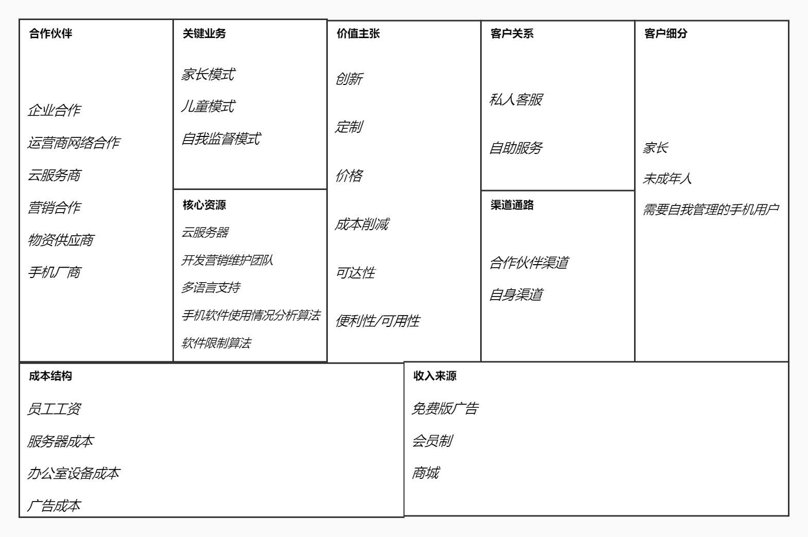 

 

#### 2.1.2 加分项

收入来源：免费版广告，收费版会员，收入来源灵活

客户细分：客户受众广

价值主张：正好符合这个时代许多人的需求

关键业务：业务多样，面对各种客户

成本结构：成本低廉，发展可持续

渠道通路：渠道丰富且多样

 

#### 2.1.3 减分项

核心资源：资源的需求较难预测

收入来源：收入来源未必稳定

合作伙伴：合作范围较小

价值主张：严格的产品自我要求带来巨大的开发压力

成本结构：成本效率较低

 

### 2.2 SWOT分析概览

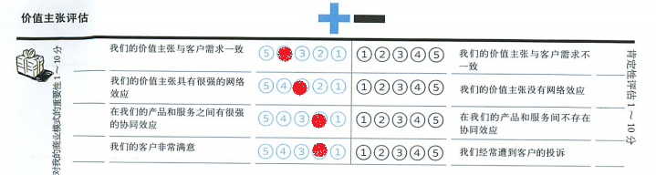

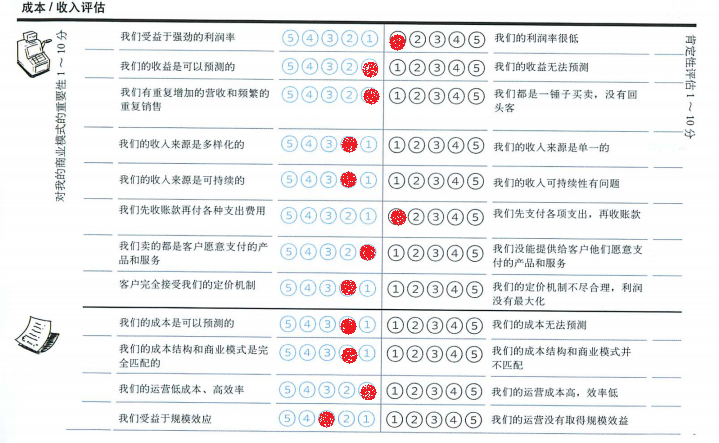 

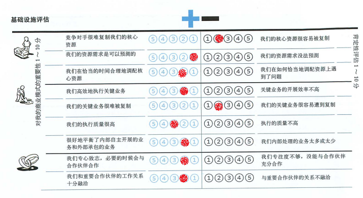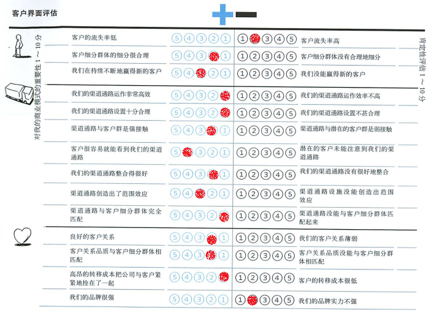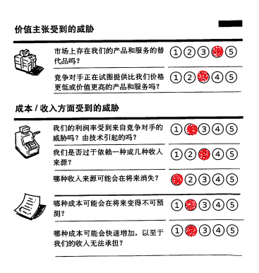

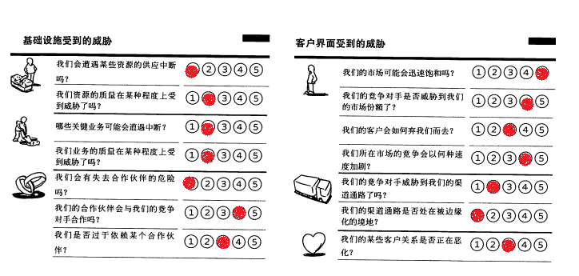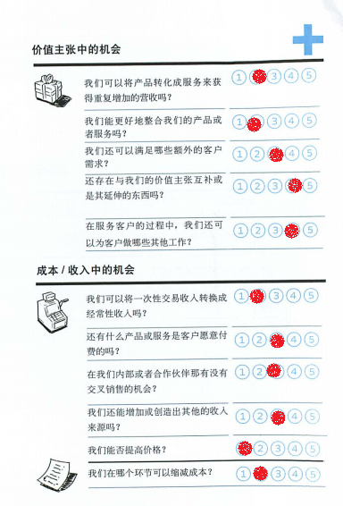

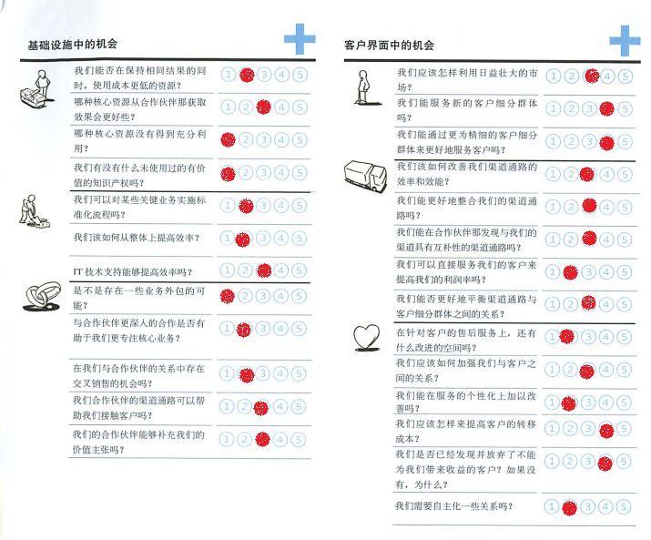 

### 2.3 S&W优势劣势分析

#### 2.3.1 价值主张分析

 

> ***调研&新闻 30***
>
> *根据哈斯乌拉在2015年发表的《青少年手机沉迷现状及对策研究》，当今社会，使用手机上网的网民占近九成，超过七成的青少年人拥有手机。*
>
> *——哈斯乌拉《青少年手机沉迷现状及对策研究》*

1. 随着手机和软件的发展与普及，越来越多的年轻人开始沉迷于手机，很多人意识到沉迷于手机是不好的，他们想戒掉手机，但却苦于有心无力，而我们的产品正是面对这些有心无力想要摆脱手机的人，因此我们的价值主张有很深的群众基础。在年轻人之外，还有大量青少年儿童沉迷手机无法自拔，每天熬夜玩手机，上课时精力不集中，考试成绩直线下滑，也许这些青少年儿童自己并没有意识到问题的严重性，但他们的家长却为之而担忧焦虑，家长们很希望有一个辅助手段来帮助自己的孩子摆脱手机，这部分家长就成为了我们未来的潜在客户。

> ***调研&新闻 31***
>
> *根据共青团中央维护青少年权益部、中国互联网络信息中心《2020年全国未成年人互联网使用情况研究报告》显示，62.5%的未成年人网民会经常在网上玩游戏，其中玩手机游戏的比例为56.4%，在工作日玩手机游戏日均超过两小时的达到13.2%。*
>
> *——共青团中央维护青少年权益部、中国互联网络信息中心《2020年全国未成年人互联网使用情况研究报告》*

2. 因此，引导人们摆脱沉迷手机刻不容缓，而这又在很大程度上契合了人民群众的普遍愿望，并且，如果一个用户对我们的产品满意，他很有可能会从摆脱手机沉迷的过程中获得巨大的成就感，因此他就会有很大的动力去向朋友推广我们的产品，因此，无论是客户满意度，需求一致性，协同效应，还是网络效应，我们的产品都具有很强的竞争力。

 

#### 2.3.2 成本收入分析

 

1. 我们的产品收入主要来源于广告，会员和商城，因此走的是薄利多销的道路，自然无法受益于强劲的利润率，但收益较为稳定，并且由于广告合作伙伴比较稳定，也具有一定的多样性和可持续性。
2. 但要实现线上商城，需要完整的供应链，快递系统和仓库系统，其实现成本将是巨大的，这可能会使一个初创企业陷入困境，所以我们决定至少在最初的阶段，放弃商城的实现，把时间和精力更多地投入到更加核心的功能上，这也有利于我们的产品顺利开发和维护。

> ***调研&新闻 32***
>
> *会员制具有更好地了解顾客的消费行为，进行更加针对性的营销和关怀，把会员作为最好的宣传媒体，提升客户忠诚度，加强互动交流，获得可观的会费收入等几大优点。*
>
> *——宋艳娇《会员制企业营销调查报告》*

3. 然而，会员制的收费方式决定了我们只能先付出一定的成本进行开发和维护，然后才会有会员费的收入，不过由于会员费并不是每个用户必须缴纳的，而是每个用户自己选择的结果，所以我们卖的都是客户愿意支付的产品和服务，同时客户也完全接受我们的定价机制。
4. 至于成本，基本也比较固定，就是开发成本和维护成本，可预测且与商业模式匹配，当用户规模逐渐上升时，我们的产品也会受益于规模效应，因为更多的用户就意味着更多可能存在的安利推荐，而更多的安利推荐也会进一步导致更多的用户，从而进入良性循环。

 

#### 2.3.3 基础设施分析

 

1. 然后，我们的核心资源不够机密，核心技术也不具备较高的技术壁垒，所以竞争对手很容易复制我们的核心资源，但我们业务相对简单，资源需求就是可以预测的，我们也会在恰当的时间合理地调配核心资源。
2. 关键业务的情况基本上和核心资源一样，我们的关键业务相对比较好执行，无论是质量还是效率都是很有竞争力的，同时还很好地平衡了内部自主开展的业务和外部承包的业务，但由于其简单性，导致关键业务很容易遭到复制。
3. 不过，我们主要的合作伙伴，应用商店和自媒体都是比较稳定的，尤其是B站，和它们的关系也比较融洽，在必要的时候会与合作伙伴合作。

> ***调研&新闻 33***
>
> *根据大线索挖掘平台的《大线索报道：哔哩哔哩（B站）运营分析报告》，B站早在2019年，APP端DAU就达到了0.23亿，APP端日均就达到了83分钟。*
>
> *——《大线索报道：哔哩哔哩（B站）运营分析报告》*

#### 2.3.4 客户界面分析

 

1. 客户的流失率是我们比较担心的问题，因为我们的产品对用户的黏性不高，如果出现同样定位的产品，客户就有可能因为价格优势而流失，但我们客户细分群体的细分还是很不错的，由于在用户中拥有良好的口碑，我们自信会持续不断地赢得新的用户。
2. 而宣传产品的渠道通路主要就是应用商店和自媒体，目前和我们合作的自媒体中最具有代表性的就是B站，我们可以在B站上买下恰饭视频up主的广告，从而达到宣传产品的目的，这个渠道通路合理又高效，而且和观众用户是强接触，在B站上看视频的用户很容易就能看到我们的恰饭视频，同时看到恰饭视频的观众很可能会将视频分享给自己的朋友，因此也创造出了一定的范围效应。

> ***调研&新闻 34***
>
> *“连接”这个词，是过去⼏年相当⽕热的⼀个概念，⼤型互联⽹公司如百度和腾讯，都提出了⾃⼰的连接主张，百度是“连接⼈与服务”，腾讯是“连接器”，就连奇⻁ 360 也提出了“万物互联”的⼝号。 互联⽹本身就是连接。*
>
> *——《互联⽹是连接成分还是连接主体？》*

3. 至于客户关系，我们比较有自信，因为我们坚守着自己的价值主张，客户关系品质和客户细分群体相匹配，分为想要限制孩子手机应用使用时长的家长，想要认真学习，避免沉迷网络的未成年人和想要自我约束，控制自己手机使用时长的成年人。
4. 同时，得益于良好的客服系统，我们也具有良好的客户关系，但是我们的品牌目前并不强势，而且目前用户的转移成本不够高，无法把公司和客户紧紧地拴在一起，这也会成为客户稳定存在的硬伤。

> ***调研&新闻 35***
>
> *"客户分类是根据客户的属性特征所进⾏的差异化区分。 客户分类的意义在于，通过分类不仅实现客户的统⼀有效识别，也能在⾯对不同类型的客户时快速做出统⼀的处理。”*
>
> *——《客户维护第⼀步——客户分类你做好了吗？》*

### 2.4 O&T机会威胁分析

#### 2.4.1 机会分析

 

 

1. 目前市场上并没有存在和我们产品定位完全相同的产品和服务，但定位相似的产品并不少，并且以后有可能出现定位完全相同的产品，同时由于缺少技术壁垒，竞争对手很有可能会和我们打价格战，通过提供比我们价格更低或价值更高的产品和服务来打败我们。

> ***调研&新闻 36***
>
> *“价格水平必须适应产品的定位。一种产品的市场是由愿意并有能力购买该产品的全体消费者组成。因此，企业在选择新产品的价格水平时一定要注意新产品在市场上的定位。”*
>
> *——沈国华《新产品价格的制定》*

2. 由于相似定位的高度竞争，如果打起价格战，我们的利润率存在受到来着竞争对手威胁的可能，同时我们可能过于依赖广告和会员的收入来源，不过这两种收入来源在可见的未来都是不会消失的，而如果用户数量过快增加，有可能导致我们的服务器承担不了，但这种可能性微乎其微。

> ***调研&新闻 37***
>
> *“许多企业在建设电⼦商务时，并没有进行成本/效益分析，糊⾥糊涂地上马电⼦商 务，⼜⽆声⽆息地收场。根据美国有关机构对汽⻋、⻝品、化⼯等⾏业所做 的调查，结果显示只有 13%的公司在实施电⼦商务之前做过专⻔的成本分析， 另有 27%的公司在实施电⼦商务之前做过专⻔的效益分析。*
>
> *——《电子商务的成本——效益构成与分析》*

3. 至于基础设施，我们可能面临的威胁较小，因为我们的产品只依赖于互联网和手机，硬件并不缺乏，在可见的未来应该不会遇到供应中断和业务中断，服务质量也没有问题，而合作伙伴虽然和我们关系很稳定，但并不能排除合作伙伴与竞争对手的合作，而且这种合作很可能会发生。
4. 由于技术壁垒较小，我们的市场很可能会迅速饱和，而竞争对手也可能会很多，并威胁到我们的市场份额，可以想见竞争也会越来越白热化，不过渠道通路应该不会受到竞争对手的影响，同时在短期来看，应用商店和以B站为首的自媒体都不太可能被边缘化，而是应该持续具有巨大的影响力和竞争力。 

 

#### 2.4.2 威胁分析

 

 

1. 广告费和会员费比较固定，不太可能获得重复增加的营收，不过由于我们的价值主张是放下手机，努力学习，所以我们在后续也可以加入更多关于学习的服务，比如自习室等，自习室里可以让天南海北的同学们一起学习，同时同学们可以自愿地缴纳报名费进入学习小组，如果按时完成学习任务，则可以拿回报名费，如果坚持失败，报名费会在扣除手续费后平分给坚持成功的同学。

> ***调研&新闻 38***
>
> *随着社会节奏的加快，⼿机、互联⽹在⽣活中的渗透，低头族越来越多，越来越多的⼈“患上”拖延症和⼿机依赖症，也有越来越多的⼈需要提⾼⾃⼰的时间利⽤效率，充分在有限的时间⾥集中注意⼒。时间管理软件应运⽽⽣，“forest”“番茄ToDo”等相继出现。*
>
> *——⼈⼈都是产品经理《产品分析：番茄ToDo — 我的时间，由你来掌握》* 

2. 至于会员的价格，最好不要提高，这很可能会影响产品的口碑和竞争力，因为竞争对手也很有可能降低价格，这会使我们的产品陷入不利的境地，而缩减成本主要可以在开发，因为只有在产品刚开始的时候需要大量的开发成本，到了运营的后期，成本结构主要就是运营成本，开发成本就可以被缩减掉。
3. 目前来看，在保持相同结果的同时，使用成本更低的资源是不太现实的，我们也并没有未使用过的有价值的知识产权，所以在核心资源的开发方面是我们产品的弱项。
4. 关于业务外包，我们目前并没有更多的计划，在与合作伙伴的关系中不存在交叉销售的机会，但是合作伙伴的渠道通路，比如B站的强大影响力，有可能会帮助我们接触到更多的客户，也可能在合作和发展的过程中补充我们的价值主张。

> ***调研&新闻 39***
>
> *“切换成本让你可以降低你的⽤户获取成本，让你可以⻓期的从你的客户身上挤取经常性收益，同时它还是你在竞争这个战场中的护城河。”*
>
> *——《锁定客户的六⼤策略：教你如何将切换成本嵌⼊商业模式》* 

5. 随着市场的逐渐壮大，我们有可能会在运营的过程中获得启发，发现新的客户细分群体，通过更为精细的客户细分群体来更好地服务客户，同时可以加大在B站上购买恰饭视频广告的力度，不断吸引越来越多的用户，然后提高售后服务的质量，打造更好的口碑，尽量提高客户的转移成本。可以预见，也会有大量选择不开通会员的用户，但这些用户也并非完全不能带来收益，广告也是收入来源的一部分。

## 3. 蓝海战略

**对成本影响方面：**

作为初创企业，我们的资金必定十分有限，好钢要用到刀刃上，无数资金链断裂的企业就是前车之鉴，减少成本，提高利润，不仅能使得我们的企业更容易撑过初创的资金紧张时期，还能提高企业在投资人眼中的价值，进而获取更多的投资，因此我们认为应该优先从成本影响方向进行探究

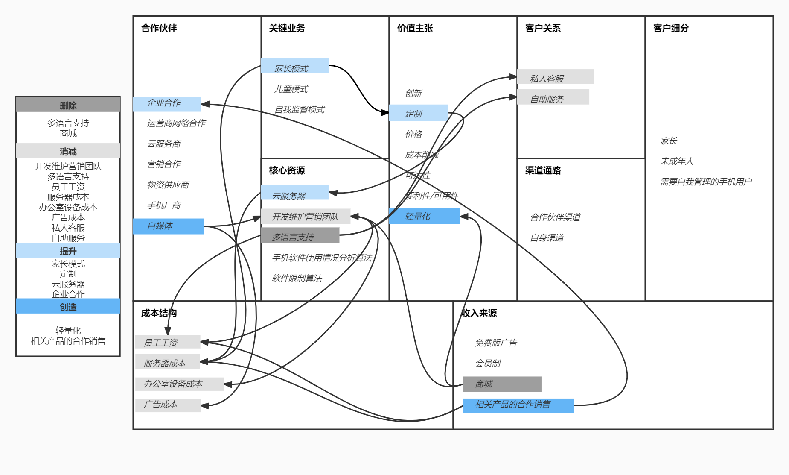

**解析：**

1. 要实现线上**商城**，需要一套完整的供应链以及销售渠道，这对于一个初创企业是难以承受的，因此我们认为，取消商城功能，转而和已有相关基础的企业进行**合作销售**才是共赢之道，如此不仅可以降低开发周期和维护难度，**减少员工成本**，还可以减少云服务器的负载，进而**减少服务器成本**，同时，商城功能的削减还有助于使软件的UI更简洁，缩减软件的大小，实现软件的**轻量化**

2. 我们还对**家长模式**的视频监督功能进行了一定的改进，改进后，家长可以选择获得孩子手机屏幕的实时截屏，十秒钟的GIF图，抑或是同步视频，多种选择扩大了家长的**定制**空间，也降低了云服务器的负载压力，有助于**减少服务器成本**

3. 介于该类软件属于功能性软件，社交性并不强，且软件更偏向于单机运行，在软件开发完成，公司稳定运行后，不会再需要高强度的更新内容和营销宣传，因此我们认为可以在软件上线完成后，**缩减开发团队的规模**，同时在营销的黄金时间结束后，**减少营销团队规格**，以节约**员工成本**和**办公室设备成本**
4. 在企业运行初期，我们没有足够的力量进入陌生的国外市场，因此**多语言支持**暂时并不需要，取消多语言支持后，可以随之取消针对其他语言的**私人客服**和**自助服务**，有助于减少**员工成本**
5. 为了减少**广告成本**，我们可以使用**自媒体**代替传统媒体进行宣传，通过炒作热点，制造网红，雇佣大V等方法，可以使用较少的成本实现原本的宣传效果

## 4. 更新过的商业模式画布

画布在“合作伙伴”部分增加了“自媒体”，在“核心资源”部分削减了“多语言支持”，在“价值主张”部分增加了“轻量化”，在“收入来源”部分削减了“商城”并增加了“相关产品的合作销售”，其余部分尽皆如常

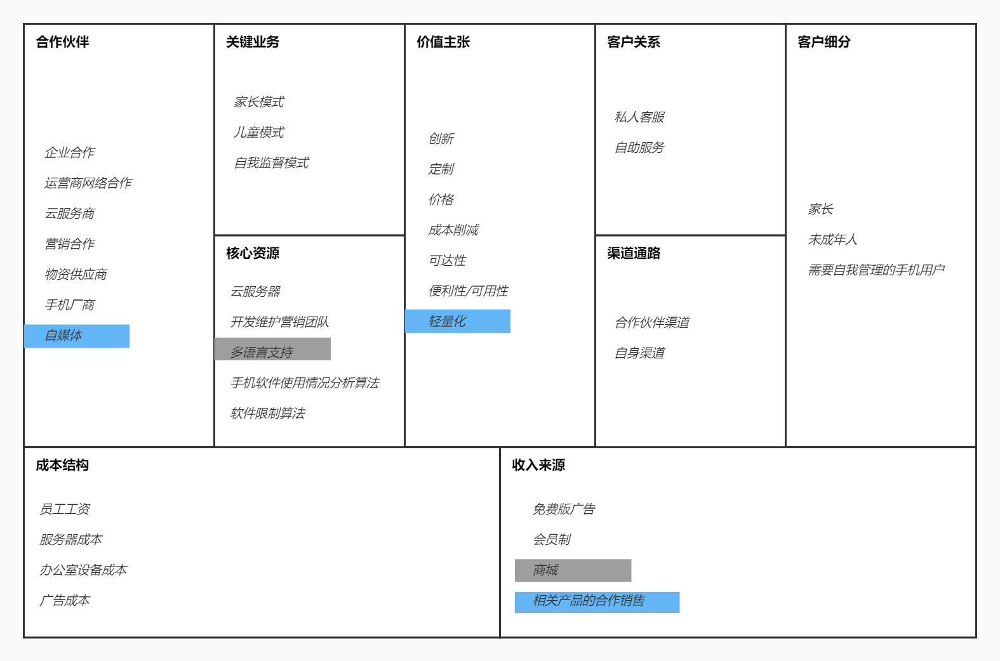

灰色标注为删除部分，蓝色标注为新增部分

**新加入或修改过的模块要点与模块之间的依赖关系详见蓝海战略部分**

### 4.1 关键业务

家长模式：

针对家长端，家长端可以对儿童端应用软件进行相应约束限制。

a. 限制儿童端软件的使用时长：家长端可以查看到所绑定儿童端各个应用软件，并可以对应用软件施加一个使用限制，即规定一个时间内允许软件正常工作，超过规定时间后儿童端的该软件无法正常工作（如会有本软件的弹窗跳出进行强行屏蔽或提高延迟波动进行软性屏蔽）

b. 实时监控（进阶版--需付费）：家长端可远程实时监控儿童端屏幕信息以及儿童端各软件的使用信息，并会对数据进行整合分析生成报告提供给家长端，**对于实时监控，家长可以根据需求选择获得孩子手机屏幕的实时截屏，十秒钟的GIF图，抑或是同步视频，同时还可以设置某些时间点的自动记录，自动记录的屏幕信息会保存在每天的分析报告中供家长端参考**

儿童模式：

针对儿童端，受到绑定的家长端软件控制，并与家长端软件保持联系。

a. 反馈机制：当儿童端本软件出现异常时（如被强行关闭或异常停止工作），儿童端的软件会自动发送一个反馈信号到家长端告知家长本软件的非正常退出情况。

b. 模式保护机制：儿童端无法自行切换为其他模式，切换模式需要获得家长端的验证码

c. 监控机制（进阶版--需付费）：儿童端软件的使用信息和屏幕信息会实时传输到云端存储，方便家长端查看儿童端软件使用情况

自我监督模式：

在单部手机里的自我监督模式，无家长端、儿童端区分，个人模式，适用于自我约束或家长将自己的手机给儿童玩的情况。

a. 锁定软件：可以自行为手机里的其他软件上锁并设定一个锁定时长（即在规定时间内手机内锁定的软件无法打开。

b. 密码认证解锁：每次使用本软件锁定其他软件时会需要用户自行设定一个解除密码，若出现意外情况需要及时使用已被锁定软件时只需要输入密码进行认证即可对软件进行解锁。

c. 软件时长限制与统计：可以设定某软件每日或每周使用时长限制，后台统计该软件每日或每周的使用情况，软件使用限制可以是短时的，也可以是长时的。并会分别在一日或一周的规定时间点生成报告反馈用户。

d. 奖励机制：当用户在规定时间内未使用密码认证解锁软件或是在长期过程中对于手机内软件使用没有超时记录则会达成相应成就，成就会自动保存到该用户数据中。用户可在朋友圈中分享自己获得的成就。

### 4.2 客户细分

想要限制孩子手机应用使用时长的家长。

想要认真学习，避免沉迷网络的未成年人。

想要自我约束，控制自己手机使用时长的成年人。

### 4.3 价值主张

创新：

目前市场上还没有定位完全一致的手机应用，本应用不仅可以自定义地限制手机上每一个应用的使用时长，还可以根据应用使用情况生成分析报告，让用户对自己的时间分配情况有更好的了解，同时，本应用还拥有独特的未成年人-家长绑定系统，家长可以设置未成年人手机应用的使用限额，并且可以付费来实时观察未成年人的手机使用，在本应用异常关闭时，会向已绑定的家长端应用发起提醒，以此避免应用因被关闭而失去效用，这样可以方便家长更加高效和便利地管理孩子的手机使用。

定制：

拥有自定义模式，应用白名单等具有定制特点的功能，用户可以根据自身情况自由设置部分参数，可以满足用户需求的高自由度和多样性。**在更新的画布中，家长还可以对视频监控的方式进行个性化定制，这进一步扩大了定制化的范围**

价格：普通用户在不付费的情况下也能拥有较舒适的使用体验，VIP用户在适当付费之后将能够使用多种拓展功能。

成本削减：

本应用可以帮助用户屏蔽无关应用并分析自己的时间使用情况，以助力减少用户浪费在无关应用上的时间成本，同时，本应用的未成年人-家长绑定系统可以大大降低家长在防止孩子沉迷游戏上所需要付出的时间与精力。

可达性：

本产品的价值主张明确，积极响应国家号召和家长需求，可以较为容易地通过广告和推送抵达更多的潜在用户，具有相当广泛的可达用户。

便利性/可用性：

本产品使得用户能够更加便捷地获取自己的手机使用情况，以进行针对性的调整，同时方便家长更高效地管理孩子的手机使用

**轻量化：**

**在更新后的画布中，我们删除了繁杂的商场功能，减轻了软件的体量，同时使得软件的UI更加简洁，可以为用户提供轻量化的使用体验**

### 4.4 渠道通路

合作伙伴渠道

a. 知名度 

​	i. 可以通过与各大应用商店的合作与宣传，提升自身知名度。

​	ii. 可以和手机平板厂商合作，作为该厂产品的预装App，可以有效的提高我们产品的流量，增强知名度。

​	iii. 可以和学校合作，在比如统一配备的学习平板上安装。

​	**iv. 可以和自媒体合作进行产品宣传。**

b. 购买：与各大应用商店合作，提供专属优惠，学校可以以优惠价格取得团体专属进阶功能使用权

自身渠道

a. 知名度

​	i. 制作官方网站，方便用户更好的了解我们，并且潜在用户在浏览到我们的网站时可以提高知名度。

​	ii. 在公司进入正轨后，特殊时段可以提供一定程度的免费服务，增强影响力和知名度。

b. 评价：通过问卷、问题反馈、在线客服等反馈机制让用户对产品功能和价值主张进行评估。

c. 购买：普通用户在我们的官方网站上或者软件内可以购买到VIP服务。

d. 传递：通过使用手册及操作引导的形式让用户明确产品的价值主张。

e. 售后：有智能客服和在线人工客服，向客户提供售后支持。

### 4.5 客户关系

私人客服：

有在线人工客服，可以和客户进行交流并在销售的过程中以及购买完成之后提供相应的帮助。 **在更新后的画布中，我们只提供中文的私人客服，不再提供多语言的客服服务**

自助服务：

自助客服具有导航系统，用户可以根据自己遇到的问题查阅已有的常见问题条目，以解决较为常见的问题。 **在更新后的画布中，我们只提供中文的自助服务，不再提供多语言的自助服务**

### 4.6 收入来源

免费版：

植入（相关）广告，可以通过收取广告费盈利。

会员制：

充值成为VIP用户后，开放更多功能，并取消广告，且VIP用户在商城消费时享有一定折扣，可以通过收取会员费盈利。

~~商城：~~

~~应用中具有商城模块，可以通过商城交易收取平台费用盈利。~~

**在更新后的画布中，该功能已被取消**

**相关产品的合作销售：**

**为了替代商城的功能，我们决定和已有相关经验的企业进行合作，借用他们的供应链和销售渠道共同销售产品**

### 4.7 核心资源

云服务器：

初期在用户量较少时只需低配置云服务器来维持运行以减少成本。在后期业务增长时，可以通过增加云服务器数量来避免资源耗尽问题。**在更新后的画布中，视频监督功能的优化和商城功能的取消大大降低了云服务器的负载，我们可以使用更少的云服务器达成原来的目的**

开发营销维护团队：

软件开发过程中需要高效的开发团队保证软件开发任务顺利完成。在软件发布后需要专业营销团队对软件进行广告宣传，并且需要一个维护团队来保证软件的正常运行。**在更新后的画布中，我们决定在软件平稳运行及营销的黄金时间结束后对开发和营销团队进行削减，以减少员工成本**

~~多语言支持：~~

~~软件支持多种语言，使软件变得国际化，让应用能够走出国门，使得国内外用户均可使用。~~

**由于企业初创，无力进入国外市场竞争，因此我们决定暂时取消多语言支持**

软件使用情况分析算法：

根据软件使用时段，时长，频率等信息分析用户使用情况并结合多学科理论生成分析报告的算法。

软件限制算法：

一套对于手机软件使用进行硬性限制的算法，即让限定的软件无法正常运转。

### 4.8 重要合作

企业合作：

我们会和有相关产品销售经验的企业进行合作，借用其供应链和销售渠道进行产品销售

运营商网络合作：

软件需要向电信网络投入且这是一个较为长期的过程，与网络运营商合作可以制定更清晰的产业发展计划，制定阶段性、透明的政策。协调价值链之间的利益关系从而调动各个环节的积极性。

云服务商：

该软件在开发初期需要在服务器中存储相关文件，在应用运行过程中的视频和下载包需要存储到云服务器上来为用户获得更好的体验。随着用户数量的增长也会需要更多的云服务器作为支撑，将用户数据存到云端既可以节省用户存储空间，又可以保证数据的安全性。

营销合作：

需要与其他相关企业进行合作，通过捆绑宣传来提高软件的知名度。

物资供应商：

软件企业中的员工在进行开发及调试工作时需要一定的平台基础，与物资供应商合作可以保障软件开发人员的工作环境质量。

手机平板厂商：

该软件可以与部分手机平板厂商合作，在旗下产品上预装，扩张用户量。

**自媒体：**

**我们可以与自媒体如微博大V，B站知名UP主等进行合作，在不影响宣传效果的基础上花费较少的广告费用进行宣传**

### 4.9 成本结构

员工工资：

软件在开发过程中所需的开发人员的薪资以及后期维护过程时维护人员的薪资。

**在更新后的画布中，我们通过缩减开发营销团队，取消多余功能等方式减少了员工成本**

服务器成本：在软件开发初期，需要使用已有的云服务器平台以节省成本、扩大存储空间。在应用运行中需要对视频等文件进行存储，也需要云服务器资源保证软件的正常运转。

**在更新后的商业画布中，我们通过视频监督方式改良，取消多余功能等方式减少了服务器成本**

办公室设备成本：

软件里设有私人客服，且后期需要维护人员持续提供服务，因此需要一定的成本为职工的办公设备进行配置和维护。

**由于开发营销团队的削减，办公室设备成本也会随之减少**

广告成本：

在软件发布初期需要通过大量广告宣传来提高知名度，从而扩展用户数量，需要一定的广告运营成本。

**通过自媒体宣传的方式，可以部分降低我们的广告成本**

