# Healing需求规格说明

## 小组成员

| 组员   | 学号      |
| ------ | --------- |
| 任毅   | 191250116 |
| 王思尧 | 191250137 |
| 王庭泰 | 191250139 |
| 王嘉玮 | 191250136 |

## 度量数值

在分析模型章节中，共对4个场景进行建模，共计模型12个，同时使用OCL语⾔来增强模型的表达力并简化模型

顺利完成了软件需求规格说明文档，功能需求为11个

## 文档简介

本文档为我们小组为Healing系统所做的需求规格说明文档，记录了系统的功能描述及需求。在有了项目需求获取文档的完成经验后，我们将整个⽂档的每⼀个章节竖向切分为四个模块，四名组员并行工作。文档包括两个章节，分别是分析模型和软件需求规格说明文档

## 目录

[TOC]

## 分析模型

### 1. VIP服务购买

####  领域模型

下图描述了在用例VIP服务购买中，各个类之间的关系

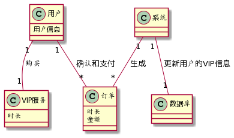

图中主要包括了用户，VIP服务，订单，系统，数据库这几个类

用户与VIP服务是购买关系；用户与订单是确认和支付的关系；订单由系统生成；系统更新数据库中用户的VIP信息

#### 顺序图

下图展示了用户购买VIP服务的顺序流程

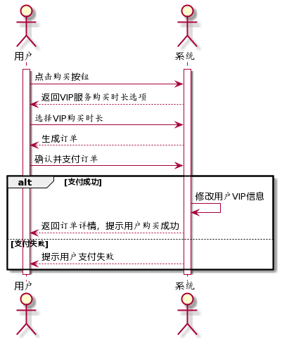

主要流程为：用户点击购买按钮，系统返回VIP服务购买时长选项，用户选择VIP购买时长，系统生成订单，用户确认并支付订单，如果支付成功，系统修改数据库中用户VIP信息并返回订单信息，提示用户购买成功，如果用户支付失败，则系统提醒用户支付失败

#### 状态图

下图展示了用户购买VIP服务的状态转换

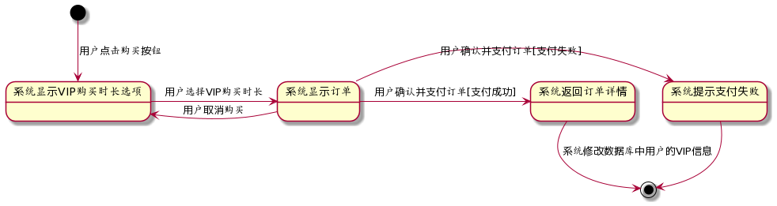

状态转换主要为用户点击，由原始状态进入显示VIP购买时长选项状态，用户选择VIP时长后进入显示订单状态，如果用户取消购买，则会回到显示VIP购买时长选项状态，而如果用户确认并支付订单，支付成功时转换到系统返回订单详情状态，而支付失败时转换到系统提示支付失败状态

### 2. 日程和提醒安排

#### 领域模型

该图展示了日程和提醒安排功能中各个类之间的关系：

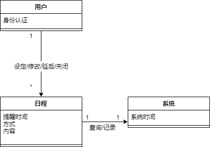

图中主要包括了用户，日程，系统这几个类。

用户可以设定，修改，延后或关闭日程提醒功能，日程会向系统查询系统时间，系统会记录用户没有及时按下关闭按钮的情况。

#### 顺序图

该图展示了用户进行日程和提醒安排的顺序流程图：

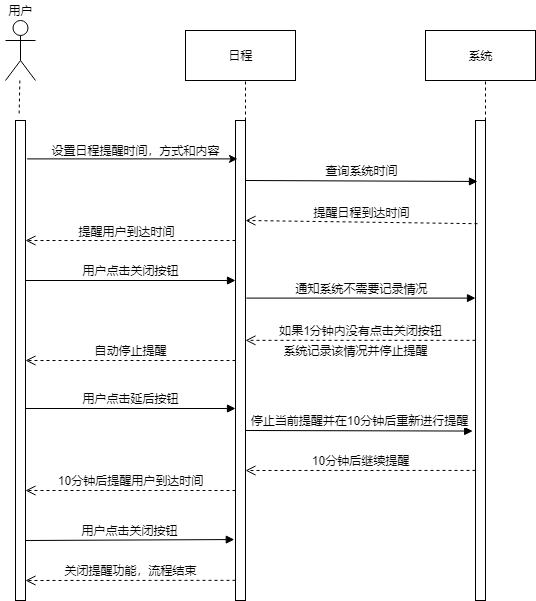

主要流程为：用户点击日程和提醒模块，设置日程提醒时间，方式和内容，日程向系统查询时间，时间到达后，系统通知日程，日程提醒用户，提醒后1分钟内，若用户按下关闭按钮，流程结束，否则系统记录该情况并停止提醒。用户点击延后按钮，可以停止当前提醒，并在10分钟后重新进行提醒。用户点击关闭按钮，可以关闭提醒功能，流程结束。

#### 状态图

该图展示了用户进行日程和提醒安排的状态转换：

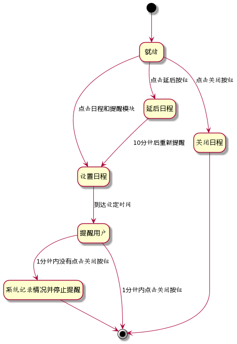

状态转换主要为点击日程和提醒模块，开始设置日程，点击延后按钮，10分钟后重新提醒，点击关闭按钮，关闭日程，到达设定时间后，提醒用户，若用户在1分钟内点击关闭按钮，则流程结束，否则系统记录情况并停止提醒。

### 3. 咨询专业人士

#### 领域模型

下图解释了用例咨询专业人士中的类关系：

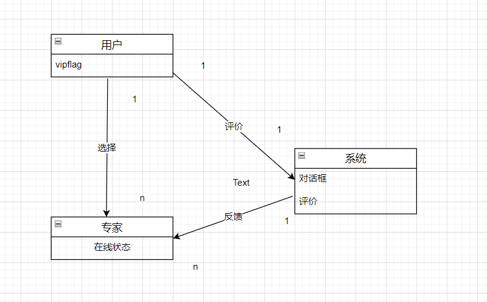

  该图主要包括了用户，系统和专家三个类。用户和专家之间主要是选择关系，

用户、专家和系统间主要是提供评价和接受反馈的关系

#### 顺序图

下图解释了用例咨询专业人士中的实体交互关系：

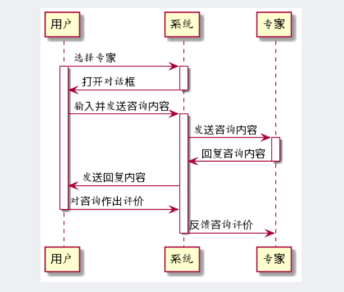

该图展示了用户咨询专业人士的整个流程。主要流程为用户选择自己想要咨询的专家，完成和专家间的咨询，最后给出对专家的评价和反馈。

#### 状态图

下图解释了用例咨询专业人士中所经过的过程和状态的转移：

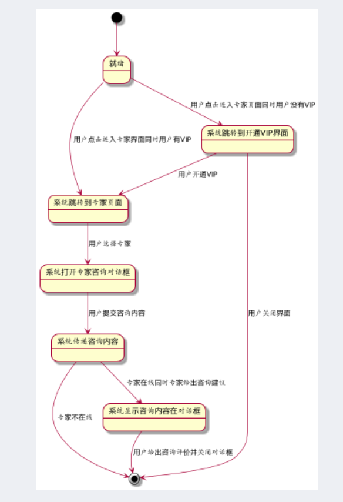

该图中，状态主要有图中显示的种类。主要状态的转换有系统提示用户开通VIP、系统打开对话框、系统获取并反馈咨询评价和内容。

### 4. 健康食品和产品购买

#### 领域模型

下图描述了有关健康食品和产品购买功能下，各个类之间的关系：

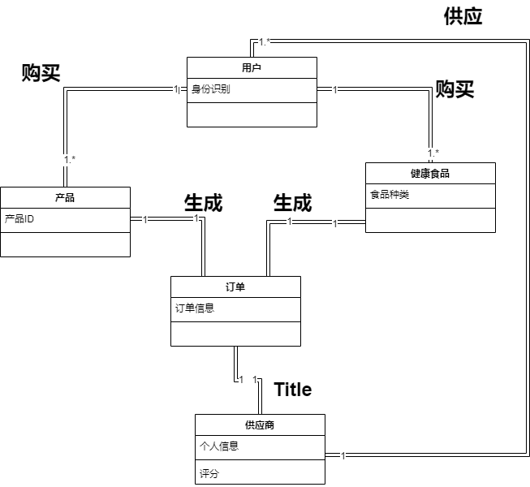

图中包含了用户，产品，健康食品，订单，供应商这位几个类。

用户与产品和健康食品是购买关系；产品和健康食品与订单时生成关系；订单与供应商是提供关系；供应商与用户是供应关系。

#### 顺序图

下图描述了用户在健康食品和产品购买过程中的实体交互顺序：

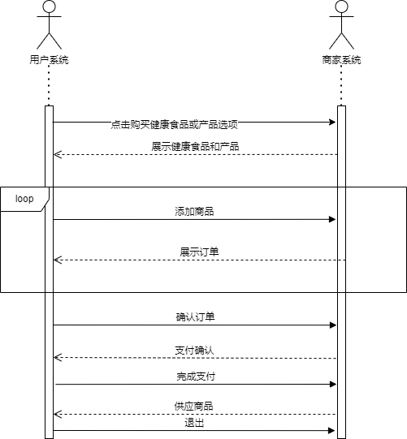

该图展示了用户购买商品的整个流程。首先用户点击购买健康食品和产品选型后系统会向用户展示可供购买的商品，用户可以在购物篮里反复添加、删除商品，系统会根据用户的操作展示当前购物篮信息并反复生成订单，用户确认订单后商家系统发出支付请求，用户完成支付后等待商家供应商品，最后由用户接收到商品确认退出。

#### 状态图

下图描述健康食品和产品购买过程中经历过的状态和转移：

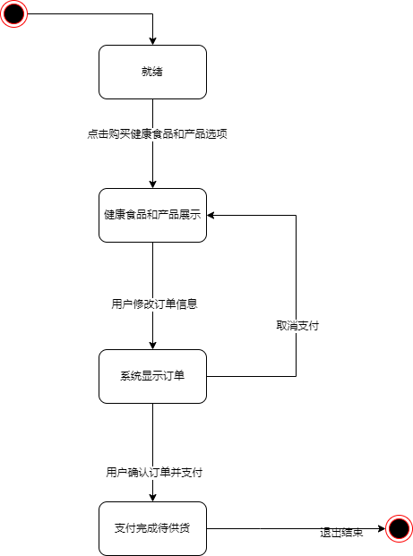

在该图中，状态主要由就绪，健康食品和产品展示，系统显示订单，支付完成待供货4种状态。就绪状态用来确认用户的具体信息保证用户身份的正确性、安全性。健康食品和产品展示为就绪态用户点击购买按钮后的跳转状态，在该状态下用户可以点击添加购买商品来跳转到系统显示的订单的状态，若在生成订单过程中用户取消支付则回到展示状态，若支付完成则跳转到支付完成待供货状态，任何状态环节时钟超时都会回到结束状态。

## 软件需求规格说明

### 1. 引言

#### 1.1 目的

​		本文档描述了Healing的功能需求和非功能需求，Healing是一个通过移动端的app给不同年龄、职业用户普及食品、运动等专业知识，带来健康生活的系统。后续展开开发实现与验证⼯作时，开发团队会以此⽂档为依据 

#### 1.2 范围

​	本文档要描述的是Healing的需求说明，预期中的功能包括为用户提供进行健康咨询的平台，营造一个包容家庭但不限于此的社区环境，让用户对自身健康水平和饮食习惯有深层次了解，该产品中用户可以直接购买需要的健康食品或者报价品。用户还可以进行每日健康打卡，发布帖子与其他用户进行交流。产品开发的目的是让用户在专家和其他用户、软件提供的健康知识的帮助下，可以提升生活品质，享受健康生活。

#### 1.3 定义、首字母缩写和缩略语

##### 1.3.1 定义

普通用户：讲提升自己健康水平作为使用软件的目的的平台用户

管理员：对平台内容进行审核以及管理销售产品状态的管理员

健康食品提供方：为平台提供健康食品的生产厂商

专业人员：为普通用户提供咨询服务，具有健康管理方面专业知识的用户

##### 1.3.2 首字母缩写

无

##### 1.3.3 缩略语

无

#### 1.4 参考文献

1. 《需求⼯程——软件建模与分析》

2. Healing系统需求获取⽂档

3. IEEE标准

#### 1.5 文档组织

​	由总体描述和详细需求描述构成，其中详细需求描述包括了对外接口需求、功能需求、约束、质量属性、其他需求

### 2. 总体描述

#### 2.1 产品前景

##### 2.1.1 背景与机遇

​		随着时代发展，科技不断进步，人们的生活环境变好，生活质量不断提升，但是人们的健康也开始出现隐患，但是又没有很好地途径解决类似问题，healing就在此背景下出现，旨在解决人们的生活条件和健康水平之间出现的矛盾

##### 2.1.2 业务需求

BR1：第一版应用之后的一年后，VIP用户人数占据总用户人数的25%

BR2：第一版应用之后的一年内，产生付费意愿的用户占据总用户人数的45%

BR3：系统投入使用一年半后，发表过文章或帖子的用户占总用户的40%，创作总量达到1000万

BR4：系统投入使用一年后，点赞数超过1000的创作文章，即高质量文章占创作文章总数的10%

#### 2.2 产品功能

Healing产品有如下功能

FE-1：健康生活方式推荐

FE-2：日程和提醒安排

FE-3：健康食谱获得

FE-4：运动计划设置

FE-5：健康食品和产品购买

FE-6：健康知识获取

FE-7：健康帖子查看，发表和回复

FE-8：专业人士咨询

#### 2.3 用户特征

##### 2.3.1 用户识别

使用该系统的用户有：用户，VIP用户，健康管理师等专业人员，保健食品提供方，线下合作人员，管理员

##### 2.3.2 用户描述

对所有用户的整合如下：

用户：这类用户不确定会长期使用软件

VIP用户：用户开通VIP代表对平台有较高的信任程度，希望坚持使用软件

健康管理师等专业人员：这类用户从平台牟利，很有可能坚持使用软件

保健食品提供方：这类用户为健康食品的来源

线下合作人员：这类用户提供线下健康指导

| 涉众           | 特征                                                         | 主要目标                                                     | 教育水平 | 主要关注点                       | 使用能力                   |
| -------------- | ------------------------------------------------------------ | ------------------------------------------------------------ | -------- | -------------------------------- | -------------------------- |
| 用户           | 用户可以浏览产品商城，查看产品信息，查看产品目标对象，选择想购买的产品。用户可以先将产品加入购物车，并向专业人员进行咨询。用户选择好购买的产品，可以在线上购买产品，新用户购买产品可以享受一定的折扣 | 能够通过购买使用保健产品或者食品提升自身身体素质，维持身体健康 | 不等     | 食品的安全程度以及食品价格       | 可能不能熟练的使用移动软件 |
| VIP用户        | 相较于普通用户，VIP用户可以使用VIP用户的优惠券，以更优惠的价格购买到产品，同时，该类用户可以通过线上咨询，向健康管理师等专业人员发起咨询了解产品适用人员、使用方式等，同时可以购买VIP用户才可以享有的专有产品 | 目标同普通用户                                               | 不等     | 食品的安全程度以及食品价格       | 可能不能熟练地使用移动软件 |
| 管理员         | 管理员负责对平台的食品进行质检处理，将用户的食品供应商以及专业人员间进行对接，及时的给用户或供应商间进行通知 | 进行不同涉众间的对接，并处理商品                             | 较高     | 保证产品有效的发出并保证供应质量 | 很高                       |
| 保健食品提供方 | 提供方给用户提供保健食品                                     | 销售食品给用户                                               | 不等     | 能够便利的提供食品               | 较高                       |
| 专业人员       | 提供给用户使用产品建议                                       | 提供建议给用户                                               | 较高     | 能够方便的提供建议               | 可能不能熟练地使用移动软件 |

​	

#### 2.4 约束

CON1. 系统基于移动端APP进⾏开发，后端使⽤Java

CON2. 代码提交前必须通过⻛格检查

CON3. 开发过程使⽤螺旋模型

#### 2.5 假设和依赖

AS-1：承载系统的服务器有较⾼的稳定性, 操作系统为 CentOS。 

AS-2：服务器所在的⽹络是安全的。1. 引言

### 3. 详细需求描述

#### 3.1 对外接口需求

##### 3.1.1 用户界面

系统中部分⽤户界⾯如下，因为甲⽅要求主要产品为⼿机客户端，因此只提供⼿机客户端界⾯。

part1: 用户登录界面

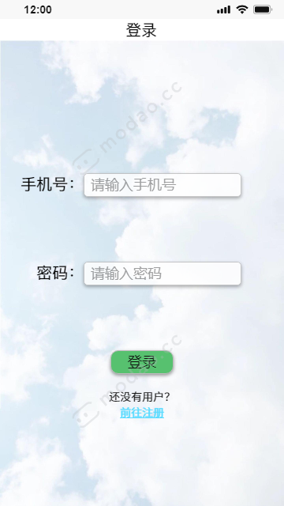

part2: 用户注册界面

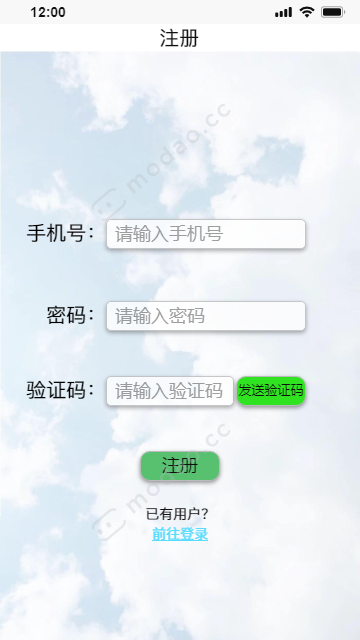

part3: 应用首页

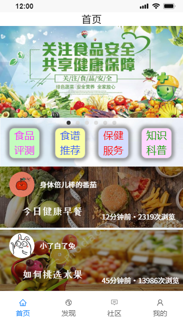

part4: 发现页面

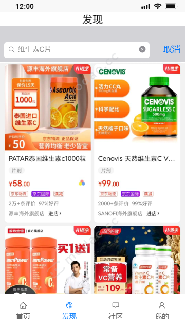

part5: 个人主页

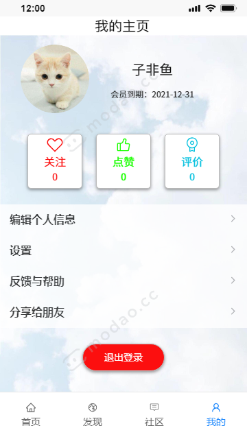

##### 3.1.2 硬件接口

系统采用分布式开发，部署在多台服务器上，数据库多实例应保障数据⼀致性。

##### 3.1.3 软件接口

平台与第三⽅⽀付平台之间通过⽹络双向通信，第三⽅⽀付平台⽤于⽀付，将⽤户⽀付成功与否的信息返给平台。 

##### 3.1.4 通信接口

移动app与后端使用基于json的REST API进行通信

#### 3.2 功能需求

##### 3.2.1 健康生活方式推荐

**特性描述**

本功能可以根据用户的身体信息和生活习惯，为用户推荐个性化的健康生活方式。

**刺激/响应序列**

刺激：点击健康生活模块按钮

响应：进入健康生活模块

刺激：输入用户的身体信息和作息习惯

响应：自动生成符合用户情况的健康生活方式

刺激：选择默认的预设

响应：生成泛用性高的生活方式推荐

**相关功能需求**

| Recommend.Start   | 进入健康生活模块               |
| ----------------- | ------------------------------ |
| Recommend.Input   | 输入身体信息和作息习惯         |
| Recommend.Default | 选择默认的预设                 |
| Recommend.Make    | 生成符合用户情况的健康生活方式 |

##### 3.2.2 日程和提醒安排

**特性描述**

本功能可以为用户设置日程提醒，用户可以设置提醒时间，方式和内容，也可以随时关闭提醒或延后提醒，并且提醒后1分钟内用户没有关闭的话，系统会记录该情况。

**刺激/响应序列**

刺激：点击日程和提醒模块

响应：进入日程和提醒模块

刺激：设置提醒时间，方式和内容

响应：日程设置成功

刺激：到达用户设置的时间

响应：系统按照提醒方式提醒并显示提醒内容或响应日程

刺激：点击关闭按钮

响应：关闭提醒功能，流程结束

刺激：点击延后按钮

响应：停止当前提醒并在10分钟后重新进行提醒

刺激：用户在1分钟内没有点击关闭按钮

响应：系统记录该情况并停止提醒

**相关功能需求**

| Alert.Start  | 进入日程和提醒模块                           |
| ------------ | -------------------------------------------- |
| Alert.Set    | 设置提醒时间，方式和内容                     |
| Alert.Close  | 关闭提醒功能，流程结束                       |
| Alert.Alert  | 系统按照提醒方式提醒并显示提醒内容或响应日程 |
| Alert.Delay  | 停止当前提醒并在10分钟后重新进行提醒         |
| Alert.Record | 系统记录该情况并停止提醒                     |

##### 3.2.3 健康食谱获得

**特性描述**

本功能可以根据用户的身体情况和生活习惯，以及用户对自己想要的食谱类型的筛选，自动选择合适的食谱显示给用户

**刺激/响应序列**

刺激：点击健康食谱按钮

响应：进入健康食谱模块

刺激：点击筛选按钮

响应：筛选想要的食谱类型

刺激：点击食谱生成按钮

响应：自动选择合适的食谱显示给用户

**相关功能需求**

| Recipe.Start   | 进入健康食谱模块         |
| -------------- | ------------------------ |
| Recipe.Select  | 筛选想要的食谱类型       |
| Recipe.Default | 没有进行筛选             |
| Recipe.Make    | 选择合适的食谱显示给用户 |

##### 3.2.4 运动计划设置

**特性描述**

本功能可以根据用户的身体情况和生活习惯，以及用户设置的运动时间，运动部位，运动量等数据，生成运动计划供用户参考，随后系统在预定时间进行提醒和运动情况记录

**刺激/响应序列**

刺激：点击运动计划按钮

响应：进入运动计划模块

刺激：点击设置数据按钮

响应：记录运动时间，运动部位，运动量等数据

刺激：点击运动计划生成按钮

响应：系统根据用户设置以及用户身体情况生成运动计划供用户参考

刺激：用户确定该计划

响应：系统开始按时执行计划

刺激：到达计划预定时间

响应：系统进行提醒和运动情况记录

刺激：用户调整计划

响应：按照用户调整后的计划重新生成计划并跳转

**相关功能需求**

| Plan.Start | 进入运动计划模块                                       |
| ---------- | ------------------------------------------------------ |
| Plan.Set   | 设置运动时间，运动部位，运动量等数据                   |
| Plan.Make  | 系统根据用户设置以及用户身体情况生成运动计划供用户参考 |
| Plan.Asure | 用户确定该计划                                         |
| Plan.Alert | 提醒用户并记录运动情况                                 |
| Plan.Reset | 按照用户调整后的计划重新生成计划并跳转                 |

##### 3.2.5 VIP服务购买

**特性描述**

用户可以通过本服务购买VIP，用户可以选择VIP服务购买时长，选择修改订单信息，也可以在流程中随时取消购买，结束流程

**刺激/响应序列**

刺激：点击VIP充值按钮

响应：进入VIP充值模块

刺激：选择VIP购买时长，确认并支付订单

响应：系统更新数据库中用户的VIP信息

刺激：用户取消购买

响应：流程结束

刺激：选择修改订单信息

响应：系统更新订单信息

**相关功能需求**

| VIP.Start   | 进入VIP充值模块           |
| ----------- | ------------------------- |
| VIP.Select  | 选择VIP购买时长           |
| VIP.Asure   | 确认订单                  |
| VIP.Pay     | 支付订单                  |
| VIP.Reflash | 更新数据库中用户的VIP信息 |
| VIP.Cancel  | 取消购买，结束流程        |
| VIP.Change  | 选择修改订单信息          |

##### 3.2.6 代币充值

**特性描述**

本功能可以允许用户充值代币以购买平台提供的商品，用户可以自由选择代币的充值数量和支付平台

**刺激/响应序列**

刺激：用户点击代币充值按钮

响应：系统跳转入代币充值页面

刺激：用户选择代币充值数量

响应：系统生成订单并显示

刺激：用户确认订单

响应：系统显示支付页面

刺激：用户支付订单

响应：系统修改用户代币信息并返回订单详情

刺激：用户取消购买

响应：系统退出充值页面

刺激：用户选择修改订单信息

响应：系统返回订单页面

**相关功能需求**

| System.open        | 系统打开页面     |
| ------------------ | ---------------- |
| System.createOrder | 系统生成订单     |
| System.update      | 系统更新用户信息 |
| System.close       | 系统关闭页面     |

##### 3.2.7 健康食品和产品购买

**特性描述**

本功能可以为用户提供经权威认证的健康食品和产品，用户可以使用代币购买我们的产品，产品会由快递寄送到用户手中

**刺激/响应序列**

刺激：用户点击健康食品和产品模块

响应：系统跳转入健康食品和产品购买页面

刺激：用户选择需要购买的产品

响应：系统提示用户填写收货地址

刺激：用户填写收货地址

响应：系统生成订单

刺激：用户确认订单

响应：系统显示支付页面

刺激：用户支付订单

响应：系统通知厂家发货并返回给用户订单详情

刺激：用户选择了被下架的产品

响应：系统提示用户重新选择

刺激：用户填写了空的地址

响应：系统提醒用户填写收货地址或使用历史地址

刺激：用户取消订单

响应：系统撤销订单并退出购买界面

刺激：用户代币余额不足

响应：系统提示用户代币余额不足并条转入代币充值页面

**相关功能需求**

| System.open        | 系统跳转页面       |
| ------------------ | ------------------ |
| System.alert       | 系统对用户进行提醒 |
| System.createOrder | 系统生成订单       |
| System.close       | 系统关闭页面       |
| System.report      | 系统通知厂家发货   |

##### 3.2.8 健康知识获取

**特性描述**

本功能能够让用户在软件上获取需要的健康知识

**刺激/响应序列**

刺激：用户点击健康知识模块

响应：系统跳转入健康知识模块

刺激：用户取消浏览健康知识

响应：系统关闭健康知识页面

**相关功能需求**

| System.open  | 系统跳转页面 |
| ------------ | ------------ |
| System.close | 系统关闭页面 |

##### 3.2.9 查看和回复健康帖子

**特性描述**

本功能可以允许用户在软件的讨论板块查看和回复其中的健康知识帖子，其中回复帖子功能需要用户登录后才能使用

**刺激/响应序列**

刺激：用户点击某个帖子

响应：系统跳转入该帖子的具体内容界面

刺激：用户在评论框中输入文本并点击发表按钮

响应：系统生成验证码页面

刺激：用户输入正确的验证码并点击确定按钮

响应：系统关闭验证码页面，发布该评论并提醒用户评论发表成功

刺激：用户输入错误的验证码并点击确定按钮

响应：系统提示用户验证码输入错误并刷新验证码

刺激：用户访问的帖子被删除

响应：系统提示用户该帖子被删除并退出该帖子页面

**相关功能需求**

| System.open               | 系统跳转页面             |
| ------------------------- | ------------------------ |
| System.close              | 系统关闭页面             |
| System.createVerification | 系统生成验证码页面       |
| System.checkVerification  | 系统检验验证码输入正确性 |
| System.alert              | 系统对用户作出提醒       |
| System.addComment         | 系统在某个帖子下增加评论 |

##### 3.2.10 发表健康帖子

**特性描述**

本功能运行登录后且未被封禁的用户在软件讨论区中发表健康帖子

**刺激/响应序列**

刺激：用户点击发表按钮

响应：系统跳转入发表页面

刺激：用户填写帖子内容并点击发表按钮

响应：系统生成验证码页面

刺激：用户输入正确的验证码并点击确定按钮

响应：系统关闭验证码页面，发表该帖子并提醒用户帖子发表成功

刺激：用户输入错误的验证码并点击确定按钮

响应：系统提示用户验证码输入错误并刷新验证码

刺激：用户的帖子中没有输入文本或者文本长度过短

响应：系统提示用户输入文本过短

**相关功能需求**

| System.open               | 系统跳转页面             |
| ------------------------- | ------------------------ |
| System.close              | 系统关闭页面             |
| System.createVerification | 系统生成验证码页面       |
| System.checkVerification  | 系统检验验证码输入正确性 |
| System.addPost            | 系统添加帖子             |
| System.alert              | 系统对用户作出提醒       |

##### 3.2.11 咨询专业人士

**特性描述**

本功能为用户提供专家咨询服务，用户可以向专家咨询健康问题，专家在上线后会给用户答复

**刺激/响应序列**

刺激：用户点击专家咨询按钮

响应：系统跳转入专业咨询页面

刺激：用户选择某位专家并点击咨询按钮

响应：系统打开用户和该专家的聊天页面

刺激：用户输入咨询文本发送给专家

响应：系统提示专家回复信息

刺激：专家回复咨询信息

响应：系统提示用户获得了专家的回复

刺激：用户查看回复信息

响应：系统显示专家的回复信息

刺激：用户点击咨询完成按钮

响应：系统关闭咨询页面并要求用户对该次咨询进行评价

刺激：用户填写评价

响应：系统收集评价并反馈给专家

**相关功能需求**

| System.open         | 系统跳转页面       |
| ------------------- | ------------------ |
| System.close        | 系统关闭页面       |
| System.alert        | 系统对用户作出提醒 |
| System.send         | 系统向用户发送信息 |
| System.createAssess | 系统生成评价页面   |

#### 3.3 性能需求

| 性能   | ID   | 需求内容                                                   |
| ------ | ---- | ---------------------------------------------------------- |
| 速度   | PR1  | 所有的⽤户查询都必须在10秒内完成。                         |
|        | PR2  | 咨询内容、评价、反馈在1秒内发送                            |
|        | PR3  | 购买订单在2秒内发送                                        |
|        | PR4  | 发送帖子需要在1秒内响应                                    |
| 容量   | PR5  | 系统至少能存至少50万名用户                                 |
|        | PR6  | 系统至少能存储1万种商品                                    |
|        | PR6  | 系统至少能存储500万条评论                                  |
|        | PR7  | 系统至少能存储100万条健康tips                              |
| 吞吐量 | PR8  | 系统每秒能处理10万条⽤户的数据                             |
|        | PR9  | 系统每分钟应该能处理超过10万条请求                         |
| 负载   | PR10 | 系统在10万个用户同时使用app时能正常工作                    |
|        | PR11 | 系统允许5000名商户同时在线                                 |
| 实时性 | PR12 | 在收到任何请求后，0.1秒内响应                              |
|        | PR13 | 系统必须及时更新数据库，保证专家回复等内容的实时性和准确性 |

#### 3.4 约束

| ID   | 需求内容                                                     |
| ---- | ------------------------------------------------------------ |
| C1   | 系统每半年出现的服务中断次数不得超过2次                      |
| C2   | 系统的最⼤响应时间不得超过5s                                 |
| C3   | 系统要满⾜较⾼的安全性需求，包括不允许⽤户信息泄露、不允许题⽬资源被⾮法复制、VIP身份检测不能被⽹络攻击所绕开 |
| C4   | 系统需要允许资源可以永久扩展                                 |

#### 3.5 质量约束

| ID   | 特征     | 需求内容                                           |
| ---- | -------- | -------------------------------------------------- |
| QR1  | 功能性   | 系统满⾜⽤户所需要的所有需求，功能完备             |
| QR2  | 可移植性 | 系统为程序员定制，不需考虑可移植性                 |
| QR3  | 可维护性 | 系统易于维护，易于进⾏修改和缺陷剔除               |
| QR4  | 效率     | 系统处理专家建议、健康提醒等需求的效率⾼           |
| QR5  | 可靠性   | 系统在崩溃时能⾃动保存数据，确保数据不会丢失       |
| QR6  | 可用性   | 系统界⾯简洁明了，⽤户可以短时间了解⽹站的各项功能 |

#### 3.6 其他需求

| ID   | 需求内容                                      |
| ---- | --------------------------------------------- |
| 1    | 对系统现有的数据进⾏备份，定时保存            |
| 2    | 系统投⼊使⽤时，需要对管理员进⾏为期1天的培训 |

