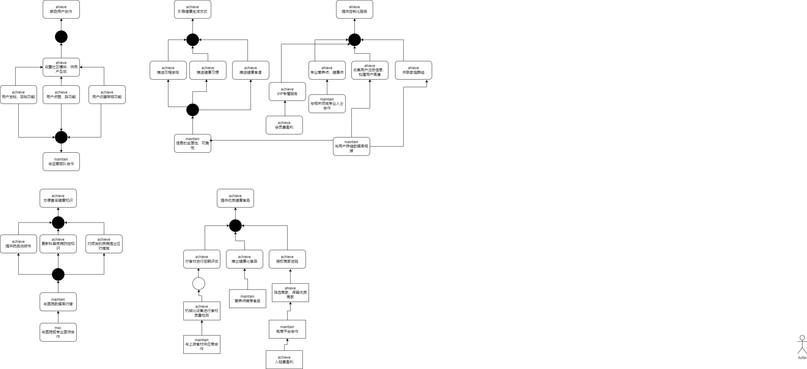
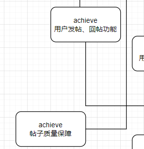
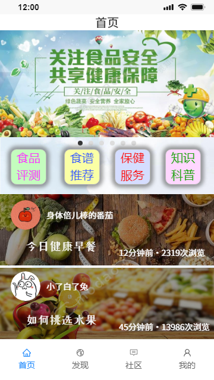
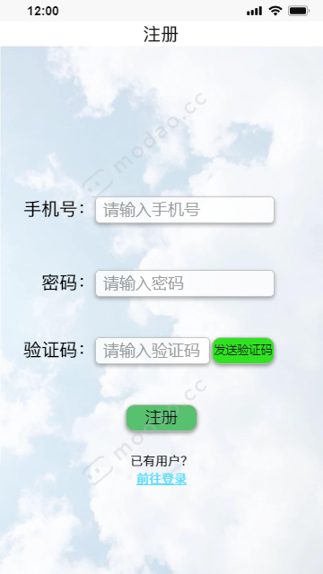
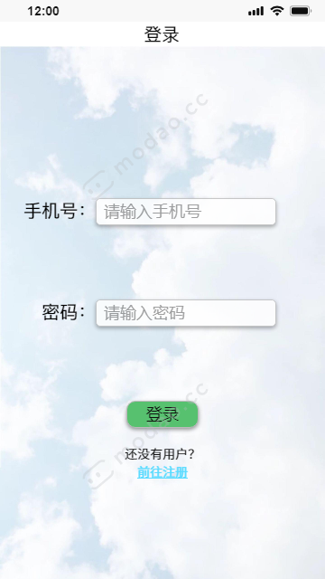

# Heal项目需求获取

## 小组成员

| 组员   | 学号      |
| ------ | --------- |
| 任毅   | 191250116 |
| 王思尧 | 191250137 |
| 王庭泰 | 191250139 |
| 王嘉玮 | 191250136 |

## 度量数值

面谈安排和正式面谈报告共4次，前景范围2次，用户需求获取2次

前景和范围文档覆盖的商业模式设计要素为35%，产品最独特功能的使用场景（用户-系统互动）的用例完整

## 文档简介

本文档为我们小组为Healing系统所做的需求获取结果文档，在对整体商业模式有了初步的了解后，将商业模式划分为四个模块，四名组员并行⼯作。文档包括五个章节， 分别是需求获取安排计划书、目标模型分析、项目前景与范围、获取过程中使用的面谈报告与原型物件、 基于用例/场景的用户需求文档

## 目录

[TOC]

## 1. 需求获取安排计划书

### 1.1 需求获取技术

#### 1.1.1 需求获取的目的

向⽤户确认⼀些已有的功能并完整地获取⽤户需求

#### 1.1.2 需求获取⾯临的挑战

由于⻆⾊不同，分析⼈员和⽤户对于软件的功能的理解存在偏差，⽤户可能会有⼀些⽆法实现的要求。由于问题存在复杂性，问题的有些⻆度也可能会考虑不到，或者考虑不周。对此，我们需要和⽤户进⾏深⼊的沟通。

### 1.2 需求获取安排计划 

#### 项⽬前景与范围阶段

第⼀轮⾯谈时间：2020-12-21

第⼀轮⾯谈⽬的：问题分析 

第⼆轮⾯谈时间：2020-12-23

第⼆轮⾯谈⽬的：确认⾼层解决⽅案 

#### ⽤户需求获取阶段 

第⼀轮⾯谈时间：2020-12-24

第⼀轮⾯谈⽬的：解决⽤户需求获取过程中的遇到的问题

第⼆轮⾯谈时间：2020-12-26

第⼆轮⾯谈⽬的：确定原型图

### 1.3 问题分析与确认

问题分析与确认，在需求获取结束之后，为防⽌遗漏情况的发⽣，要组织双⽅进⾏验证，并且评价，来确定问题是否⽐较完整，合乎⽤户需求。

## 2. 目标模型分析

### 2.1 高层目标

**1.引导健康生活方式**

通过智能推荐生活方式，为用户提供对应年龄、性别、健康因素的健康生活安排，引导用户一个属于自己的健康生活方式

**2.提供定制化服务**

根据用户注册时候的注册信息填写，为每一个用户建立一个用户画像，从而能根据用户画像向用户推送帖子。家庭群组的建立也可以让产品以家庭结构的方式个性化推荐饮食、活动等

**3.鼓励用户创作兴趣**

开设社区模块，让每一个用户都可以在社区中互动，提高用户对于创作的热情，鼓励用户进行创作

**4.方便查询健康知识**

药典，健康知识专题以及药备忘录为每一个用户提供一个快捷途径查询相关的健康知识

**5.提供优质健康食品**

定期对食材进行质量评估，升级传统意义上的食品，授权质量商家进驻，最大程度上保障了食品的安全性、健康性

### 2.2 目标精划

#### 2.2.1 图形化的模型

##### 整体模型

##### 引导健康生活方式

##### 提供定制化服务

##### 鼓励用户创作兴趣

##### 方便查询健康知识

##### 提供优质健康食材

#### 2.2.2 文字分析

##### 2.2.2.1 健康生活引导功能

推送日程安排：为了让用户能够养成健康的生活方式，需要为每一个用户提供对应当天的日程安排，日程安排主要用来规划用户的作息时间，保证用户的作息时间规律。作息安排与每一个用户一一对应，需要及时性获得用户信息来保证安排的合理性。

推送健康习惯：对于不同的职业的用户可能除了不同的作息时间以外，还有着不同的生活习惯，而健康的习惯也是一个健康生活方式中必不可少的一部分，在信息可靠的情况下，软件能够为每一个用户推送适合自己的健康习惯。帮助用户养成习惯。

推送健康食谱：推送健康食谱需要获得用户的更多信息输入，例如用户的身体健康情况，以及有无过敏食物等等。经过系统里的算法分析出每一个用户适合的食谱，并将食谱以每天的行程规划好后才向用户进行推送。

##### 2.2.2.2 定制化功能

收集用户信息，构建用户画像：收集用户信息的途径有两个方式，通过用户注册时候的信息填写，后期用户使用过程的信息更改。其中软件内部需要有一个算法分析每一个用户信息来为每一个用户都能构建出属于他的用户画像，通过用户画像能够提高各种信息推送的精准度。

关联家庭群组：建立家庭群组，使得软件不再局限于面向个体用户，而是以一个家庭结构方式去分析用户数据，让每一个家庭群组的用户能够互相查看家人的实时健康状况，及时发现健康隐患。也能以家庭为单位去推荐饮食、活动的安排。

##### 2.2.2.3 社区服务功能

社区模块：社区模块的功能主要是为了吸引用户，提高软件的知名度，增加用户在软件内的互动，使得软件功能不单一化。通过开设发帖、回帖、点踩、收藏和举报功能，可以激发每一个用户在社区中交流的热情，保证每一个帖子的质量，营造一个更为专业且具有个性化的生活社区。

##### 2.2.2.4 健康知识查询功能

提供药品说明书：为了方便用户在使用药物时候能够对症下药，并能够获得药物使用的信息，软件里面药典功能可供用户自行查看对应药物的详细使用情况，而药典的资料需要来自权威的医院机构，所以可以选择与医院关于药物的数据库对接获得每一个药物的具体使用情况，也可选择与专业医学领域的人士合作，目的都是为了完善药典，提高用户的满意度。

更新科普防控知识：不能仅仅是对症下药，对于一些思想较为落后的老年群体，需要为他们科普疾病防控知识，而且该功能模块需要保证易用性，即人人都能使用。当然知识发布也需要与医院以及相关医学人士合作。

对频发疾病提出应对措施：预防也是保证健康的一个关键点，对于每一个不同时期流行病、传染病的防范也是需要有对应的措施宣传。获得来自医院提供的建议后可以通过软件发布来为每一个用户提供对应病症的预防措施。

##### 2.2.2.5 提供优质健康食品

定期食材评估：定期进行食材评估，该部分需要保证自动化、机械化，使用机械化设备对食材进行质量评估检测一定程度上能保证食材的可靠性。对于食材的攻击方面需要与上有食材供应商进行合作，选择上有食材供应商也是保证食材安全可靠的关键环节。

推出传统健康化食品：对于一些用户来说可能无法在原有的传统食物上做出太大的转变，因此需要在那些所谓的传统食品上推出健康食品，这方面需要与营养师合作，保证在推出的食品方面满足个人的营养摄取需求以及每日的食用量。

授权商家进驻：对于商家进驻平台，需要经过严格筛选来保证优质商家，一方面是为了维护软件的口碑，另一方面也是为了保证优质的健康食品提供。商家进驻可以与电商合作，纳入更多优质商家进入，通过收取入驻费获取盈利。

### 2.3 目标冲突与协作

#### 2.3.1 图形化模型

##### 冲突

冲突一：鼓舞用户创作与质量帖子保障

在鼓舞用户创作的同时，难免就会出现更多的灌水帖，影响帖的质量。通过对优质贴给予相应的奖励可以避免劣质帖子的发布。

冲突二：建立家庭群组与个体VIP服务

家庭群组的建立，可以享受家庭结构的服务，但个体VIP用户无法在家庭群组中体现其VIP专属的服务优势。

##### 协作

协作一：上游食材提供商合作与电商平台合作

食材提供商也可以是平台中用于出售食品的电商，平台与用户均能从电商中获得相应的服务，平台在电商中购买食材相比用户应该获取相应的优惠。

协作二：用户反馈与用户画像的构建

获取用户注册时的信息是为用户第一次用户画像构建准备，后期在软件使用过程中通过用户画像为用户推送相应信息获取用户反馈，同时也是为了完善用户画像，构建出更为准确的用户画像来为用户提供更加个性化的服务。

协作三：与医院合作与健康生活的引导

健康生活引导中提供健康的食谱以及健康的生活习惯两个环节需要获得相应的知识资源，通过与医院合作的这一方面恰好可从专业的医学人士中获得信息。通过信息来完善算法分析，为用户提供适合用户个人的健康生活引导方式。

### 2.4 目标实现

##### 2.4.1 主题分配

##### 2.4.2 文字分析

运营商：负责完成软件设计领域中各个功能模块实现和维护

专业领域人士：负责提供专业领域内的知识

用户系统：负责获取个体的用户数据并针对每一个用户提供定制化的服务

客服系统：负责接受用户的反馈

数据库系统：负责存储每一个用户数据并与其他数据库进行对接

商家：负责向平台用户出售食品

供应商：负责为平台提供优质的食品原材料

##### 2.4.3 操作实现

①添加经理用于决策商家入驻以及商家筛选

②运营商不仅要负责软件开发的维护，也需要对机械设备进行检测维护

③用户系统与直接面向用户的目标功能相连

## 3. 项目的前景与范围

### 3.1 本次需求开发迭代的商业模式部分

我们结合了甲方的商业模式画布与面谈讨论结果，敲定了本次需求开发迭代的商业模式部分。我们估算本次设计可以覆盖到甲方35%的商业模式要点。

#### 具体说明

**（对应于甲方最终商业模式评估更新后的画布图）**

价值主张：覆盖到健康的生活方式引导，定制化服务，优质健康食品的提供

关键业务：覆盖到优质的健康食品的销售，软件开发，食品评测

客户细分：覆盖到优质创作者，普通用户，VIP用户，入驻平台的商家

客户关系：覆盖到私人服务，自助服务

渠道通路：未涉及

收入来源：覆盖到会员，资产销售，平台抽成

成本结构：覆盖到固定成本，范围经济，可变成本

核心资源：未覆盖

重要合作：覆盖到上流食品供应商

### 3.2 业务需求

#### 3.2.1 具体业务需求

BR1：第一版应用之后的一年后，VIP用户人数占据总用户人数的25%

BR2：第一版应用之后的一年内，产生付费意愿的用户占据总用户人数的45%

BR3：系统投入使用一年半后，发表过文章或帖子的用户占总用户的40%，创作总量达到1000万

BR4：系统投入使用一年后，点赞数超过1000的创作文章，即高质量文章占创作文章总数的10%

#### 3.2.2 提出业务需求的依据

注意：以下依据的问题标识的ID（P1、P2、P3、P4）分别具体对应具体业务需求的标号（BR1、BR2、BR3、BR4）

| 要素   | 内容                                                         |
| ------ | ------------------------------------------------------------ |
| ID     | P1                                                           |
| 提出者 | Healing的产品经理                                            |
| 关联者 | Healing的使用用户                                            |
| 问题   | 产品需要⼀定的盈利能⼒，会员费作为我们产品收⼊的⼀⼤块，⼀开始肯定是不会有太多的使⽤者会选择购买会员，我们就需要吸引更多的普通⽤户来购买我们的VIP服务，从⽽才能让我们的产品具有⻓久的⽣命⼒。 |
| 影响   | 如果我们产品的普通会员购买VIP服务的欲望不强烈，VIP⽤户数量少，会影响到我们产品的收⼊情况，甚⾄会影响到我们产品的活性和⽣命⼒。 |
| 目标   | BR1：第一版应用之后的一年后，VIP用户人数占据总用户人数的25%  |

| 要素   | 内容                                                         |
| ------ | ------------------------------------------------------------ |
| ID     | P2                                                           |
| 提出者 | Healing的产品经理                                            |
| 关联者 | Healing的使用用户、Healing外聘保健方面及医疗方面专业人士     |
| 问题   | 区别于软件VIP收取的会员费，Healing提供咨询服务、销售产品和代币服务，如何吸引用户专业人士入住平台以及吸引用户充值代币购买产品是获取这部分收入的关键。我们要尽力打造开放、有活力的软件平台，同时提供有保健特色食品、产品，并积极推出代币服务，吸引用户消费，提升软件收益。 |
| 影响   | 如果平台的咨询费用和分成比例不够诱人，就无法吸引专业人士入住平台，从而影响软件用户消费咨询。再者，用户如果没有花费购买产品，平台收入将会大打折扣，软件开发、维护、经营也会出现问题。 |
| 目标   | BR2：第一版应用之后的一年内，产生付费意愿的用户占据总用户人数的45%。 |

| 要素   | 内容                                                         |
| ------ | ------------------------------------------------------------ |
| ID     | P3                                                           |
| 提出者 | Healing的产品经理                                            |
| 关联者 | Healing的使用用户、Healing外聘保健方面及医疗方面专业人士     |
| 问题   | 用户发表文章或帖子代表对软件有较强的认同或者参与度，而如何吸引用户发表帖子、分享自己在健康方面的心得必定会成为软件引流、维持用户上期使用的关键，也是软件社区打造的关键。 |
| 影响   | 如果用户缺乏发表观点、文章、帖子的热情，软件的活力就会受到影响，如果不能根据用户需要分享给对应用户需要的帖子，用户必然会在其他平台上寻找对应方面的帖子，严重情况下会导致用户的流失。 |
| 目标   | BR3：系统投入使用一年半后，发表过文章或帖子的用户占总用户的40%，创作总量达到1000万。 |

| 要素   | 内容                                                         |
| ------ | ------------------------------------------------------------ |
| ID     | P4                                                           |
| 提出者 | Healing的产品经理                                            |
| 关联者 | Healing的使用用户、Healing外聘保健方面及医疗方面专业人士     |
| 问题   | 用户点赞帖子代表了对创作内容的认可，一个创作文章的点赞数代表一篇创作文章的优质与否，而Healing想提供优质的用户使用软件环境就需要有丰富的优质创作文章的出现。这里面专业的健康相关文章是用户点赞的前提，用户有点赞的热情是文章积累点赞数的关键。 |
| 影响   | 由于人们从众心理，这类高赞数目文章是吸引用户学习健康知识、坚持使用软件平台的关键。如果Healing类似软件平台缺乏高质量文章，每篇文章的点赞数有限，高赞数目文章比率低，用户就会缺乏相信文章内容的动力，从而更有可能最后放弃使用软件，影响软件寿命。 |
| 目标   | BR4：系统投入使用一年后，点赞数超过1000的创作文章，即高质量文章占创作文章总数的10%。 |

### 3.3 系统特性

#### 3.3.1 具体系统特性

SF1：系统提供详细的产品信息

SF2：系统提供VIP的购买、续费服务，提供代币购买服务

SF3：系统允许VIP用户选择对应的专业健康管理师进行健康咨询

SF4：系统为用户提供购买产品的平台

SF5：系统提供健康视频的观看平台

SF6：系统允许入驻的专业人员创作专业的健康管理文章

SF7：系统需要维护有大量帖子的社区平台

SF8：系统允许用户、专业人员在指定空间、社区发帖、发布文章

SF9：系统允许产品提供商修改自己的产品种类价格

SF9：系统有专门的数据库存放用户信息

SF10：系统提供健康食品、器具购买平台

SF11：系统需要足够大的存储空间维护健康视频等内容

SF12：系统提供平台展示健康知识并支持搜索

SF13：系统允许用户间加入同一个家庭频道中进行监督管理

SF14：系统允许用户邀请新用户并获取收益

#### 3.3.2 提出系统特性的依据

##### 3.3.2.1 解决方案

**首先，我们经过小组讨论和与客户面谈，对每一个明确一致的问题都确定了一致的解决方案：**

| 要素         | 内容                                                         |
| ------------ | ------------------------------------------------------------ |
| ID           | P1                                                           |
| 解决方案描述 | 系统为开通VIP服务的用户提供定制化服务；系统针对不同的会员功能，仅收取对应功能的会员费 |
| 业务优势     | 系统为开通VIP服务的用户提供定制化服务，用户可以得到专业的健康管理师提出的针对个人健康情况的健康生活建议；系统会根据VIP用户填写的个人饮食习惯，提供个性化对应商品的优惠券，吸引客户办理VIP；一次性开通长期VIP用户会得到对应的优惠，同时会赠送代币；连续包月用户和新用户可以享有很高的VIP折扣；新用户同时会获得几天的体验VIP时间。这样以来，用户开通VIP的意愿就会提升。 |
| 代价         | 需要大量的健康管理专业人员合作，让他们入住平台，同时优惠券战略可能会产生一定的损失。 |

| 要素         | 内容                                                         |
| ------------ | ------------------------------------------------------------ |
| ID           | P2                                                           |
| 解决方案描述 | 给新用户提供一定量的代币，新用户购买物品打折，首充二倍代币   |
| 业务优势     | 软件获取收益一定是开发软件的根本目的，提供少量代币有助于用户体验代币从而进行代币充值，新用户购买打折可以让用户产生“占便宜“，心理从而进行第一次消费，首充二倍代币可以让用户的第一次代币充值获得很好的体验。老人是充值困难群体，因此，适当的优惠可以让中年人带领老人进行充值消费。 |
| 代价         | 新用户优惠可能会导致前期收入受到影响。                       |

| 要素         | 内容                                                         |
| ------------ | ------------------------------------------------------------ |
| ID           | P3                                                           |
| 解决方案描述 | 发布帖子获得点击量或者点赞量，根据相应等级，平台提供优惠券或现金鼓励 |
| 业务优势     | 发布帖子可以获得优惠券，既可以拉动消费，同时提高了软件用户消费的热情；点击量和点赞量可以转化为现金鼓励，这个是效仿B站的模式，可以鼓励人们发布优质的帖子等内容。 |
| 代价         | 有一定的开销，鼓励模式需要不断更新                           |

| 要素         | 内容                                                         |
| ------------ | ------------------------------------------------------------ |
| ID           | P4                                                           |
| 解决方案描述 | 和优质创作者签订协议，点踩数量超过点赞数量很多的劣质文章会被清除，优质的推荐算法可以向用户展示优质的创作内容 |
| 业务优势     | 与优质创作者签订协议，知识产权仍然归创作者所有，但是作者一旦跳槽，创作的帖子将不能进一步获得收益；有效的清除劣质文章有助于提高优质文章的比率，根据推荐算法向用户推荐的更多的是优质的帖子，可以激发用户点赞的热情 |
| 代价         | 清除文章可能会导致用户的总帖子数目受到影响，与创作者签订协议会支出更多的创作方面的成本，推荐算法实现存在困难 |

##### 3.3.2.2 系统特性的确定

在选定解决方案后，我们进一步明确了该解决方案需要具备的功能特征，即系统特性：

| 系统特性编号 | 针对的问题 |
| ------------ | ---------- |
| SF1          | P2         |
| SF2          | P1,P2      |
| SF3          | P1,P2      |
| SF4          | P2         |
| SF6          | P3,P4      |
| SF7          | P3         |
| SF8          | P3         |
| SF10         | P2         |
| SF11         | P2         |
| SF14         | P2,P3      |

### 3.4 系统用例图

### 3.5 假设、依赖与限制

#### 3.5.1 假设

| ID   | 假设内容                                                   |
| ---- | ---------------------------------------------------------- |
| AS—1 | 用户愿意在使用软件后提供反馈                               |
| AS—2 | 用户愿意点击浏览软件的推送                                 |
| AS—3 | 健康管理师等专业人员愿意加入软件系统并接受合同自觉进行创作 |
| AS—4 | 保健产品供应商愿意与我们合作供应产品并能保证产品质量       |
| AS—5 | 用户愿意接受软件提供的保健建议并购买相关的保健产品和VIP    |
| AS—6 | 线下商户愿意与软件方达成合作并提供服务                     |

#### 3.5.2 依赖

| ID   | 依赖内容                                                     |
| ---- | ------------------------------------------------------------ |
| DE—1 | 需要租用第三方提供的服务器进行软件数据的存储服务             |
| DE—2 | 需要专业人员提供健康保健知识，建立该方面的数据库             |
| DE—3 | 需要使用很多第三方服务，甚至可能需要大量的视频、知识的版权服务 |
| DE—4 | 需要产品供应商提供相应的产品列表以及对应的功效，建立数据库   |

#### 3.5.3 限制

| ID   | 限制内容                                                     |
| ---- | ------------------------------------------------------------ |
| LI—1 | 本系统暂时只支持移动端App的使用方式，不提供Web服务           |
| LI—2 | 本系统线下服务暂时只在大城市投放试用                         |
| LI—3 | 本系统不支持在线客服功能，只能通过电话或邮件联系软件维护人员 |

### 3.6 场景交互环境

**用户地理集中环境：**用户在地理位置上具有明显的分散的特点

**各类用户使用系统的时间状况：**

| 用户类别               | 使用时间状况     |
| ---------------------- | ---------------- |
| 管理员                 | 全天使用         |
| 接受健康服务的用户     | 基本上全天使用   |
| 优质的创作者和专业人员 | 创作或咨询时使用 |
| 商品供应商             | 全天使用         |

**数据生成和使用情况：**

| 数据类型           | 生成出处                                       | 使用情况                                                     |
| ------------------ | ---------------------------------------------- | ------------------------------------------------------------ |
| 广告               | 广告供应商                                     | 提供给用户增加软件平台收益                                   |
| 用户资料           | 用户自行填写，也有系统的生成或者历史数据的分析 | 用于分析用户，为用户提供一定的推荐服务                       |
| 健康知识资料       | 数据来源于互联网和医院，由Healing团队整理发布  | 用于向用户提供及时的健康知识和根据实情经行分析向用户推荐实用商品（比如口罩） |
| 商品数据           | 数据来源第三方商家或者Healing平台自发产品      | 提供给用户购买                                               |
| 创作文章、帖子数据 | 用户及专业人员                                 | 形成沟通社区，形成Healing软件文化，提高用户共识度            |
| 线下商家数据       | 线下商家                                       | 方便用户通过该信息选择合适的线下健康管理咨询服务             |

**访问数据最大响应时间：**1s

**是否需要提供安全控制和数据保护：**需要

### 3.7 涉众分析

#### 3.7.1 涉众识别

总体而言，该系统的涉众有：用户，VIP用户，健康管理师等专业人员，保健食品提供方，线下合作人员，管理员

#### 3.7.2 涉众描述

| 涉众           | 特征                                                         | 主要目标                                                     | 态度     | 主要关注点                       | 约束条件                                   |
| -------------- | ------------------------------------------------------------ | ------------------------------------------------------------ | -------- | -------------------------------- | ------------------------------------------ |
| 用户           | 用户可以浏览产品商城，查看产品信息，查看产品目标对象，选择想购买的产品。用户可以先将产品加入购物车，并向专业人员进行咨询。用户选择好购买的产品，可以在线上购买产品，新用户购买产品可以享受一定的折扣 | 能够通过购买使用保健产品或者食品提升自身身体素质，维持身体健康 | 强烈支持 | 食品的安全程度以及食品价格       | 需要提供个人资料                           |
| VIP用户        | 相较于普通用户，VIP用户可以使用VIP用户的优惠券，以更优惠的价格购买到产品，同时，该类用户可以通过线上咨询，向健康管理师等专业人员发起咨询了解产品适用人员、使用方式等，同时可以购买VIP用户才可以享有的专有产品 | 目标同普通用户                                               | 强烈支持 | 食品的安全程度以及食品价格       | 需要提供个人资料以及会员信息、优惠券信息等 |
| 管理员         | 管理员负责对平台的食品进行质检处理，将用户的食品供应商以及专业人员间进行对接，及时的给用户或供应商间进行通知 | 进行不同涉众间的对接，并处理商品                             | 强烈支持 | 保证产品有效的发出并保证供应质量 | 使用平台前进行培训                         |
| 保健食品提供方 | 提供方给用户提供保健食品                                     | 销售食品给用户                                               | 强烈支持 | 能够便利的提供食品               | 需要提供资质证明                           |
| 专业人员       | 提供给用户使用产品建议                                       | 提供建议给用户                                               | 支持     | 能够方便的提供建议               | 需要提供专业证明                           |

#### 3.7.3 涉众评估

| 用户群体             | 任务                                             | 群体数量 | 优先级 |
| -------------------- | ------------------------------------------------ | -------- | ------ |
| 用户                 | 使用软件进行健康管理                             | 百万级   | 2      |
| VIP用户              | 使用软件获得自身健康评估和更全方面的健康管理     | 十万级   | 1      |
| 健康管理师等专业人员 | 提供优质文章，提供相关咨询                       | 数千     | 4      |
| 保健食品提供方       | 提供保健食品                                     | 数百     | 5      |
| 线下合作人员         | 提供线下服务                                     | 数百     | 6      |
| 管理员               | 对软件内容进行一定的过滤和掌控，与合作方进行沟通 | 数百     | 3      |

## 4. 面谈报告与原型物件

### 第一次面谈

#### 一，前言

##### 1.1 引言

面对面访谈是⼀种具丰富内容的交流方法，同时也是实践中应用为广泛的需求获取方法之一。通过面谈可以获得很多信息内容，包括了事实与问题，被会见者的感受，组织与个人的目标等等。 

##### 1.2 目的

本文档旨在通过面对面会见，获取构建Healing产品所需的各类信息，从而可以细化解决方案中遇到的⼀些问题，在存在问题的方面与用户之间达成共识，确定该项目的解决方案。 

##### 1.3 阅读说明

本文档主要是需求工程活动中的整个面谈过程为主要内容。通过叙述面谈过程中的面谈计划，面谈过程，面谈报告以及参考内容。其中内容主要以笔录和电子文档等方式进行面谈过程的记录工作。 

##### 1.4 参考说明

[1]需求工程:软件建模与分析，骆斌、丁二玉，高等教育出版社，2009-04-01，ISBN：9787040262957 

#### 二，面谈计划阶段

##### 2.1 产生背景

随着科技的发展和社会的进步，人民生活水平在不断地提高，但与此同时，在现代的快节奏生活中，人们很容易在生活中被动养成不良的生活方式，比如过于频繁地食用缺乏营养的快餐，导致营养结构不平衡，又由于人们习惯性地过度依赖发达的现代科技，比如过度依赖汽车等交通工具而缺乏运动，结果是越来越多的人正处于亚健康状态，因此，养成营养均衡的饮食习惯，严选高品质食材，保持身体健康逐渐成为人民群众的普遍需求。

##### 2.2 面谈对象

甲方： 张蔚然，张博雅，王涛，夏宇 

##### 2.3 面谈类型和面谈结构

本次面谈类型主要采取两种类型：开放式问题和封闭式问题 

（1）开放式问题（Open-Ended） 

（2）封闭式问题（Closed）

##### 2.4 面谈问题

1. 请问我们最终要在哪些平台实现我们的产品？ 

2. 那基于这个平台，我们要实现怎样的⽬标？即你能提供些具体的指标，以便于我们产品投⼊使⽤后进⾏评估？ 

3. 请问你觉得当前市场，我们存在哪些竞品？ 

4. 你们最想优先看到成品与成果的业务是那⼀部分？ 

5. 您觉得在满⾜需求的过程中，我们需要注意的地⽅是什么？也就是说我们需求的最根本来源是什么？ 

6. 请问我们要给予产品的主要定位是饮食还是健身？ 

7. 普通用户和会员有什么区别？
8. 关于与专业人士和咨询专家的合作，我们要采取怎样的收费制度？ 

9. 如何把接触⽤户变成忠实⽤户？ 

10. 您觉得我们的产品有什么可以被放⼤与强调的有优势？ 

11. 我们的产品有哪些具体的盈利机制？ 

12. 你觉得产品应该怎样吸引专业人士和咨询专家？ 

13. 我们的产品和正常的饮食有什么区别，以便于体现产品的必要性？ 

14. 你们觉得主要⽤户是更加注重饮食还是健身？ 

15. 我们具体有哪些免费的功能？

#### 三，面谈具体过程

##### 3.1 面谈参与人员

甲方： 张蔚然，张博雅，王涛，夏宇 

乙方：任毅，王思尧，王庭泰，王嘉玮

##### 3.2 面谈时间

2021-12-21-16:00

##### 3.3 面谈地点

南京大学鼓楼校区南芳园餐厅

##### 3.4 面谈项目

Healing

##### 3.5 面谈目的

1. 确定产品的业务需求。 

2. 确定⾼层业务功能。 

3. 明确产品的具体业务细节。 

4. 明确关于产品⼀些功能的疑惑与完善对于产品的认知。

##### 3.6 面谈内容  

1. 请问我们最终要在哪些平台实现我们的产品？ 

>初步目标是先做出移动端的app，电脑端的web暂时不做，但可以先建立用于宣传的官网，因为我们的主要业务都是移动端的。

2. 那基于这个平台，我们要实现怎样的⽬标？即你能提供些具体的指标，以便于我们产品投⼊使⽤后进⾏评估？ 

> 我们预计在第一年拥有5000万用户

3. 请问你觉得当前市场，我们存在哪些竞品？

> Keep和我们的产品在一定程度上有业务重合，但不完全重合

4. 你们最想优先看到成品与成果的业务是那⼀部分？ 

> 先实现食品评测，食谱推荐，保健科普和社区，再实现食品生产和销售，以及保健服务

5. 您觉得在满⾜需求的过程中，我们需要注意的地⽅是什么？也就是说我们需求的最根本来源是什么？ 

> 注意应该注重个性化的健康服务，应该通过各种途径获得用户可能需要的健康服务，并进行个性化的推荐。

6. 请问我们要给予产品的主要定位是饮食还是健身？ 

> 我们的主要业务是饮食，健身方面已经有Keep了

7. 普通用户和会员有什么区别？

> 会员拥有普通用户享受不到的服务，如付费内容的获取，均摊下来比直接代币购买便宜，同时会员拥有部分特权，比如购物时赠送优惠券、满减券，个人动态的置顶内容等。

8. 关于与专业人士和咨询专家的合作，我们要采取怎样的收费制度？ 

> 我们可以收取专业人士和咨询专业获取利润的一部分作为收入

9. 如何把接触⽤户变成忠实⽤户？ 

> 我们会不断精心打磨产品，争取用良好的口碑留住老用户，吸引新用户

10. 您觉得我们的产品有什么可以被放⼤与强调的有优势？ 

> 我们的产品在国内，定位完全一致的竞品较少

11. 我们的产品有哪些具体的盈利机制？ 

> 代币，会员，广告，资产销售和平台抽成

12. 你觉得产品应该怎样吸引专业人士和咨询专家？ 

> 加强宣传力度和可接触度，通过良好的口碑吸引专业人士和咨询专家

13. 我们的产品和正常的饮食有什么区别，以便于体现产品的必要性？

> 我们的产品经过科学的计算和研究，可以全方位个性化地满足每一位用户的健康需求

14. 你们觉得主要⽤户是更加注重饮食还是健身？ 

> 用户应该都重视，不过这并不冲突，用户可以在健身方面使用Keep的同时，在饮食方面使用我们的产品

15. 我们具体有哪些免费的功能？

> 食品测评，食谱推荐，社区和保健科普

16. 其他细节问题

#### 四，面谈报告概要

| 面谈日期     | 2021-12-21                                                   |
| ------------ | ------------------------------------------------------------ |
| 会见者       | 任毅，王思尧，王庭泰，王嘉玮                                 |
| 被会见者     | 张蔚然，张博雅，王涛，夏宇                                   |
| 会见目标     | 1. 确定产品的业务需求。 2. 确定⾼层业务功能。 3. 明确产品的具体业务细节。  4. 明确关于产品⼀些功能的疑惑与完善对于产品的认知。 |
| 谈话要点     | 系统的亮点，主要功能的具体讨论与项⽬前景的分析               |
| 被会见者观点 | 先实现食品评测，食谱推荐，保健科普和社区，再实现食品生产和销售，以及保健服务 |

### 第二次面谈

#### 一，前言

##### 1.1 引言

面对面访谈是⼀种具丰富内容的交流方法，同时也是实践中应用为广泛的需求获取方法之一。通过面谈可以获得很多信息内容，包括了事实与问题，被会见者的感受，组织与个人的目标等等。 

##### 1.2 目的

本文档旨在通过面对面会见，获取构建Healing产品所需的各类信息，从而可以细化解决方案中遇到的⼀些问题，在存在问题的方面与用户之间达成共识，确定该项目的解决方案。 

##### 1.3 阅读说明

本文档主要是需求工程活动中的整个面谈过程为主要内容。通过叙述面谈过程中的面谈计划，面谈过程，面谈报告以及参考内容。其中内容主要以笔录和电子文档等方式进行面谈过程的记录工作。 

##### 1.4 参考说明

[1]需求工程:软件建模与分析，骆斌、丁二玉，高等教育出版社，2009-04-01，ISBN：9787040262957 

#### 二，面谈计划阶段

##### 2.1 产生背景

随着科技的发展和社会的进步，人民生活水平在不断地提高，但与此同时，在现代的快节奏生活中，人们很容易在生活中被动养成不良的生活方式，比如过于频繁地食用缺乏营养的快餐，导致营养结构不平衡，又由于人们习惯性地过度依赖发达的现代科技，比如过度依赖汽车等交通工具而缺乏运动，结果是越来越多的人正处于亚健康状态，因此，养成营养均衡的饮食习惯，严选高品质食材，保持身体健康逐渐成为人民群众的普遍需求。

##### 2.2 面谈对象

甲方： 张蔚然，张博雅，王涛，夏宇 

##### 2.3 面谈类型和面谈结构

本次面谈类型主要采取两种类型：开放式问题和封闭式问题 

（1）开放式问题（Open-Ended） 

（2）封闭式问题（Closed）

##### 2.4 面谈问题

1. 以下⼏个问题可能需要你们提出⼀些⽐价明确的数值指标。 

   （1）请问我们的产品预估上线到⼀段时间⽤户群体需要达到多少呢，有什么具体数值的⽇期指标		  与数量指标吗？ 

   （2）对于⽤户接触产品到使⽤产品的转化率有什么指标吗？ 

   （3）对于参与服务的专业人士和咨询专家有什么具体的数值指标？ 

   （4）从普通⽤户到VIP⽤户的转换率有什么指标？ 

   （5）关于保健知识科普视频的指标？ 

2. 你们希望饮食搭配的视频是由谁提供？ 

3. 你们对于食谱推荐的部分，希望达到⼀个怎样的推荐算法？ 

4. 我们有考虑到每个⽤户的作息是不同的，因此，在这种前提下，我们准备实现提醒功能的可调节化功能，你们觉得可⾏吗？ 

5. 那你们对于我们初步的需求规划与报告有什么整改的意⻅吗？

6. 你们对于新技术的应⽤持什么态度？积极尝试，适当探索还是禁⽌？

#### 三，面谈具体过程

##### 3.1 面谈参与人员

甲方： 张蔚然，张博雅，王涛，夏宇 

乙方：任毅，王思尧，王庭泰，王嘉玮

##### 3.2 面谈时间

2021-12-23-17:00

##### 3.3 面谈地点

南京大学鼓楼校区南芳园餐厅

##### 3.4 面谈项目

Healing

##### 3.5 面谈目的

1. 明确业务需求 

2. 落实解决⽅案细节 

3. 明确具体业务细节 

4. 甲⽅对⼄⽅所完成的第⼀部分⼯作进⾏审核 

##### 3.6 面谈内容

1. 以下⼏个问题可能需要你们提出⼀些⽐价明确的数值指标。 

（1）请问我们的产品预估上线到⼀段时间⽤户群体需要达到多少呢，有什么具体数值的⽇期指标与数量指标吗？ 

> 我们预计在一年的时间内，达到5000万用户的目标

（2）对于⽤户接触产品到使⽤产品的转化率有什么指标吗？ 

>我们希望从接触产品到使用产品的转化率至少达到60%，最好能达到80%

（3）对于参与服务的专业人士和咨询专家有什么具体的数值指标？ 

> 我们预计在一年的时间内，至少拥有100位专业人士和咨询专家

（4）从普通⽤户到VIP⽤户的转换率有什么指标？ 

> 我们希望从普通用户到VIP用户的转换率至少达到20%

（5）关于保健知识科普视频的指标？ 

> 我们预计在一年的时间内，保健知识科普视频的数量至少达到200个

2. 你们希望饮食搭配的视频是由谁提供？ 

> 我们的产品数据库来提供

3. 你们对于食谱推荐的部分，希望达到⼀个怎样的推荐算法？ 

> 我们希望能够按照用户的身体状况直接进行推荐，通过多种渠道了解用户的健康信息，然后进行个性化的推荐

4. 我们有考虑到每个⽤户的作息是不同的，因此，在这种前提下，我们准备实现提醒功能的可调节化功能，你们觉得可⾏吗？ 

> 我们也觉得很有必要，每个人的身体状况和作息规律都不同，用户应该可以根据自己的作息习惯，自主地设置提醒功能

5. 那你们对于我们初步的需求规划与报告有什么整改的意⻅吗？

> 目前我们没有更多的整改意见

6. 你们对于新技术的应⽤持什么态度？积极尝试，适当探索还是禁⽌？

> 我们鼓励新技术，如果新技术能提高效率，降低成本，我们会积极使用

7. 其他细节问题

#### 四，面谈报告概要

| 面谈日期     | 2021-12-23                                                   |
| ------------ | ------------------------------------------------------------ |
| 会见者       | 任毅，王思尧，王庭泰，王嘉玮                                 |
| 被会见者     | 张蔚然，张博雅，王涛，夏宇                                   |
| 会见目标     | 1. 明确业务需求  2. 落实解决⽅案细节  3. 明确具体业务细节 4. 甲⽅对⼄⽅所完成的第⼀部分⼯作进⾏审核 |
| 谈话要点     | ⼀些具体业务需求实现的细节。对于⼀些指标的敲定。             |
| 被会见者观点 | 提供⼀些明确的期望指标。可以让⽤户自己调节提醒功能，由产品提供食材搭配的数据库，优质的推荐算法，并对于新技术采取开放态度。 |

### 第三次面谈

#### 一，前言

##### 1.1 引言

面对面访谈是⼀种具丰富内容的交流方法，同时也是实践中应用为广泛的需求获取方法之一。通过面谈可以获得很多信息内容，包括了事实与问题，被会见者的感受，组织与个人的目标等等。 

##### 1.2 目的

本文档旨在通过面对面会见，获取构建Healing产品所需的各类信息，从而可以细化解决方案中遇到的⼀些问题，在存在问题的方面与用户之间达成共识，确定该项目的解决方案。 

##### 1.3 阅读说明

本文档主要是需求工程活动中的整个面谈过程为主要内容。通过叙述面谈过程中的面谈计划，面谈过程，面谈报告以及参考内容。其中内容主要以笔录和电子文档等方式进行面谈过程的记录工作。 

##### 1.4 参考说明

[1]需求工程:软件建模与分析，骆斌、丁二玉，高等教育出版社，2009-04-01，ISBN：9787040262957 

#### 二，面谈计划阶段

##### 2.1 产生背景

随着科技的发展和社会的进步，人民生活水平在不断地提高，但与此同时，在现代的快节奏生活中，人们很容易在生活中被动养成不良的生活方式，比如过于频繁地食用缺乏营养的快餐，导致营养结构不平衡，又由于人们习惯性地过度依赖发达的现代科技，比如过度依赖汽车等交通工具而缺乏运动，结果是越来越多的人正处于亚健康状态，因此，养成营养均衡的饮食习惯，严选高品质食材，保持身体健康逐渐成为人民群众的普遍需求。

##### 2.2 面谈对象

甲方： 张蔚然，张博雅，王涛，夏宇 

##### 2.3 面谈类型和面谈结构

本次面谈类型主要采取两种类型：开放式问题和封闭式问题 

（1）开放式问题（Open-Ended） 

（2）封闭式问题（Closed）

##### 2.4 面谈问题

1. 针对于我们列举的用户需求用例，你们有什么建议或需要更改的地方吗？ 

2. 其他有什么需要更改的地方吗？

3. 针对于态度这里，你们觉得有没有需要商榷的地方？ 

4. 下一次会议会进行原型图的商榷，你们对原型图有什么初步的要求吗？

#### 三，面谈具体过程

##### 3.1 面谈参与人员

甲方： 张蔚然，张博雅，王涛，夏宇 

乙方：任毅，王思尧，王庭泰，王嘉玮

##### 3.2 面谈时间

2021-12-24-17:00

##### 3.3 面谈地点

南京大学鼓楼校区南芳园餐厅

##### 3.4 面谈项目

Healing

##### 3.5 面谈目的

1. 明确具体业务细节。 

2. 分析过程中积累的问题，解决前期需求开发过程中的疑惑以及问题。 

##### 3.6 面谈内容

1. 针对于我们列举的用户需求用例，你们有什么建议或需要更改的地方吗？ 

> 没有了，我们觉得用户需求用例已经很完备了

2. 其他有什么需要更改的地方吗？

> 没有了，已经覆盖的很全面了

3. 针对于态度这里，你们觉得有没有需要商榷的地方？ 

> 没有了，我们觉得已经可以了

4. 下一次会议会进行原型图的商榷，你们对原型图有什么初步的要求吗？

> 目前没有具体的要求，主要是希望能有良好的人机交互体验，希望用户界面比较友好

5. 其他细节问题

#### 四，面谈报告概要

| 面谈日期     | 2021-12-24                                                   |
| ------------ | ------------------------------------------------------------ |
| 会见者       | 任毅，王思尧，王庭泰，王嘉玮                                 |
| 被会见者     | 张蔚然，张博雅，王涛，夏宇                                   |
| 会见目标     | 1. 明确具体业务细节。  2. 分析过程中积累的问题，解决前期需求开发过程中的疑惑以及问题。 |
| 谈话要点     | 关于分析过程中积累的问题的商榷，关于前期需求开发过程中的疑惑以及问题的讨论。 |
| 被会见者观点 | 对已完成的⽂档内容表示肯定，对细节进⾏修改。明确了原型图在人机交互体验上的要求。 |

### 第四次面谈

#### 一，前言

##### 1.1 引言

面对面访谈是⼀种具丰富内容的交流方法，同时也是实践中应用为广泛的需求获取方法之一。通过面谈可以获得很多信息内容，包括了事实与问题，被会见者的感受，组织与个人的目标等等。 

##### 1.2 目的

本文档旨在通过面对面会见，获取构建Healing产品所需的各类信息，从而可以细化解决方案中遇到的⼀些问题，在存在问题的方面与用户之间达成共识，确定该项目的解决方案。 

##### 1.3 阅读说明

本文档主要是需求工程活动中的整个面谈过程为主要内容。通过叙述面谈过程中的面谈计划，面谈过程，面谈报告以及参考内容。其中内容主要以笔录和电子文档等方式进行面谈过程的记录工作。 

##### 1.4 参考说明

[1]需求工程:软件建模与分析，骆斌、丁二玉，高等教育出版社，2009-04-01，ISBN：9787040262957 

#### 二，面谈计划阶段

##### 2.1 产生背景

随着科技的发展和社会的进步，人民生活水平在不断地提高，但与此同时，在现代的快节奏生活中，人们很容易在生活中被动养成不良的生活方式，比如过于频繁地食用缺乏营养的快餐，导致营养结构不平衡，又由于人们习惯性地过度依赖发达的现代科技，比如过度依赖汽车等交通工具而缺乏运动，结果是越来越多的人正处于亚健康状态，因此，养成营养均衡的饮食习惯，严选高品质食材，保持身体健康逐渐成为人民群众的普遍需求。

##### 2.2 面谈对象

甲方： 张蔚然，张博雅，王涛，夏宇 

##### 2.3 面谈类型和面谈结构

本次面谈类型主要采取两种类型：开放式问题和封闭式问题 

（1）开放式问题（Open-Ended） 

（2）封闭式问题（Closed）

##### 2.4 面谈问题

1.  针对我们提供的原型图，你们有什么修改意见吗？
2.  保健知识科普视频需要有单独可以搜索和查看的视频库页面吗？ 
3.  还有什么别的更改意见吗？

#### 三，面谈具体过程

##### 3.1 面谈参与人员

甲方： 张蔚然，张博雅，王涛，夏宇 

乙方：任毅，王思尧，王庭泰，王嘉玮

##### 3.2 面谈时间

2021-12-26-16:00

##### 3.3 面谈地点

南京大学鼓楼校区南芳园餐厅

##### 3.4 面谈项目

Healing

##### 3.5 面谈目的

1. 明确解决方案 

2. 明确原型图 

##### 3.6 面谈内容

1.  针对我们提供的原型图，你们有什么修改意见吗？

> 最好在登录界面能抵达注册界面，在注册界面也能抵达登录界面

2.  保健知识科普视频需要有单独可以搜索和查看的视频库页面吗？ 

> 我们觉得并不需要，直接显示在主页就可以了

3. 还有什么别的更改意见吗？

> 其他的更改意见没有了

4. 其他细节问题

#### 四，面谈报告概要

| 面谈日期     | 2021-12-26                                                   |
| ------------ | ------------------------------------------------------------ |
| 会见者       | 任毅，王思尧，王庭泰，王嘉玮                                 |
| 被会见者     | 张蔚然，张博雅，王涛，夏宇                                   |
| 会见目标     | 1. 明确解决方案   2. 明确原型图                              |
| 谈话要点     | 甲⽅给出对原型图最终的修改意⻅，确定最终原型图。             |
| 被会见者观点 | 最好在登录界面能抵达注册界面，在注册界面也能抵达登录界面，保健知识科普视频直接显示在主页就可以了 |

### 原型图

**（修改前）**

**（修改后的部分页面）**

## 5. 用户需求文档

### 5.1 概述

#### 5.1.1 项目背景

​		随着社会生产力的发展，小康社会的建成，人们的追求早已从过去的吃饱穿暖升级为了健康生活，人人都希望自己能够保持健康 ，但是工作生活的压力却往往使人忽略了健康的生活习惯：有人在工位上一坐就是一下午，滴水未沾，有人为了复习熬夜到凌晨3点，此时，就需要有人来及时提醒他们，以避免对健康的损害。此外，如今互联网的发达使得各种或真实或虚假的健康知识满天飞，各种养生产品的广告到处都是，在这种情况下，人们很难分辨它们的真假，因此就需要一个权威的健康社区来为饱受广告荼毒的人们提供易得且真实的知识和产品，这也是我们Healing项目的初衷之一

#### 5.1.2 共识

​		Healing App目前最主要的方向有两个——通过定制化服务引导用户养成健康的生活习惯，打造一个具有权威性的健康知识，健康产品和健康交流三合一社区，我们的初步计划都将围绕这两个方向进行

### 5.2 用户需求列表

|  ID  |                    需求内容                    |
| :--: | :--------------------------------------------: |
| UR1  | 用户可以使用软件来获得智能化的健康生活方式推荐 |
| UR2  |        用户可以使用软件来安排日程和提醒        |
| UR3  |         用户可以使用软件来获得健康食谱         |
| UR4  |         用户可以使用软件来设置运动计划         |
| UR5  |         用户可以使用软件来购买VIP服务          |
| UR6  |           用户可以使用软件来充值代币           |
| UR7  |      用户可以使用软件来购买健康食品和产品      |
| UR8  |         用户可以使用软件来获得健康知识         |
| UR9  |       用户可以使用软件查看和回复健康帖子       |
| UR10 |          用户可以使用软件发表健康帖子          |
| UR11 |         用户可以使用软件来咨询专业人士         |

### 5.3 用例描述

#### 5.3.1 定制化服务板块

<table>
    <tr>
        <th width="20%">ID</th>
        <th>1.1</th>
    </tr>
    <tr>
        <th>名称</th>
        <th>健康生活方式推荐</th>
    </tr>
    <tr>
        <th>参与者</th>
        <th>参与者是软件的用户，目标是获得健康生活方式推荐</th>
    </tr>
    <tr>
        <th>优先级</th>
        <th>高</th>
    </tr>
    <tr>
        <th>触发条件</th>
        <th>用户点击健康生活模块按钮</th>
    </tr>
    <tr>
        <th>前置条件</th>
        <th>用户输入自己的身体信息和生活习惯</th>
    </tr>
    <tr>
        <th>后置条件</th>
        <th>系统显示推荐的健康生活方式</th>
    </tr>
    <tr>
        <th>正常流程</th>
        <th>
            1. 用户点击健康生活模块按钮 
            2. 用户跟随系统引导输入自己的身体信息和作息习惯 
            3. 系统自动生成符合用户情况的健康生活方式 
        </th>
    </tr>
    <tr>
        <th>扩展流程</th>
        <th>
            2a. 用户不输入个性化信息而选择默认的预设 
            3a. 系统生成泛用性高的生活方式推荐 
        </th>
    </tr>
    <tr>
        <th>特殊需求</th>
        <th>无</th>
    </tr>
</table>

<table>
    <tr>
        <th width="20%">ID</th>
        <th>1.2</th>
    </tr>
    <tr>
        <th>名称</th>
        <th>日程和提醒安排</th>
    </tr>
    <tr>
        <th>参与者</th>
        <th>参与者是软件的用户，目标是安排日程和软件提醒</th>
    </tr>
    <tr>
        <th>优先级</th>
        <th>高</th>
    </tr>
    <tr>
        <th>触发条件</th>
        <th>到达用户设定的时间</th>
    </tr>
    <tr>
        <th>前置条件</th>
        <th>用户已经设置了日程和提醒时间</th>
    </tr>
    <tr>
        <th>后置条件</th>
        <th>系统按照设定方式进行提醒并显示提醒事项</th>
    </tr>
    <tr>
        <th>正常流程</th>
        <th>
            1. 用户点击日程和提醒模块 
            2. 用户设置日程，提醒时间，方式和内容 
            3. 到达用户设置的时间 
            4. 系统按照提醒方式提醒并显示提醒内容或相应日程 
            5. 用户点击关闭按钮停止提醒 
        </th>
    </tr>
    <tr>
        <th>扩展流程</th>
        <th>
            2a. 用户关闭提醒功能，流程结束 
            5a. 用户点击延后按钮，系统将停止当前提醒并在10分钟后重新进行提醒 
            5b. 用户1分钟内没有点击关闭按钮，则系统记录该情况并停止提醒 
        </th>
    </tr>
    <tr>
        <th>特殊需求</th>
        <th>系统要获得设备的通知权限</th>
    </tr>
</table>

<table>
    <tr>
        <th width="20%">ID</th>
        <th>1.3</th>
    </tr>
    <tr>
        <th>名称</th>
        <th>健康食谱获得</th>
    </tr>
    <tr>
        <th>参与者</th>
        <th>参与者是软件的用户，目标是获得健康食谱</th>
    </tr>
    <tr>
        <th>优先级</th>
        <th>高</th>
    </tr>
    <tr>
        <th>触发条件</th>
        <th>用户点击健康食谱按钮</th>
    </tr>
    <tr>
        <th>前置条件</th>
        <th>用户提交过身体情况和生活习惯</th>
    </tr>
    <tr>
        <th>后置条件</th>
        <th>系统自动选择合适的食谱显示给用户</th>
    </tr>
    <tr>
        <th>正常流程</th>
        <th>
            1. 用户点击健康食谱按钮 
            2. 用户筛选自己想要的食谱类型 
            3. 系统自动选择合适的食谱显示给用户 
        </th>
    </tr>
    <tr>
        <th>扩展流程</th>
        <th>
           2a. 用户没有进行筛选 
               1. 系统从合适的食谱中随机选择数种提供给用户 
           3a. 用户没有提交过身体情况和生活习惯 
               1. 系统选择泛用性高的数种食谱显示给用户 
        </th>
    </tr>
    <tr>
        <th>特殊需求</th>
        <th>食谱必须是经过权威机构验证安全健康的</th>
    </tr>
</table>

<table>
    <tr>
        <th width="20%">ID</th>
        <th>1.4</th>
    </tr>
    <tr>
        <th>名称</th>
        <th>运动计划设置</th>
    </tr>
    <tr>
        <th>参与者</th>
        <th>参与者是软件的用户，目标是设定运动计划</th>
    </tr>
    <tr>
        <th>优先级</th>
        <th>高</th>
    </tr>
    <tr>
        <th>触发条件</th>
        <th>用户点击运动计划按钮</th>
    </tr>
    <tr>
        <th>前置条件</th>
        <th>用户提交过身体情况和生活习惯</th>
    </tr>
    <tr>
        <th>后置条件</th>
        <th>系统自动生成合适的运动计划显示给用户</th>
    </tr>
    <tr>
        <th>正常流程</th>
        <th>
            1. 用户点击运动计划按钮 
            2. 用户设置运动时间，运动部位，运动量等数据 
            3. 系统根据用户设置以及用户身体情况生成运动计划供用户参考 
            4. 用户确定该计划 
            5. 系统在预定时间进行提醒和运动情况记录 
        </th>
    </tr>
    <tr>
        <th>扩展流程</th>
        <th>
           2a. 用户没有设置任何信息 
               1. 系统自动按照预设生成计划 
           4a. 用户调整计划 
               1. 系统按照用户调整后的计划重新生成计划，跳转4 
           4b. 用户取消计划，退出计划界面，流程结束 
        </th>
    </tr>
    <tr>
        <th>特殊需求</th>
        <th>系统要获得设备的通知权限</th>
    </tr>
</table>

#### 5.3.2 社区打造板块

<table>
    <tr>
        <th width="20%">ID</th>
        <th>2.1</th>
    </tr>
    <tr>
        <th>名称</th>
        <th>VIP服务购买</th>
    </tr>
    <tr>
        <th>参与者</th>
        <th>参与者是软件的用户，目标是购买VIP服务</th>
    </tr>
    <tr>
        <th>优先级</th>
        <th>高</th>
    </tr>
    <tr>
        <th>触发条件</th>
        <th>用户点击VIP充值按钮</th>
    </tr>
    <tr>
        <th>前置条件</th>
        <th>用户已登录</th>
    </tr>
    <tr>
        <th>后置条件</th>
        <th>系统更新用户的VIP信息</th>
    </tr>
    <tr>
        <th>正常流程</th>
        <th>
            1. 用户点击VIP充值按钮 
            2. 用户选择VIP服务购买时长 
            3. 用户确认订单 
            4. 用户支付订单 
            5. 系统更新数据库中用户的VIP信息 
        </th>
    </tr>
    <tr>
        <th>扩展流程</th>
        <th>
           2a. 用户取消购买，流程结束 
           3a. 用户取消购买，流程结束 
           3b. 用户选择修改订单信息 
               1. 回到流程2 
           4a. 用户取消支付，流程结束 
        </th>
    </tr>
    <tr>
        <th>特殊需求</th>
        <th>无</th>
    </tr>
</table>

<table>
    <tr>
        <th width="20%">ID</th>
        <th>2.2</th>
    </tr>
    <tr>
        <th>名称</th>
        <th>代币充值</th>
    </tr>
    <tr>
        <th>参与者</th>
        <th>参与者是软件的用户，目标是充值代币</th>
    </tr>
    <tr>
        <th>优先级</th>
        <th>高</th>
    </tr>
    <tr>
        <th>触发条件</th>
        <th>用户点击代币充值按钮</th>
    </tr>
    <tr>
        <th>前置条件</th>
        <th>用户已登录</th>
    </tr>
    <tr>
        <th>后置条件</th>
        <th>系统更新用户的代币信息</th>
    </tr>
    <tr>
        <th>正常流程</th>
        <th>
            1. 用户点击代币充值按钮 
            2. 用户选择代币充值数量 
            3. 用户确认订单 
            4. 用户支付订单 
            5. 用户确认自己的代币信息 
        </th>
    </tr>
    <tr>
        <th>扩展流程</th>
        <th>
           2a. 用户取消购买 
           3a. 用户取消购买，流程结束 
           3b. 用户选择修改订单信息 
               1. 回到流程2 
           4a. 用户取消支付，流程结束 
        </th>
    </tr>
    <tr>
        <th>特殊需求</th>
        <th>无</th>
    </tr>
</table>

<table>
    <tr>
        <th width="20%">ID</th>
        <th>2.3</th>
    </tr>
    <tr>
        <th>名称</th>
        <th>健康食品和产品购买</th>
    </tr>
    <tr>
        <th>参与者</th>
        <th>参与者是软件的用户，目标是购买健康食品和产品</th>
    </tr>
    <tr>
        <th>优先级</th>
        <th>高</th>
    </tr>
    <tr>
        <th>触发条件</th>
        <th>用户点击购买按钮</th>
    </tr>
    <tr>
        <th>前置条件</th>
        <th>用户已登录</th>
    </tr>
    <tr>
        <th>后置条件</th>
        <th>系统保存交易记录</th>
    </tr>
    <tr>
        <th>正常流程</th>
        <th>
            1. 用户进入健康食品和产品购买界面 
            2. 用户选择要购买的产品 
            3. 用户填写收货地址 
            4. 用户确认订单 
            5. 用户支付订单 
            6. 厂家发货 
            7. 用户收货 
        </th>
    </tr>
    <tr>
        <th>扩展流程</th>
        <th>
           2a. 用户选择时产品被下架 
            1. 系统提示用户重新选择 
           3a. 用户没有填写收货地址 
            1. 系统提醒用户填写收货地址或使用历史地址 
           4a. 用户取消订单 
            1. 返回流程2 
           4b. 用户是VIP用户，系统对订单给予一定折扣 
           5a. 用户取消支付 
            1. 返回流程4 
           5b. 用户代币余额不足 
            1. 系统提示用户代币余额不足 
            2. 系统跳转至代币充值页面 
        </th>
    </tr>
    <tr>
        <th>特殊需求</th>
        <th>
        	1. 产品必须经过权威的健康认证 
            2. 无货的产品对于用户不可见 
        </th>
    </tr>
</table>

<table>
    <tr>
        <th width="20%">ID</th>
        <th>2.4</th>
    </tr>
    <tr>
        <th>名称</th>
        <th>健康知识获取</th>
    </tr>
    <tr>
        <th>参与者</th>
        <th>参与者是软件的用户，目标是获取健康知识</th>
    </tr>
    <tr>
        <th>优先级</th>
        <th>高</th>
    </tr>
    <tr>
        <th>触发条件</th>
        <th>用户点击健康知识模块</th>
    </tr>
    <tr>
        <th>前置条件</th>
        <th>无</th>
    </tr>
    <tr>
        <th>后置条件</th>
        <th>系统跳转入健康知识页面</th>
    </tr>
    <tr>
        <th>正常流程</th>
        <th>
            1. 用户点击健康知识模块 
            2. 系统跳转入健康知识页面 
        </th>
    </tr>
    <tr>
        <th>扩展流程</th>
        <th>
            无
        </th>
	</tr>
	<tr>
   		<th>特殊需求</th>
    	<th>无</th>
	</tr>
</table>

<table>
    <tr>
        <th width="20%">ID</th>
        <th>2.5</th>
    </tr>
    <tr>
        <th>名称</th>
        <th>查看和回复健康帖子</th>
    </tr>
    <tr>
        <th>参与者</th>
        <th>参与者是软件的用户，目标是查看和回复健康帖子</th>
    </tr>
    <tr>
        <th>优先级</th>
        <th>高</th>
    </tr>
    <tr>
        <th>触发条件</th>
        <th>用户点击某个帖子</th>
    </tr>
    <tr>
        <th>前置条件</th>
        <th>用户已登录</th>
    </tr>
    <tr>
        <th>后置条件</th>
        <th>系统跳转入帖子的具体内容页面</th>
    </tr>
    <tr>
        <th>正常流程</th>
        <th>
            1. 用户点击某个帖子 
            2. 系统跳转入该帖子的具体内容页面 
            3. 用户在评论框中输入文本 
            4. 用户点击发表按钮 
            5. 系统要求输入验证码 
            6. 用户输入验证码并点击确定按钮 
            7. 评论发表成功 
        </th>
    </tr>
    <tr>
        <th>扩展流程</th>
        <th>
            2a. 帖子已被删除 
            1. 系统提示用户帖子已被删除并刷新页面 
            6a. 用户验证码输入错误 
            1. 系统提示用户验证码输入错误 
            2. 系统刷新验证码和输入框内容 
            3. 跳转流程5 
        </th>
	</tr>
	<tr>
   		<th>特殊需求</th>
    	<th>无</th>
	</tr>
</table>

<table>
    <tr>
        <th width="20%">ID</th>
        <th>2.6</th>
    </tr>
    <tr>
        <th>名称</th>
        <th>发表健康帖子</th>
    </tr>
    <tr>
        <th>参与者</th>
        <th>参与者是软件的用户，目标是发表健康帖子</th>
    </tr>
    <tr>
        <th>优先级</th>
        <th>高</th>
    </tr>
    <tr>
        <th>触发条件</th>
        <th>用户点击发表按钮</th>
    </tr>
    <tr>
        <th>前置条件</th>
        <th>用户已登录</th>
    </tr>
    <tr>
        <th>后置条件</th>
        <th>系统跳转入发表页面</th>
    </tr>
    <tr>
        <th>正常流程</th>
        <th>
            1. 用户点击发表按钮 
            2. 系统跳转入发表页面 
            3. 用户填写帖子内容 
            4. 用户点击发表按钮 
            5. 系统要求输入验证码 
            6. 用户输入验证码并点击确定按钮 
            7. 评论发表成功 
        </th>
    </tr>
    <tr>
        <th>扩展流程</th>
        <th>
            4a. 用户没有输入如何文本或者文本长度过短 
            1. 系统提示用户输入文本过短 
            6a. 用户验证码输入错误 
            1. 系统提示用户验证码输入错误 
            2. 系统刷新验证码和输入框内容 
            3. 跳转流程5 
        </th>
	</tr>
	<tr>
   		<th>特殊需求</th>
    	<th>无</th>
	</tr>
</table>

<table>
    <tr>
        <th width="20%">ID</th>
        <th>2.7</th>
    </tr>
    <tr>
        <th>名称</th>
        <th>咨询专业人士</th>
    </tr>
    <tr>
        <th>参与者</th>
        <th>参与者是软件的用户，目标是咨询专业人士健康问题</th>
    </tr>
    <tr>
        <th>优先级</th>
        <th>高</th>
    </tr>
    <tr>
        <th>触发条件</th>
        <th>用户点击咨询按钮</th>
    </tr>
    <tr>
        <th>前置条件</th>
        <th>用户已选择某位专家</th>
    </tr>
    <tr>
        <th>后置条件</th>
        <th>系统打开用户和专家的聊天页面</th>
    </tr>
    <tr>
        <th>正常流程</th>
        <th>
            1. 用户进入专家页面 
            2. 用户选择某位专家 
            3. 用户点击咨询按钮 
            4. 系统打开用户和专家的聊天页面 
            5. 用户向专家进行咨询 
            6. 咨询完毕后用户对该次咨询给出评价 
            7. 系统收集评价反馈给专家 
        </th>
    </tr>
    <tr>
        <th>扩展流程</th>
        <th>
            3a. 用户没有VIP权限 
            1. 系统提示用户需要VIP权限才能咨询专家 
            2. 系统跳转入VIP购买界面 
            5a. 专家当前不在线，则系统会在专家上线后提醒专家进行回复 
        </th>
	</tr>
	<tr>
   		<th>特殊需求</th>
    	<th>专家必须经过认证，需要具有相关资质</th>
	</tr>
</table>

