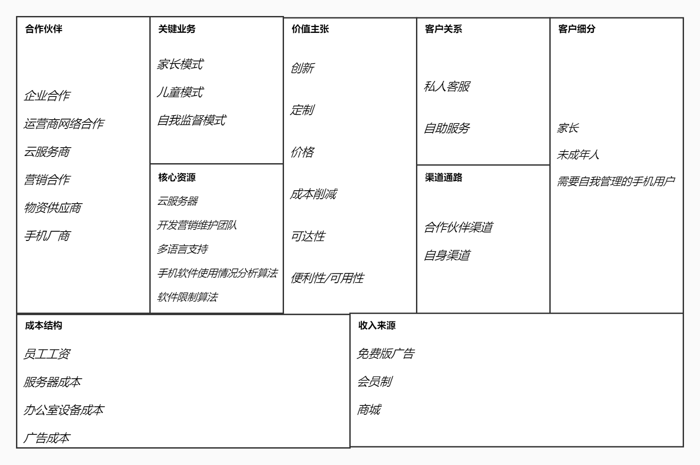

# CONT 项目启动文档

[TOC]

## 1 项目总览

### 1.1 项目题目

集应用限制，自律培养和绑定控制于一体的学习软件——CONT

### 1.2 组员信息

| 组员   | 学号      |
| ------ | --------- |
| 任毅   | 191250116 |
| 王思尧 | 191250137 |
| 王庭泰 | 191250139 |
| 王嘉玮 | 191250136 |

### 1.3 度量数值

​		本文档共包含了48个要点与15条关联关系，平均要点数量约为6个。

​		要点详见第四部分，由于多个要点之间互相都会有联系，故会将其聚合以增强联系的直观性。每个联系之前有要点位置的标注，如1.1（家长）表示第一个模块客户细分的第一点“想要限制孩子手机应用使用时长的家长”。

## 2 项目简介

​		CONT是一款致力于帮助用户摆脱手机依赖，帮助家长避免未成年人沉迷手机的产品。其功能主要分为家长模式、儿童模式和自我监督模式，这三个模式充分实现家长对儿童手机使用的云管理以及用户对自我手机软件使用的监督和管理，以满足不同用户角色对摆脱手机依赖的需求。

​		家长模式和儿童模式是CONT的最主要业务。我们将家长设备和未成年人设备通过软件账号实现绑定，从而家长可以在父设备上通过CONT实现对子设备软件的管理。软件允许家长用父设备中CONT设置子设备软件使用时长限制，同时家长还可以定时收到由CONT系统发送的子设备手机软件使用信息，更进一步，为了加强家长对子设备软件使用的监督，在会员模式下，我们提供了子设备向父设备发送当前手机屏幕截屏和手机软件使用情况分析报告的功能。

​		响应国家控制未成年人游戏时长的政策，为了避免未成年人沉迷手机，我们为子设备软件使用的超时长现象提供了创造性且软性的解决方案：当某应用使用时长超出规定使用时长时，在一定缓冲时间内，CONT会弹出提示窗影响子设备使用者体验并限制网速，在缓冲时间结束后，CONT会强制关闭软件并向家长端应用发送提醒。家长模式和儿童模式的绑定让家长们摆脱了传统的“担心儿童随意使用手机而不敢给未成年人手机”的困境，通对未成年人手机软件使用的云管理和云监视，既可以让家长放心，也可以帮助未成年人摆脱手机依赖。

​		自我监督模式是我们产品基于市场产品的改良业务。当前市面上的自我管理软件并不能充分限制用户其他软件使用，因此，我们提供了如下服务：锁定软件并设置锁定时长，设置锁定密码，限制软件使用时长，生成软件使用报告以及提供成就机制。当用户需要屏蔽某些软件的打扰时，可以临时为软件设置锁定时间，期间无法使用，对于长期使用而言，用户还可以在CONT中对某些软件的使用添加各项限制，以逐步减轻对该应用的依赖。此外，CONT还会在获得允许后记录用户使用软件的情况，并会根据用户需要生成数据报告反馈给用户。当用户满足某些自律条件时则会达成相应成就，成就会自动保存到该用户账号中，用户可以在社交平台分享其成就·。此外，自我监督模式还可以满足手机外借时用户隐私保护的需要，只需锁定需要保护的软件即可。

​		CONT的与众不同之处在于其“软硬结合”。软性控制体现在儿童模式的“缓冲”机制，而硬性则体现在当子设备中的CONT意外关闭时，系统会向父设备发送提醒，因此子设备不能通过关闭或者删除软件来摆脱控制，而屏幕信息的获取则对试图偷偷玩手机的未成年人形成了有效的威慑。同样，在自我监督模式下，我们会提供“硬核模式”，该模式中被锁定的应用将无法通过任何方法提前解锁。这也是CONT名字的来源，Controller，控制者，意为依靠外界的强大力量来束缚住信息时代人们被过分赋予的放肆的自由。

## 3 商业模式画布

### 3.1 要点概述

### 3.2 要点介绍

#### 3.2.1 客户细分

1. 想要限制孩子手机应用使用时长的家长。

2. 想要认真学习，避免沉迷网络的未成年人。

3. 想要自我约束，控制自己手机使用时长的成年人。

#### 3.3.2 价值主张

1. 创新：目前市场上还没有定位完全一致的手机应用，本应用不仅可以自定义地限制手机上每一个应用的使用时长，还可以根据应用使用情况生成分析报告，让用户对自己的时间分配情况有更好的了解，同时，本应用还拥有独特的未成年人-家长绑定系统，家长可以设置未成年人手机应用的使用限额，并且可以付费来实时观察未成年人的手机使用，在本应用异常关闭时，会向已绑定的家长端应用发起提醒，以此避免应用因被关闭而失去效用，这样可以方便家长更加高效和便利地管理孩子的手机使用。

2. 定制：拥有自定义模式，应用白名单等具有定制特点的功能，用户可以根据自身情况自由设置部分参数，可以满足用户需求的高自由度和多样性。

3. 价格：普通用户在不付费的情况下也能拥有较舒适的使用体验，VIP用户在适当付费之后将能够使用多种拓展功能。

4. 成本削减：本应用可以帮助用户屏蔽无关应用并分析自己的时间使用情况，以助力减少用户浪费在无关应用上的时间成本，同时，本应用的未成年人-家长绑定系统可以大大降低家长在防止孩子沉迷游戏上所需要付出的时间与精力。

5. 可达性：本产品的价值主张明确，积极响应国家号召和家长需求，可以较为容易地通过广告和推送抵达更多的潜在用户，具有相当广泛的可达用户。

6. 便利性/可用性：本产品使得用户能够更加便捷地获取自己的手机使用情况，以进行针对性的调整，同时方便家长更高效地管理孩子的手机使用

#### 3.2.3  渠道通路

1. 合作伙伴渠道

   a. 知名度 

   ​	i. 可以通过与各大应用商店的合作与宣传，提升自身知名度。

   ​	ii. 可以和手机平板厂商合作，作为该厂产品的预装App，可以有效的提高我们产品的流量，增强知名度。

   ​	iii. 可以和学校合作，在比如统一配备的学习平板上安装。

   b. 购买：与各大应用商店合作，提供专属优惠，学校可以以优惠价格取得团体专属进阶功能使用权

2. 自身渠道

   a. 知名度

   ​	i. 制作官方网站，方便用户更好的了解我们，并且潜在用户在浏览到我们的网站时可以提高知名度。

   ​	ii. 在公司进入正轨后，特殊时段可以提供一定程度的免费服务，增强影响力和知名度。

   b. 评价：通过问卷、问题反馈、在线客服等反馈机制让用户对产品功能和价值主张进行评估。

   c. 购买：普通用户在我们的官方网站上或者软件内可以购买到VIP服务。

   d. 传递：通过使用手册及操作引导的形式让用户明确产品的价值主张。

   e. 售后：有智能客服和在线人工客服，向客户提供售后支持。

#### 3.2.4 客户关系

1. 私人客服：有在线人工客服，可以和客户进行交流并在销售的过程中以及购买完成之后提供相应的帮助。 

2. 自助服务：自助客服具有导航系统，用户可以根据自己遇到的问题查阅已有的常见问题条目，以解决较为常见的问题。

#### 3.2.5 收入来源

1. 免费版：植入（相关）广告，可以通过收取广告费盈利。

2. 会员制：充值成为VIP用户后，开放更多功能，并取消广告，且VIP用户在商城消费时享有一定折扣，可以通过收取会员费盈利。

3. 商城：应用中具有商城模块，可以通过商城交易收取平台费用盈利。

#### 3.2.6 核心资源

1. 云服务器：初期在用户量较少时只需低配置云服务器来维持运行以减少成本。在后期业务增长时，可以通过增加云服务器数量来避免资源耗尽问题。

2. 开发营销维护团队：软件开发过程中需要高效的开发团队保证软件开发任务顺利完成。在软件发布后需要专业营销团队对软件进行广告宣传，并且需要一个维护团队来保证软件的正常运行。

3. 多语言支持：软件支持多种语言，使软件变得国际化，让应用能够走出国门，使得国内外用户均可使用。

4. 软件使用情况分析算法：根据软件使用时段，时长，频率等信息分析用户使用情况并结合多学科理论生成分析报告的算法。

5. 软件限制算法：一套对于手机软件使用进行硬性限制的算法，即让限定的软件无法正常运转。

#### 3.2.7 关键业务

1. 家长模式：针对家长端，家长端可以对儿童端应用软件进行相应约束限制。

   a. 限制儿童端软件的使用时长：家长端可以查看到所绑定儿童端各个应用软件，并可以对应用软件施加一个使用限制，即规定一个时间内允许软件正常工作，超过规定时间后儿童端的该软件无法正常工作（如会有本软件的弹窗跳出进行强行屏蔽或提高延迟波动进行软性屏蔽）

   b. 实时监控（进阶版--需付费）：家长端可远程实时监控儿童端屏幕信息以及儿童端各软件的使用信息，并会对数据进行整合分析生成报告提供给家长端

2. 儿童模式：针对儿童端，受到绑定的家长端软件控制，并与家长端软件保持联系。

   a. 反馈机制：当儿童端本软件出现异常时（如被强行关闭或异常停止工作），儿童端的软件会自动发送一个反馈信号到家长端告知家长本软件的非正常退出情况。

   b. 模式保护机制：儿童端无法自行切换为其他模式，切换模式需要获得家长端的验证码

   c. 监控机制（进阶版--需付费）：儿童端软件的使用信息和屏幕信息会实时传输到云端存储，方便家长端查看儿童端软件使用情况

3. 自我监督模式：在单部手机里的自我监督模式，无家长端、儿童端区分，个人模式，适用于自我约束或家长将自己的手机给儿童玩的情况。

   a. 锁定软件：可以自行为手机里的其他软件上锁并设定一个锁定时长（即在规定时间内手机内锁定的软件无法打开。

   b. 密码认证解锁：每次使用本软件锁定其他软件时会需要用户自行设定一个解除密码，若出现意外情况需要及时使用已被锁定软件时只需要输入密码进行认证即可对软件进行解锁。

   c. 软件时长限制与统计：可以设定某软件每日或每周使用时长限制，后台统计该软件每日或每周的使用情况，软件使用限制可以是短时的，也可以是长时的。并会分别在一日或一周的规定时间点生成报告反馈用户。

   d. 奖励机制：当用户在规定时间内未使用密码认证解锁软件或是在长期过程中对于手机内软件使用没有超时记录则会达成相应成就，成就会自动保存到该用户数据中。用户可在朋友圈中分享自己获得的成就。

#### 3.2.8 重要合作

1. 广告合作：该软件在后期积累足够数量的用户时会植入相应的广告，因此需要与部分广告商建立企业上的合作关系。

2. 运营商网络合作：软件需要向电信网络投入且这是一个较为长期的过程，与网络运营商合作可以制定更清晰的产业发展计划，制定阶段性、透明的政策。协调价值链之间的利益关系从而调动各个环节的积极性。

3. 云服务商：该软件在开发初期需要在服务器中存储相关文件，在应用运行过程中的视频和下载包需要存储到云服务器上来为用户获得更好的体验。随着用户数量的增长也会需要更多的云服务器作为支撑，将用户数据存到云端既可以节省用户存储空间，又可以保证数据的安全性。

4. 营销合作：需要与其他相关企业进行合作，通过捆绑宣传来提高软件的知名度。

5. 物资供应商：软件企业中的员工在进行开发及调试工作时需要一定的平台基础，与物资供应商合作可以保障软件开发人员的工作环境质量。

6. 手机平板厂商：该软件可以与部分手机平板厂商合作，在旗下产品上预装，扩张用户量。

#### 3.2.9 成本结构

1. 员工工资：软件在开发过程中所需的开发人员的薪资以及后期维护过程时维护人员的薪资。

2. 服务器成本：在软件开发初期，需要使用已有的云服务器平台以节省成本、扩大存储空间。在应用运行中需要对视频等文件进行存储，也需要云服务器资源保证软件的正常运转。

3. 办公室设备成本：软件里设有私人客服，且后期需要维护人员持续提供服务，因此需要一定的成本为职工的办公设备进行配置和维护。

4. 广告成本：在软件发布初期需要通过大量广告宣传来提高知名度，从而扩展用户数量，需要一定的广告运营成本。

## 4 要点关联

1. 1.1（家长），2.1（创新），2.4（成本缩减），2.6（便利性/可用性）：本产品能够帮助家长管控孩子的手机使用情况，减少孩子沉迷手机的可能性，可以部分减轻家长的教育负担，同时由于此前尚未有相同功能的产品，本产品将可以填补这一部分的空缺。
2. 1.1（家长），2.5（可达性）：随着国家限制未成年人游戏时长政策的推行，家长对孩子沉迷手机的隐患愈加关注，因此本产品可以较为容易地为家长所知道和接受。
3. 1.1（家长），4.1（私人客服），4.2（自助服务）：考虑到家长的年龄层次，为了更好地帮助家长了解该产品的使用方式，我们提供在线客服和自助客服以实时解决家长在使用本产品中遇到的问题。
4. 1.1（家长），7.1（家长模式），7.3（自我监督模式）：如果未成年人有自己的手机，那么家长可以使用家长模式来进行管控，而如果未成年人需要使用家长的手机进行学习或者查资料，那么家长可以使用自我监督模式来管理手机应用的可用时长等来达到避免未成年人偷玩手机的目的。
5. 1.2（未成年人），1.3（成年人），2.2（定制）：针对想要帮助自己排除干扰，专注学习/工作的用户，我们提供高度灵活的自定义功能，可以对各个应用自行添加多项使用限制以避免自己沉迷手机浪费时间。
6. 1.2（未成年人），1.3（成年人），2.3（价格），5.1（免费版），5.2（会员制）：基础版免费，拓展功能收费的模式被大部分人所接受，用这种收费模式能够在快速扩大用户规模的同时获得盈利。
7. 1.2（未成年人），1.3（成年人），7.3.d（奖励机制）：本产品的成就系统可以成为推动用户自我管控，不断提升自己的动力之一，同时兼具一定的社交属性，对于产品的推广有一定帮助。
8. 3.1.a（知名度），8.4（营销合作），8.6（手机平板厂商）：本产品具有一定的教育属性，因此可以通过与学校的合作提高知名度，此外，还可以通过预装在手机平板上，与手机平板厂商进行捆绑，进一步提高知名度
9. 3.1.b，3.2.c（购买），5.2（会员制），用户可以通过官网或者在应用内部购买vip服务，而合作厂商和学校则可以拥有一部分的购买优惠。
10. 3.2.e（售后），4.1（私人客服）4.2（自助服务）：私人客服和自动客服可以帮助用户解决关于软件的问题。
11. 4.1（私人客服），6.2（维护团队），9.1（员工工资），9.3（办公室设备成本）：为了解答用户在使用软件时遇到的问题，我们需要在维护团队中包含一部分客服人员，这部分客服人员的工资及办公室设备都会产生一定成本。
12. 5.1（免费版），6.5（软件限制算法）：免费版的主要功能需要一套强大的软件限制算法支持，该算法应该能在屏蔽应用时起到硬性作用，无法通过通常手段关闭。
13. 5.2（会员制），6.1（云服务器），6.4（软件使用情况分析算法），7.1.b（实时监控），7.3.c（软件时长限制与统计）：会员拓展功能中，孩子的屏幕状况将会被保存至云服务器，以供家长查看，而对软件使用情况的统计与分析则需要一套融合了心理学社会性等的算法支持。
14. 6.1（云服务器），8.2（运营商网络合作），8.3（云服务商），9.2（服务器成本）：存储媒体文件及其他数据信息需要服务器的支持，为了削减成本，我们使用更为灵活方便的云服务器，而视频
15. 6.2（营销团队），8.4（营销合作），9.4（广告）：产品需要通过各种途径投放广告来提高知名度，广告投入，营销人员工资也是成本的一部分。

